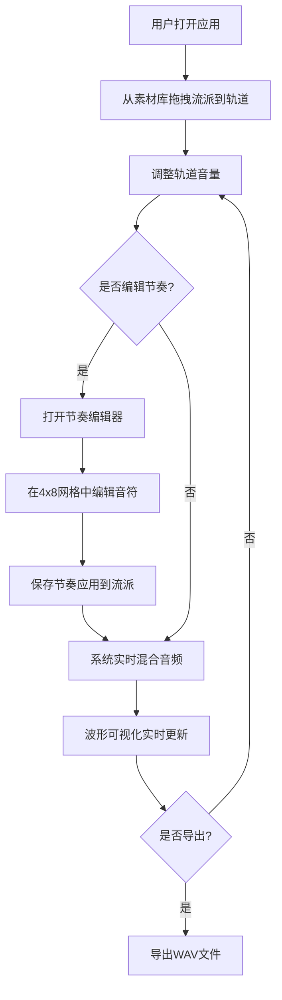

## 1. 产品概述

音乐流派混音器是一款基于浏览器的交互式音乐创作工具，让用户通过拖拽不同音乐流派的音色块到混音台轨道上，实时混合生成背景音乐，并通过可视化波形图观察音频效果。面向音乐爱好者、创意工作者和休闲用户，提供零门槛的音乐混音体验。

- 通过直观的拖拽交互降低音乐创作门槛
- 实时音频反馈与可视化波形增强创作沉浸感
- 支持节奏编辑与WAV导出，满足基础创作需求

## 2. 核心功能

### 2.1 用户角色
| 角色 | 注册方式 | 核心权限 |
|------|----------|----------|
| 普通用户 | 无需注册 | 使用全部混音与导出功能 |

### 2.2 功能模块
1. **主混音页面**：流派素材库、混音台轨道、波形可视化、节奏编辑器

### 2.3 页面详情
| 页面名称 | 模块名称 | 功能描述 |
|----------|----------|----------|
| 主混音页面 | 流派素材库面板 | 左侧固定宽度面板，展示4种流派卡片（爵士、电子、摇滚、古典），每个卡片含颜色标识和音量滑块，支持拖拽到轨道 |
| 主混音页面 | 混音台轨道区域 | 4条横向轨道，支持从左侧拖入流派、显示流派名称和音量百分比，每轨道有启停按钮 |
| 主混音页面 | 波形可视化区域 | Canvas画布实时显示混合音频波形，蓝绿渐变线条，30fps以上刷新率 |
| 主混音页面 | 节奏编辑器模态框 | 点击流派卡片上的节奏按钮弹出，4x8网格编辑节奏型，点击格子切换音符开关 |

## 3. 核心流程

用户打开应用后，从左侧流派素材库拖拽流派卡片到右侧混音台轨道上，调整各轨道音量比例，可选编辑节奏型，系统根据配置实时生成混合音频并在波形图上展示，满意后导出为WAV文件。

## 4. 用户界面设计

### 4.1 设计风格
- 主色调：深色主题，主背景#0D0D1A，卡片背景#1A1A2E，面板背景#1E1E2E
- 强调色：爵士#F4A261、电子#2A9D8F、摇滚#E76F51、古典#E9C46A
- 文字色：#E0E0E0（白色系）
- 按钮样式：圆形启停按钮（直径32px），播放绿色#4ECDC4，停止红色#FF6B6B
- 字体：JetBrains Mono（数据/数值展示）+ Outfit（UI文案），层次分明的字号体系
- 布局：左右分栏，左侧240px固定宽度素材库，右侧自适应混音台与波形
- 图标风格：简约线性图标，使用lucide-react

### 4.2 页面设计概述
| 页面名称 | 模块名称 | UI元素 |
|----------|----------|--------|
| 主混音页面 | 流派素材库面板 | 240px固定宽度，#1E1E2E背景，12px圆角，流派卡片纵向排列（200x120px，#2D2D44背景，8px圆角，顶部色条，底部音量滑块） |
| 主混音页面 | 混音台轨道区域 | 4条横向轨道（每条100px高，#16213E背景，8px圆角），轨道内流派槽位显示名称和音量百分比，右侧圆形启停按钮 |
| 主混音页面 | 波形可视化区域 | Canvas画布（100%宽，200px高，#0F0F23背景），渐变蓝绿线条（#00D4FF到#00FFAA），2px线宽 |
| 主混音页面 | 节奏编辑器模态框 | #1A1A2E背景，16px圆角，400x300px，4x8网格，激活格子填充流派颜色，未激活灰色#3D3D5C |

### 4.3 响应式设计
- 桌面优先设计，最小支持1280px宽度
- 左侧面板固定240px，右侧区域自适应
- 波形Canvas宽度100%自适应容器

### 4.4 动效设计
- 卡片拖拽时半透明拖影（不透明度0.6，偏移x+5px, y+5px）
- 拖入轨道时高亮边框变为对应流派颜色（2px solid）
- 所有交互200ms ease-out过渡动画
- 波形实时更新（30fps+）
