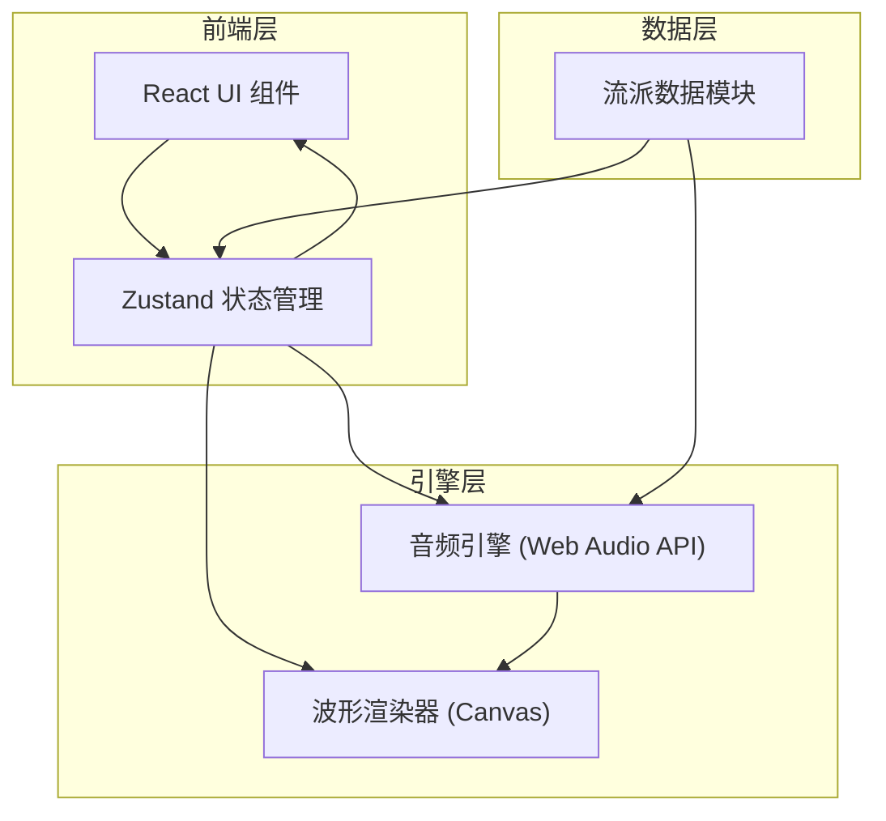
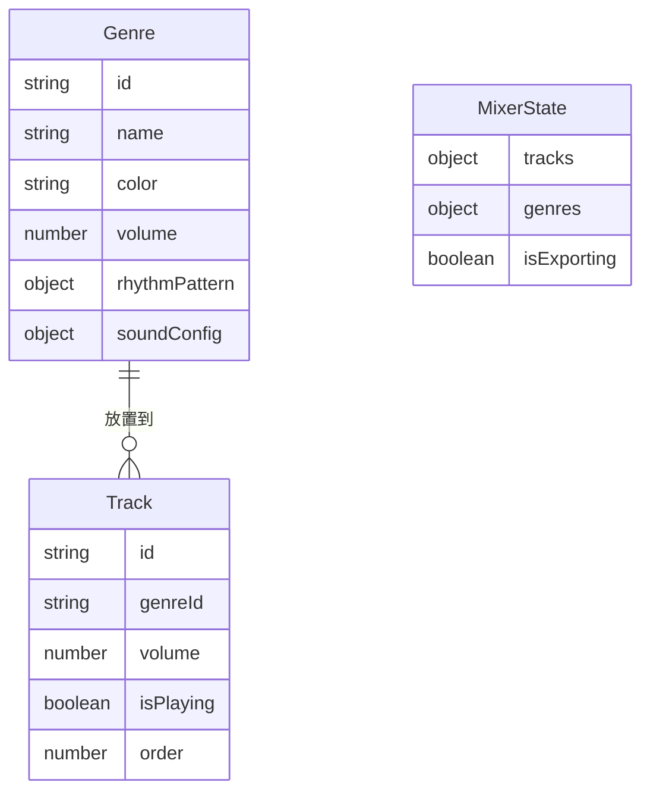

## 1. 架构设计



## 2. 技术说明
- 前端：React@18 + TypeScript + Vite
- 状态管理：Zustand
- 初始化工具：vite-init (react-ts 模板)
- 样式方案：Tailwind CSS + CSS Modules（针对动画和Canvas相关样式）
- 音频引擎：Web Audio API（原生浏览器API）
- 波形渲染：Canvas 2D API
- 后端：无
- 数据库：无

## 3. 路由定义
| 路由 | 用途 |
|------|------|
| / | 主混音页面，包含所有功能模块 |

## 4. API定义
无后端API，所有逻辑在前端完成。

## 5. 服务器架构图
无后端服务。

## 6. 数据模型

### 6.1 数据模型定义



### 6.2 核心数据结构

```typescript
interface Genre {
  id: string;
  name: string;
  color: string;
  volume: number;
  rhythmPattern: boolean[][];
  soundConfig: {
    oscillatorType: OscillatorType;
    baseFrequency: number;
    attack: number;
    decay: number;
    sustain: number;
    release: number;
  };
}

interface Track {
  id: string;
  genreId: string | null;
  volume: number;
  isPlaying: boolean;
}

interface MixerState {
  genres: Genre[];
  tracks: Track[];
  isExporting: boolean;
}
```

## 7. 文件结构

```
├── package.json
├── vite.config.js
├── tsconfig.json
├── index.html
├── src/
│   ├── main.tsx
│   ├── App.tsx
│   ├── data/
│   │   └── genres.ts
│   ├── engine/
│   │   └── audioEngine.ts
│   ├── renderer/
│   │   └── waveformRenderer.ts
│   ├── store/
│   │   └── useMixerStore.ts
│   └── components/
│       ├── MixerPanel.tsx
│       ├── GenreCard.tsx
│       ├── TrackLane.tsx
│       ├── WaveformDisplay.tsx
│       └── RhythmEditor.tsx
```

## 8. 音频引擎设计

### 8.1 音色合成
每种流派对应不同的振荡器类型和频率配置：
- 爵士：sine波 + 低频 + 长release，模拟柔和的爵士和弦
- 电子：sawtooth波 + 中频 + 短attack，模拟合成器音色
- 摇滚：square波 + 高频 + 短attack短release，模拟失真吉他
- 古典：triangle波 + 中高频 + 中等envelope，模拟弦乐

### 8.2 节奏播放
- 节奏型以4x8网格存储（4拍，每拍8个十六分音符位置）
- 使用Web Audio API的精确调度（AudioContext.currentTime）确保节拍准确
- 每个激活的网格单元格触发一个短促的音符事件

### 8.3 混音逻辑
- 使用GainNode控制各轨道音量
- 使用ChannelMergerNode合并多轨道
- AnalyserNode用于波形数据采集
- OfflineAudioContext用于WAV导出

### 8.4 WAV导出
- 使用OfflineAudioContext渲染混合音频
- 编码为PCM 16-bit WAV格式
- 通过Blob URL触发下载

## 9. 波形渲染设计
- 使用requestAnimationFrame驱动渲染循环
- 从AnalyserNode获取时域数据（getByteTimeDomainData）
- Canvas 2D绘制，线性渐变从#00D4FF到#00FFAA
- 线宽2px，背景#0F0F23
- 目标帧率≥30fps，与音频处理总延迟≤50ms
