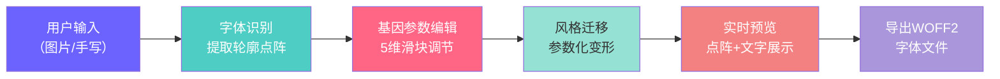

## 1. 产品概述

字体基因编辑器是一款创新的字体设计工具，允许用户通过上传图片或手写输入文字，自动识别字符轮廓并进行参数化风格迁移。用户可以通过调整"基因参数"实时预览字体变换效果，并导出为WOFF2字体文件。

- **主要用途**：字体风格化创作、手写体数字化、个性化字体生成
- **目标用户**：设计师、字体爱好者、创意工作者
- **产品价值**：降低字体设计门槛，实现所见即所得的字体基因编辑体验

## 2. 核心特性

### 2.1 功能模块

1. **输入模块**：图片上传识别 + 手写板绘制
2. **识别引擎**：字符区域检测 + 轮廓点阵提取
3. **基因编辑**：5维参数滑块实时调整
4. **风格迁移**：参数化字体变形引擎
5. **实时预览**：20x20点阵网格 + 文字预览
6. **导出模块**：WOFF2字体文件生成与下载

### 2.2 页面详情

| 页面名称 | 模块名称 | 功能描述 |
|-----------|-------------|---------------------|
| 主编辑器 | 输入切换区 | Tab切换图片上传/手写模式，支持拖拽上传 |
| 主编辑器 | 画布区域 | 显示上传图片或手写轨迹，最小高度400px |
| 主编辑器 | 基因控制面板 | 5个Material Design风格滑块，实时更新预览 |
| 主编辑器 | 点阵预览区 | 20x20网格展示字符轮廓变形效果 |
| 主编辑器 | 文字预览区 | 显示输入文字的变换后效果 |
| 主编辑器 | 导出功能 | 生成WOFF2文件，带进度条和完成提示 |

## 3. 核心流程

用户操作流程：
1. 选择输入方式（上传图片或手写绘制）
2. 系统自动识别文字区域并提取字符轮廓
3. 拖动基因参数滑块调整粗细、倾斜度等属性
4. 实时预览变形效果，可输入自定义文字预览
5. 满意后点击导出，生成WOFF2字体文件下载

## 4. 用户界面设计

### 4.1 设计风格

**科技深色主题**
- 主背景：#1E1E2E（深靛蓝灰）
- 辅助背景：#2D2D44（稍浅靛蓝灰）
- 控制面板：#1A1A2E（深蓝灰）
- 强调色：#6C63FF（紫罗兰）
- 辅助色：#4ECDC4（青绿）、#FF6584（粉红）
- 文字色：#E0E0E0（浅灰）、#FFFFFF（白色）

**字体选择**
- 标题/按钮：Space Grotesk（现代几何无衬线）
- 正文/数值：Inter（清晰易读）

**按钮样式**
- 宽120px × 高40px，圆角8px
- 背景#6C63FF，文字白色
- Hover：#7B73FF，0.3s渐变过渡

**滑块样式（Material Design）**
- 轨道高度4px，圆形滑块直径16px
- 激活色#6C63FF，未激活色#3D3D5C
- 标签14px，颜色#E0E0E0，带当前值显示

### 4.2 页面布局

**桌面端（≥768px）**：左右两栏
- 左侧60%：输入切换Tab + Canvas画布
- 右侧40%：基因控制面板 + 预览区（网格+文字）

**移动端（<768px）**：上下堆叠
- 上部：画布区域（100%宽度）
- 下部：控制面板 + 预览区（100%宽度）

**预览区规格**
- 宽度400px，高度300px
- 背景#1E1E2E，圆角12px
- 20x20点阵网格：格子12px，网格线#3D3D5C，线宽1px
- 字符填充#4ECDC4，描边0.5px白色
- 文字预览：字号20px，行高1.5

### 4.3 交互动效

- **Tab切换**：选中时下划线从中间展开动画，0.3s
- **滑块拖动**：实时预览更新延迟≤50ms
- **手写笔触**：轨迹末端10px淡出效果
- **导出进度**：渐变进度条（#6C63FF→#FF6584）
- **完成提示**：半透明黑底白字，2秒后淡出
- **按钮Hover**：颜色渐变0.3s

### 4.4 响应式设计

- 桌面优先（≥1200px）：标准左右布局
- 平板（768-1199px）：保持左右布局，调整比例
- 手机（<768px）：上下堆叠，Canvas最小高度300px
- 触摸优化：滑块和按钮增大点击区域

## 5. 性能指标

| 指标 | 目标值 |
|------|--------|
| Canvas绘制帧率 | ≥45FPS |
| 滑块→预览延迟 | ≤50ms |
| 100x100图片识别 | ≤3s |
| WOFF2导出 | ≤5s |
| 页面加载 | ≤2s |
