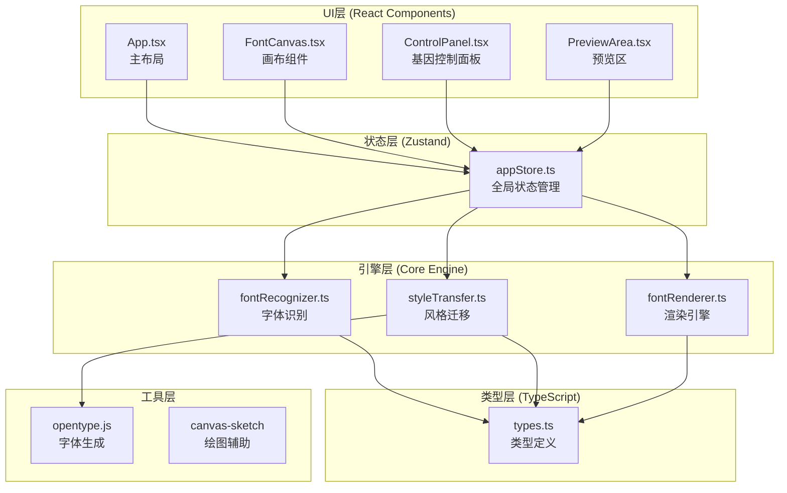

## 1. 架构设计



## 2. 技术栈说明

| 层级 | 技术选型 | 版本 | 用途 |
|------|----------|------|------|
| 框架 | React | ^18.2.0 | UI构建 |
| 语言 | TypeScript | ^5.0.0 | 类型安全 |
| 构建 | Vite | ^5.0.0 | 构建工具 |
| 状态 | Zustand | ^4.4.0 | 状态管理 |
| 字体 | opentype.js | ^1.3.4 | WOFF2生成 |
| 绘图 | canvas-sketch | ^0.7.7 | Canvas辅助 |
| 样式 | Tailwind CSS | ^3.3.0 | CSS框架 |
| 图标 | lucide-react | ^0.294.0 | 图标库 |

## 3. 目录结构

```
auto123/
├── index.html                 # 入口页面
├── package.json               # 依赖配置
├── vite.config.js             # Vite配置
├── tsconfig.json              # TypeScript配置
├── tailwind.config.js         # Tailwind配置
├── postcss.config.js          # PostCSS配置
└── src/
    ├── main.tsx               # 应用入口
    ├── App.tsx                # 主组件
    ├── types.ts               # 类型定义
    ├── index.css              # 全局样式
    ├── stores/
    │   └── appStore.ts        # Zustand状态
    ├── engine/
    │   ├── fontRecognizer.ts  # 字体识别引擎
    │   └── styleTransfer.ts   # 风格迁移引擎
    ├── renderer/
    │   └── fontRenderer.ts    # Canvas渲染器
    ├── components/
    │   ├── FontCanvas.tsx     # 画布组件
    │   ├── ControlPanel.tsx   # 控制面板
    │   ├── PreviewArea.tsx    # 预览区
    │   ├── TabSwitcher.tsx    # Tab切换器
    │   ├── GeneSlider.tsx     # 基因滑块
    │   └── ExportButton.tsx   # 导出按钮
    └── utils/
        └── fontExport.ts      # 字体导出工具
```

## 4. 数据模型定义

### 4.1 核心类型

```typescript
// src/types.ts

export interface FontGeneProfile {
  weight: number;           // 粗细：0-100
  slant: number;            // 倾斜度：-45到45
  serifAmount: number;      // 衬线幅度：0-20px
  curveTension: number;     // 曲线张力：0-100
  decorationComplexity: number; // 装饰复杂度：0-10
}

export interface Point {
  x: number;
  y: number;
}

export interface CharGlyph {
  char: string;
  unicode: number;
  outline: Point[][];       // 轮廓路径（可能多个）
  boundingBox: {
    x: number;
    y: number;
    width: number;
    height: number;
  };
  advanceWidth: number;
}

export type FontStyle = 'regular' | 'bold' | 'italic' | 'bold-italic';

export type InputMode = 'upload' | 'handwrite';

export interface AppState {
  inputMode: InputMode;
  uploadedImage: string | null;
  handwriteCanvas: HTMLCanvasElement | null;
  recognizedGlyphs: CharGlyph[];
  geneProfile: FontGeneProfile;
  previewText: string;
  isExporting: boolean;
  exportProgress: number;
  showExportToast: boolean;
}
```

### 4.2 Zustand Store

```typescript
// src/stores/appStore.ts
import { create } from 'zustand';
import { 
  AppState, 
  FontGeneProfile, 
  CharGlyph, 
  InputMode 
} from '../types';

interface AppActions {
  setInputMode: (mode: InputMode) => void;
  setUploadedImage: (image: string | null) => void;
  setRecognizedGlyphs: (glyphs: CharGlyph[]) => void;
  updateGeneProfile: (partial: Partial<FontGeneProfile>) => void;
  setPreviewText: (text: string) => void;
  setExporting: (exporting: boolean) => void;
  setExportProgress: (progress: number) => void;
  setShowExportToast: (show: boolean) => void;
  resetAll: () => void;
}

export const useAppStore = create<AppState & AppActions>((set) => ({
  // 初始状态...
  // Actions...
}));
```

## 5. 核心模块接口

### 5.1 字体识别模块

```typescript
// src/engine/fontRecognizer.ts
export interface RecognitionResult {
  glyphs: CharGlyph[];
  processingTime: number;
}

export class FontRecognizer {
  /**
   * 从图片数据URL识别字符
   * @param imageDataUrl 图片base64数据
   * @returns 识别到的字符轮廓数组
   */
  static async recognizeFromImage(
    imageDataUrl: string
  ): Promise<RecognitionResult>;

  /**
   * 从Canvas手写数据识别字符
   * @param canvas 手写画布元素
   * @returns 识别到的字符轮廓数组
   */
  static async recognizeFromCanvas(
    canvas: HTMLCanvasElement
  ): Promise<RecognitionResult>;

  /**
   * 提取字符轮廓点阵
   * @param imageData Canvas图像数据
   * @returns 轮廓点数组
   */
  private static extractOutline(
    imageData: ImageData
  ): Point[][];
}
```

### 5.2 风格迁移模块

```typescript
// src/engine/styleTransfer.ts
export class StyleTransfer {
  /**
   * 应用基因参数变形字符轮廓
   * @param glyph 原始字符轮廓
   * @param genes 基因参数配置
   * @returns 变形后的字符轮廓
   */
  static applyGenes(
    glyph: CharGlyph,
    genes: FontGeneProfile
  ): CharGlyph;

  /**
   * 应用粗细变换
   */
  private static applyWeight(
    outline: Point[][],
    weight: number
  ): Point[][];

  /**
   * 应用倾斜变换
   */
  private static applySlant(
    outline: Point[][],
    slant: number
  ): Point[][];

  /**
   * 应用衬线
   */
  private static applySerifs(
    outline: Point[][],
    amount: number
  ): Point[][];

  /**
   * 应用曲线张力
   */
  private static applyCurveTension(
    outline: Point[][],
    tension: number
  ): Point[][];

  /**
   * 应用装饰
   */
  private static applyDecorations(
    outline: Point[][],
    complexity: number
  ): Point[][];
}
```

### 5.3 渲染模块

```typescript
// src/renderer/fontRenderer.ts
export class FontRenderer {
  private canvas: HTMLCanvasElement;
  private ctx: CanvasRenderingContext2D;

  constructor(canvas: HTMLCanvasElement);

  /**
   * 绘制20x20点阵网格背景
   */
  drawGrid(): void;

  /**
   * 在点阵网格上绘制字符轮廓
   * @param glyph 变形后的字符轮廓
   */
  drawGlyphOnGrid(glyph: CharGlyph): void;

  /**
   * 绘制手写轨迹（带淡出效果）
   * @param points 轨迹点数组
   * @param color 笔触颜色
   * @param width 笔触宽度
   */
  drawHandwriting(
    points: Point[],
    color: string,
    width: number
  ): void;

  /**
   * 绘制上传图片
   * @param imageDataUrl 图片数据
   */
  drawUploadedImage(imageDataUrl: string): Promise<void>;

  /**
   * 绘制预览文字
   * @param text 预览文字
   * @param glyphs 变形后的字符轮廓数组
   */
  drawPreviewText(text: string, glyphs: CharGlyph[]): void;

  /**
   * 清除画布
   */
  clear(): void;
}
```

### 5.4 字体导出模块

```typescript
// src/utils/fontExport.ts
export async function exportToWOFF2(
  glyphs: CharGlyph[],
  genes: FontGeneProfile,
  onProgress?: (progress: number) => void
): Promise<Blob>;

export function downloadBlob(blob: Blob, filename: string): void;
```

## 6. 性能优化策略

1. **Canvas渲染优化**
   - 使用requestAnimationFrame控制帧率
   - 离屏Canvas预绘制网格
   - 脏区域重绘而非全量刷新

2. **状态更新优化**
   - Zustand selector避免不必要重渲染
   - 滑块值节流（requestAnimationFrame）
   - 基因参数变更防抖50ms

3. **识别性能优化**
   - Web Worker处理图像识别
   - 图像降采样（最大100x100处理）
   - 缓存识别结果

4. **导出性能优化**
   - 分块处理字符数据
   - 进度反馈异步更新
   - 流式生成Blob

## 7. 浏览器兼容性

| 浏览器 | 最低版本 |
|--------|----------|
| Chrome | 90+ |
| Firefox | 88+ |
| Safari | 14+ |
| Edge | 90+ |

**必需API**：Canvas 2D、Blob、FileReader、Web Workers
