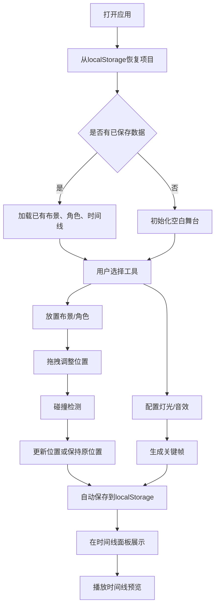

## 1. 产品概述

舞台调度沙盒是一款面向小型独立剧团的在线互动式剧场布局编辑器，帮助导演和舞美师在数字舞台上快速搭建虚拟布景、安排角色走位，并自动生成灯光和音效时间线，用于演出前的排练和方案沟通。

- 目标用户：剧团导演、舞美设计师、灯光师、音效师
- 核心价值：将传统纸质舞台调度方案数字化，提供可视化、可交互、可保存的编排工具

## 2. 核心功能

### 2.1 用户角色

| 角色 | 注册方式 | 核心权限 |
|------|----------|----------|
| 剧团工作人员 | 无需注册，直接使用 | 完整的舞台编排、保存、恢复功能 |

### 2.2 功能模块

1. **舞台布景搭建模块**：方形/圆形布景放置、拖拽移动、碰撞检测
2. **角色走位编排模块**：角色放置、编号显示、位置调整
3. **灯光时间线模块**：灯光配置（RGB/强度）、关键帧生成、时间线展示
4. **音效时间线模块**：音频文件导入、音效关键帧、预览播放
5. **项目持久化模块**：自动保存到 localStorage、页面刷新自动恢复

### 2.3 页面详情

| 页面名称 | 模块名称 | 功能描述 |
|----------|----------|----------|
| 主编辑页面 | 左侧工具面板 | 提供添加布景、角色、灯光、音效的工具按钮 |
| 主编辑页面 | 中央舞台画布 | 1200x800 俯视图舞台，支持布景和角色的放置与拖拽 |
| 主编辑页面 | 右侧时间线面板 | 展示灯光和音效关键帧，支持播放/暂停控制和关键帧微调 |
| 主编辑页面 | 灯光配置浮层 | RGB颜色和强度滑块配置，确认后生成关键帧 |
| 主编辑页面 | 音效配置浮层 | 文件选择器和名称输入，导入音频生成关键帧 |

## 3. 核心流程

## 4. 用户界面设计

### 4.1 设计风格

- 主色调：暗色主题，主背景 #1A1A2E，面板背景 #2D2D44，舞台背景 #1C1C2E
- 强调色：选中边框 #FFD700（金色），音效关键帧 #FFE5B4（米黄色）
- 网格线：1px #3D3D5C，间距 20px
- 圆角：卡片/面板 8px，灯光配置浮层 12px，工具按钮 4px
- 字体：现代无衬线字体，清晰可读

### 4.2 页面设计概述

| 页面名称 | 模块名称 | UI元素 |
|----------|----------|--------|
| 主编辑页面 | 左侧工具面板 | 宽60px，背景 #2D2D44，5个32x32px工具按钮，白色图标 |
| 主编辑页面 | 中央舞台画布 | 宽1200px高800px，2px #4A4A6A边框，内阴影凹陷感，网格背景 |
| 主编辑页面 | 右侧时间线面板 | 宽300px，背景 #2D2D44，顶部播放控制和时间显示，200px高时间轴区域 |
| 主编辑页面 | 灯光配置浮层 | 200x250px，背景 #1E1E2E，圆角12px，4个滑块控件 |
| 主编辑页面 | 布景元素 | 矩形/圆形，半透明填充，不透明边框，选中时#FFD700加粗2px边框，轻微上浮动画 |
| 主编辑页面 | 角色元素 | 半径8px圆点，随机区分色，显示编号 |

### 4.3 响应式

- 桌面端优先设计，最小支持宽度 1600px（60 + 4 + 1200 + 300 + 边距）
- 舞台画布固定尺寸 1200x800px，保证坐标系精确

### 4.4 交互动效

- 布景元素选中时：translateY -2px，0.2s ease-out 上浮动画
- 拖拽时：元素平滑跟随鼠标，延迟 < 50ms
- 时间线播放：≥ 24fps 逐帧回调
