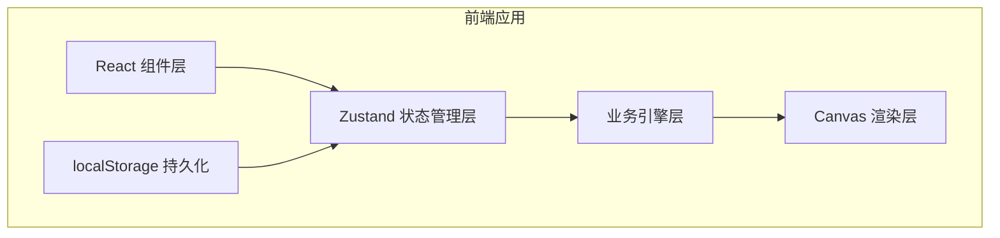
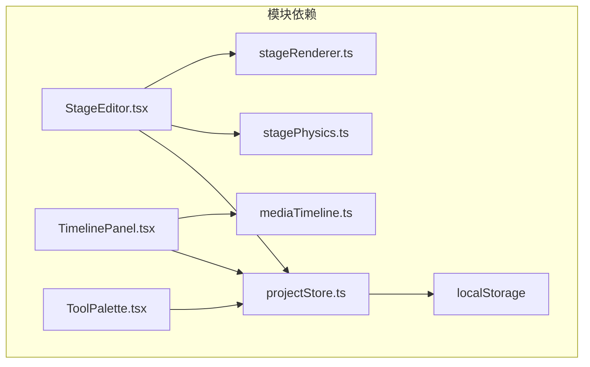

## 1. 架构设计





## 2. 技术描述

- 前端框架：React@18 + TypeScript
- 构建工具：Vite@5 + @vitejs/plugin-react
- 状态管理：Zustand@4
- 唯一ID生成：uuid@9
- 渲染方案：HTML5 Canvas 2D API
- 音频播放：HTML5 Audio API
- 数据持久化：localStorage

## 3. 目录结构

```
src/
├── stores/
│   └── projectStore.ts      # Zustand全局状态，项目持久化
├── engine/
│   ├── stagePhysics.ts      # 舞台物理引擎（碰撞检测）
│   └── mediaTimeline.ts     # 灯光音效时间线引擎
├── renderer/
│   └── stageRenderer.ts     # Canvas渲染模块
├── components/
│   ├── StageEditor.tsx      # 舞台编辑器主组件
│   ├── TimelinePanel.tsx    # 时间线面板
│   └── ToolPalette.tsx      # 左侧工具面板
├── types/
│   └── index.ts             # 类型定义
├── App.tsx                  # 应用入口
├── main.tsx                 # React渲染入口
└── index.css                # 全局样式
```

## 4. 数据模型

### 4.1 类型定义

```typescript
// 布景元素
interface PropElement {
  id: string;
  type: 'rectangle' | 'circle';
  x: number;        // 左上角x
  y: number;        // 左上角y
  width: number;
  height: number;
  fillColor: string;   // rgba
  borderColor: string; // hex
}

// 角色
interface Character {
  id: string;
  name: string;
  x: number;
  y: number;
  color: string;
}

// 灯光关键帧
interface LightKeyframe {
  id: string;
  timestamp: number; // ms
  color: { r: number; g: number; b: number };
  intensity: number; // 0-1
}

// 音效关键帧
interface SoundKeyframe {
  id: string;
  timestamp: number; // ms
  name: string;
  audioData: string; // base64 dataURL
  duration: number;  // ms
}

// 时间线条目
interface TimelineEntry {
  timestamp: number;
  lightColor: { r: number; g: number; b: number } | null;
  lightIntensity: number | null;
  soundId: string | null;
}

// 项目状态
interface ProjectState {
  props: PropElement[];
  characters: Character[];
  lightKeyframes: LightKeyframe[];
  soundKeyframes: SoundKeyframe[];
  selectedElementId: string | null;
  currentTime: number;
  isPlaying: boolean;
}
```

## 5. 核心模块说明

### 5.1 stagePhysics.ts
- 舞台坐标系：2D俯视图，x: 0-1200，y: 0-800，原点左上角
- 每个元素有矩形包围盒
- 提供 `checkCollision(element, others)` 返回碰撞检测结果
- 提供 `getValidPosition(element, targetX, targetY, others)` 返回下个有效位置
- 规则：不能越界，相邻元素重叠不超过5px

### 5.2 mediaTimeline.ts
- 接收灯光和音效关键帧数组
- `generateTimeline(lightFrames, soundFrames)` 生成按时间排序的 TimelineEntry 数组
- `startPlayback(timeline, onFrame)` 逐帧回调（≥24fps）
- `stopPlayback()` 停止播放

### 5.3 stageRenderer.ts
- `render(ctx, state)` 绘制完整舞台
- 内容：背景色、网格线、布景元素（矩形/圆形）、角色圆点、选中高亮
- 拖拽时实时渲染反馈

### 5.4 projectStore.ts
- Zustand store 管理全部项目状态
- `serialize()` 序列化为 JSON 字符串
- `deserialize(json)` 从 JSON 恢复
- 每次状态变更自动写入 localStorage（键名：/stageSchedulerProject）
- 初始化时从 localStorage 读取恢复
