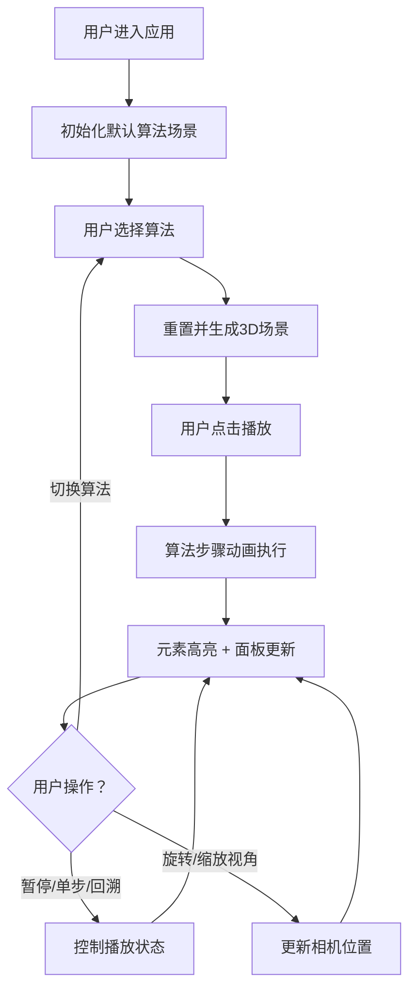

## 1. 产品概述

3D算法可视化沙盒是一款交互式教育工具，通过三维空间动态展示复杂算法的执行过程，解决传统教学中算法流程图和二维动画难以展示递归、回溯、图遍历等算法的空间结构和路径探索过程的问题。

- 核心目标：让学习者从任意角度直观观察算法执行的每一步，建立对算法空间复杂度和执行路径的深刻理解
- 目标用户：计算机科学学生、算法学习者、编程教育工作者

## 2. 核心功能

### 2.1 功能模块

1. **算法选择与场景初始化**：三种算法（八皇后回溯、A*寻路、二叉树中序遍历）切换，自动生成对应3D场景
2. **步骤执行动画与交互控制**：播放/暂停、速度调节（0.5x-3x）、单步前进/后退
3. **历史步骤回溯与信息面板**：实时显示算法状态信息，迷你时间线可跳转任意步骤
4. **3D场景自由探索**：轨道控制器支持旋转、缩放、平移，辅助网格与billboard文字标签

### 2.2 页面详情

| 页面名称 | 模块名称 | 功能描述 |
|---------|---------|---------|
| 主页面 | 算法选择区 | 顶部横向排列三个算法按钮，选中有高亮和下划线动画 |
| 主页面 | 3D渲染区 | 占满剩余空间，Three.js场景，支持轨道控制 |
| 主页面 | 播放控制条 | 场景下方居中，播放/暂停、速度滑块、单步按钮 |
| 主页面 | 右侧信息面板 | 悬浮显示当前步骤信息，底部迷你时间线 |
| 主页面 | 左侧操作面板 | 固定宽度，可折叠图例说明 |

## 3. 核心流程

用户打开应用 → 默认选中八皇后算法并初始化3D场景 → 用户可切换算法重新生成场景 → 用户点击播放按钮开始算法动画 → 场景中元素按步骤高亮变化 → 右侧面板实时更新状态信息 → 用户可暂停/单步/拖拽时间线回溯 → 用户可旋转缩放视角观察

## 4. 用户界面设计

### 4.1 设计风格

- **主色调**：深色科技感主题，主背景 `#0F0F23`，辅色 `#1A1A2E`，强调色 `#6C63FF`
- **按钮样式**：圆角8px，宽160px高48px，默认背景`#2D2D44`白色文字，选中背景`#6C63FF`带下划线动画
- **排版**：现代无衬线字体，标题16px-18px，正文12px-14px，信息面板关键数值20px
- **布局风格**：Flex布局，左侧固定面板 + 中央3D场景 + 右侧悬浮面板 + 底部控制条
- **动效**：按钮hover缩放1.05+颜色加深，点击波纹反馈，算法切换下划线动画0.3s

### 4.2 页面设计概览

| 页面名称 | 模块名称 | UI元素 |
|---------|---------|-------|
| 主页面 | 算法选择区 | 三个横向按钮，圆角，选中态高亮+下划线动画 |
| 主页面 | 3D渲染区 | Three.js场景，半透明辅助网格，billboard文字标签 |
| 主页面 | 播放控制条 | 半透明黑色`#00000066`，毛玻璃效果，圆角12px，播放按钮圆形36px，速度滑块200px，单步按钮32px |
| 主页面 | 右侧信息面板 | 背景`#1E1E2E`，圆角8px，边框`#3D3D5C`，底部迷你时间线进度条`#6C63FF` |
| 主页面 | 左侧操作面板 | 背景`#1A1A2E`，右边框`#2D2D44`，可折叠图例，图标16x16px，文字12px |

### 4.3 响应式设计

- **桌面端（1024px以上）**：左侧固定面板80px，中央3D场景，右侧悬浮信息面板280px，底部播放控制条居中
- **移动端（1024px以下）**：信息面板移至底部变为横向条状，左侧面板折叠为图标按钮，控制条宽度100%

### 4.4 3D场景设计

- **环境光**：半球光 + 方向光组合，营造柔和科技感
- **相机设置**：PerspectiveCamera，初始距离15，FOV 60°，近裁剪面0.1，远裁剪面100
- **控制器**：OrbitControls，旋转阻尼0.1，缩放范围5-50单位，右键平移
- **元素组成**：
  - 八皇后：8x8棋盘（1x1平面格子），金色`#FFD700`球体皇后
  - A*寻路：20x20网格，绿色`#00FF88`起点球，红色`#FF4444`终点球，灰色`#666666`障碍物方块
  - 二叉树：节点球体（半径0.5），颜色从`#4ECDC4`渐变到`#FF6B6B`，半透明白色连线
- **高亮效果**：当前操作元素闪烁金色边框/脉冲光晕/白色放大1.2倍，已完成元素半透明
- **辅助网格**：10x10半透明`#44444466`网格地面，线宽0.5px
