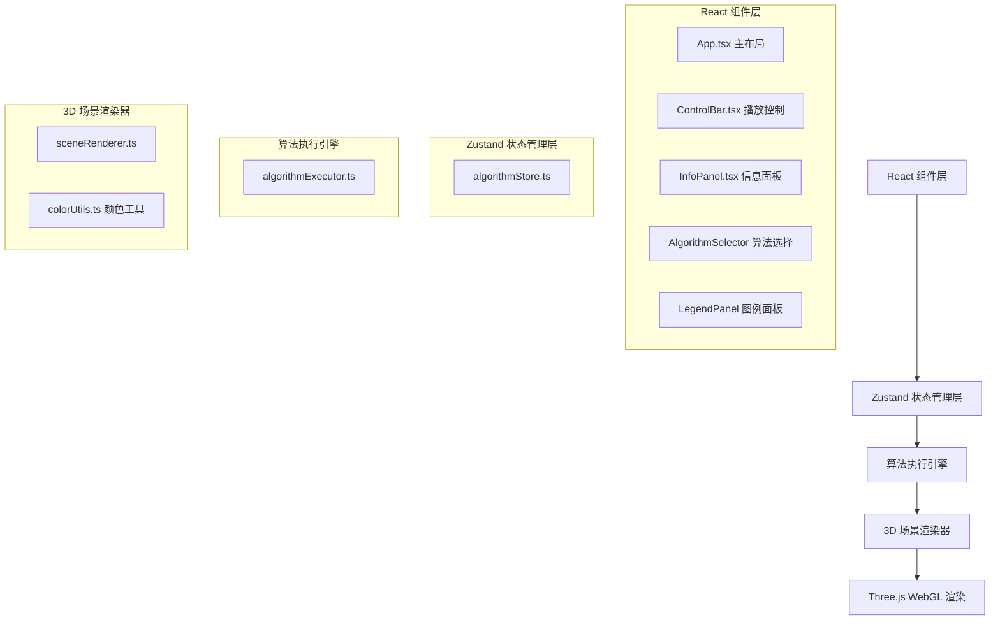

## 1. 架构设计



## 2. 技术描述

- **前端框架**：React 18 + TypeScript
- **构建工具**：Vite 5
- **3D渲染**：Three.js + @types/three
- **状态管理**：Zustand
- **样式方案**：CSS Modules + 内联样式（毛玻璃backdrop-filter）
- **初始化方式**：Vite react-ts 模板

## 3. 文件结构

```
d:\Pro\tasks\auto125/
├── package.json
├── vite.config.js
├── tsconfig.json
├── index.html
└── src/
    ├── main.tsx                    # React入口
    ├── App.tsx                     # 主布局组件
    ├── stores/
    │   └── algorithmStore.ts       # Zustand状态管理
    ├── engine/
    │   └── algorithmExecutor.ts    # 算法步进执行引擎
    ├── renderer/
    │   └── sceneRenderer.ts        # Three.js场景渲染器
    ├── components/
    │   ├── ControlBar.tsx          # 播放控制条
    │   └── InfoPanel.tsx           # 信息面板
    └── utils/
        └── colorUtils.ts           # 颜色渐变辅助函数
```

## 4. 核心数据模型

### 4.1 Zustand Store 状态

```typescript
type AlgorithmType = 'eightQueens' | 'aStar' | 'binaryTree';
type PlaybackState = 'idle' | 'playing' | 'paused';

interface AlgorithmState {
  algorithmType: AlgorithmType;
  currentStepIndex: number;
  snapshots: StepSnapshot[];
  playbackState: PlaybackState;
  speed: number; // 0.5 ~ 3.0
  // actions
  setAlgorithm: (type: AlgorithmType) => void;
  nextStep: () => void;
  prevStep: () => void;
  jumpToStep: (index: number) => void;
  togglePlay: () => void;
  setSpeed: (speed: number) => void;
  reset: () => void;
}
```

### 4.2 步骤快照对象

```typescript
interface StepSnapshot {
  stepIndex: number;
  description: string;
  highlightedItems: HighlightItem[];
  completedItems: string[];
  infoData: InfoData;
}

interface HighlightItem {
  id: string;
  type: 'queen' | 'cell' | 'node' | 'path' | 'obstacle';
  position?: { row: number; col: number } | { x: number; y: number } | { id: string };
  effect: 'pulse' | 'border' | 'scale';
}

type InfoData = EightQueensInfo | AStarInfo | BinaryTreeInfo;

interface EightQueensInfo {
  currentRow: number;
  placedQueens: number;
  backtrackCount: number;
}

interface AStarInfo {
  exploredNodes: number;
  currentPathLength: number;
  heuristicEstimate: number;
}

interface BinaryTreeInfo {
  currentNodeValue: number | null;
  visitOrderIndex: number;
}
```

## 5. 算法执行引擎设计

### AlgorithmExecutor 类

```typescript
class AlgorithmExecutor {
  constructor(type: AlgorithmType);
  executeStep(): StepSnapshot | null;  // 执行下一步，返回快照
  rewind(targetIndex: number): StepSnapshot;  // 回溯到指定步骤
  reset(): void;  // 重置算法状态
  getTotalSteps(): number;
  getAllSnapshots(): StepSnapshot[];  // 预生成所有快照
}
```

**预生成策略**：初始化时一次性预计算所有步骤快照并存储在数组中，保证40步以内回溯响应时间<50ms。

## 6. 3D渲染器设计

### SceneRenderer 类

```typescript
class SceneRenderer {
  constructor(container: HTMLElement);
  initScene(type: AlgorithmType): void;  // 初始化算法场景
  updateSnapshot(snapshot: StepSnapshot): void;  // 根据快照更新场景
  resize(): void;
  dispose(): void;
}
```

**渲染循环**：requestAnimationFrame驱动，OrbitControls更新+场景渲染，目标帧率≥45FPS。

**性能优化**：
- 场景元素复用而非重建
- 快照更新时仅修改材质属性和变换矩阵
- 非活跃元素使用InstanceMesh批处理
