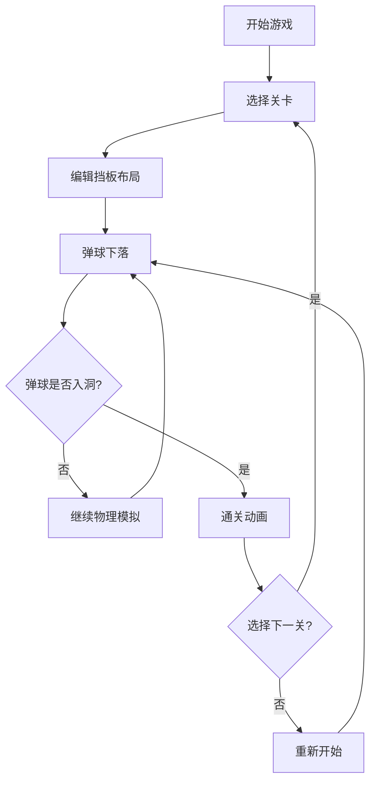

## 1. 产品概述

重力迷宫弹球是一款基于物理模拟的益智小游戏，玩家通过拖拽和放置可移动挡板来引导弹球滚入目标洞口。游戏融合了物理解谜与关卡编辑玩法，旨在提供休闲益智的游戏体验。

- 主要用途：休闲娱乐、智力训练
- 目标用户：喜欢益智解谜类游戏的玩家
- 产品价值：提供简单易上手但富有挑战性的物理益智体验

## 2. 核心功能

### 2.1 功能模块

1. **游戏主界面**：关卡选择栏、游戏画布、计时器与步数统计
2. **物理引擎**：重力模拟、碰撞检测、弹球运动计算
3. **关卡编辑器**：挡板放置、删除、拖拽移动、方向切换
4. **关卡管理**：关卡切换、保存、进度存储
5. **通关系统**：通关检测、通关动画、成绩记录

### 2.2 页面详情

| 页面名称 | 模块名称 | 功能描述 |
|---------|---------|----------|
| 游戏主页面 | 关卡选择栏 | 5个关卡横向排列，点击切换，显示最佳成绩 |
| 游戏主页面 | 游戏画布 | 弹球物理模拟、挡板渲染、洞口目标、入口提示 |
| 游戏主页面 | 统计信息 | 左上角显示计时器和弹射次数 |
| 游戏主页面 | 保存按钮 | 底部保存关卡配置到本地存储 |
| 通关弹窗 | 通关提示 | 半透明遮罩，显示恭喜通关文字和下一关/重新开始按钮 |

## 3. 核心流程

玩家进入游戏后，默认选中第一关，弹球从入口处开始下落。玩家可以切换到编辑模式，通过点击空白网格添加挡板，拖拽调整挡板位置，双击切换挡板方向，右键删除挡板。调整好挡板布局后，弹球在重力作用下下落，通过挡板反弹引导弹球进入目标洞口即可通关。通关后显示成绩，可选择下一关或重新开始。

## 4. 用户界面设计

### 4.1 设计风格

- **主色调**：深色科技风，主背景 #1A1A2E，边框 #3D3D5C
- **强调色**：紫色 #6C63FF（选中/按钮）、红色 #FF6B6B（弹球）、绿色 #4CAF50（保存按钮）
- **挡板颜色**：水平 #3D5A80，垂直 #EE6C4D，拖拽高亮 #FFD700
- **字体**：sans-serif 通用字体，计时器使用 monospace
- **视觉效果**：弹球拖尾、洞口脉冲光晕、入口箭头动画、按钮悬停效果

### 4.2 页面设计概述

| 页面名称 | 模块名称 | UI元素 |
|---------|---------|--------|
| 游戏主页面 | 关卡选择栏 | 5个关卡标签，横向排列，圆角8px，选中高亮 |
| 游戏主页面 | 游戏区域 | 900x600px Canvas，深色背景，2px边框 |
| 游戏主页面 | 弹球 | 直径24px，红色填充，深色阴影，10帧拖尾效果 |
| 游戏主页面 | 挡板 | 80x8px，圆角2px，水平/垂直两种颜色 |
| 游戏主页面 | 目标洞口 | 半径16px，白色边框，金色渐变填充，脉冲光晕 |
| 游戏主页面 | 入口提示 | 绿色▲箭头，来回移动动画 |
| 通关弹窗 | 遮罩层 | 60%透明黑色，z-index 10 |
| 通关弹窗 | 文字 | 36px白色，金色阴影 |
| 通关弹窗 | 按钮 | 紫色下一关，红色重新开始 |

### 4.3 响应式设计

- 桌面端优先，游戏区域固定900x600px居中显示
- 屏幕宽度小于1024px时，游戏区域等比缩放以适应宽度
- 保持长宽比，使用CSS transform缩放

### 4.4 动画与交互

- 弹球拖尾：最近10帧轨迹，透明度从0.5衰减到0.05
- 洞口脉冲：半径16px-24px循环，透明度0.8-0.2，周期1.2s
- 入口箭头：▲符号来回移动，颜色#66FF99，周期1s
- 挡板拖拽：高亮金色，放大1.1倍
- 按钮悬停：亮度提升10%
