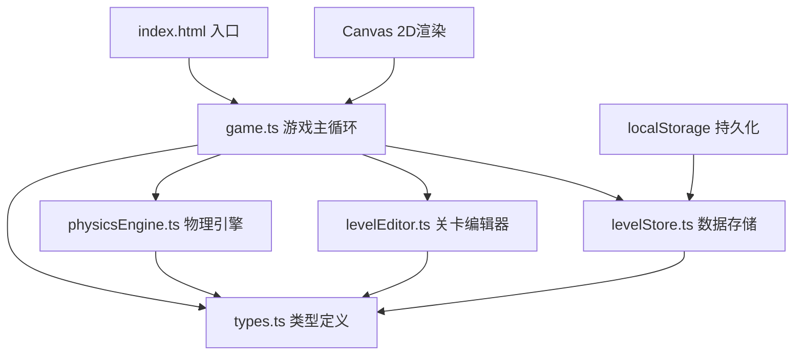

## 1. 架构设计



## 2. 技术描述

- **构建工具**：Vite 5.x
- **语言**：TypeScript 5.x（严格模式）
- **渲染**：Canvas 2D API
- **模块系统**：ESNext
- **包管理**：npm
- **数据持久化**：localStorage
- **唯一ID生成**：uuid

## 3. 文件结构

```
.
├── package.json          # 项目依赖与脚本
├── vite.config.js        # Vite构建配置
├── tsconfig.json         # TypeScript配置
├── index.html            # 入口HTML页面
└── src/
    ├── game.ts           # 游戏主循环、渲染、事件分发
    ├── types.ts          # 类型定义
    ├── engine/
    │   └── physicsEngine.ts  # 物理引擎
    ├── editor/
    │   └── levelEditor.ts    # 关卡编辑器
    └── stores/
        └── levelStore.ts     # 数据存储
```

## 4. 核心模块说明

### 4.1 类型定义 (types.ts)

定义游戏中所有核心数据结构：
- `Ball`：弹球（位置、速度、半径、颜色）
- `Baffle`：挡板（位置、方向、长度、宽度、颜色）
- `Level`：关卡（ID、名称、弹球起点、洞口位置、墙壁列表、挡板列表、最佳成绩）
- `GameState`：游戏状态（当前关卡、是否暂停、是否通关、计时器、弹射次数）

### 4.2 物理引擎 (physicsEngine.ts)

核心功能：
- 重力模拟（重力向量：(0, 0.5)）
- 碰撞检测（圆与矩形、圆与圆）
- 弹性碰撞（恢复系数0.7）
- 摩擦力（每帧速度乘以0.995）
- 120Hz物理更新频率（每帧两次子更新）

### 4.3 关卡编辑器 (levelEditor.ts)

核心功能：
- 网格吸附（40x40px网格）
- 挡板添加（点击空白网格）
- 挡板删除（右键菜单）
- 挡板拖拽（按住移动）
- 方向切换（双击切换水平/垂直）
- 路径校验（确保有解）

### 4.4 数据存储 (levelStore.ts)

核心功能：
- 关卡列表管理
- 当前选中关卡
- localStorage持久化
- 最佳成绩记录
- 5个预设关卡

### 4.5 游戏主循环 (game.ts)

核心功能：
- Canvas渲染（60fps，requestAnimationFrame）
- 帧更新调度（物理更新x2 + 渲染）
- 事件分发（鼠标、键盘、触摸）
- UI渲染（关卡选择栏、统计信息、保存按钮）
- 通关弹窗管理
- 响应式适配

## 5. 性能指标

- 帧率：60fps（requestAnimationFrame）
- 物理更新：120Hz（每帧2次子步长）
- 弹球数量：始终为1
- 挡板上限：50个
- 内存占用：< 100MB
- 拖尾帧数：10帧

## 6. 数据模型

### 6.1 关卡数据结构

```typescript
interface Level {
  id: string;
  name: string;
  ballStart: { x: number; y: number };
  hole: { x: number; y: number; radius: number };
  walls: Baffle[];
  baffles: Baffle[];
  bestTime?: number;
  bestBounces?: number;
}
```

### 6.2 初始数据

5个预设关卡，难度递增：
- 第1关：简单直线下落
- 第2关：需要一次反弹
- 第3关：多次反弹
- 第4关：复杂路径
- 第5关：高难度
