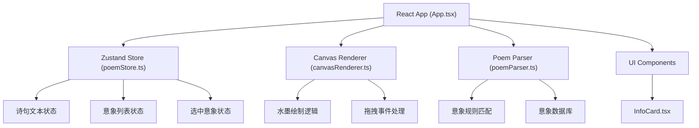

## 1. 架构设计



## 2. 技术说明

- **前端框架**：React 18 + TypeScript
- **构建工具**：Vite（端口3000）
- **状态管理**：Zustand
- **渲染技术**：HTML5 Canvas 2D API
- **样式方案**：原生CSS + CSS变量

## 3. 目录结构

```
d:\Pro\tasks\auto132\
├── index.html
├── package.json
├── tsconfig.json
├── vite.config.js
└── src/
    ├── main.tsx
    ├── components/
    │   ├── App.tsx
    │   └── InfoCard.tsx
    ├── stores/
    │   └── poemStore.ts
    ├── engine/
    │   └── poemParser.ts
    └── renderer/
        └── canvasRenderer.ts
```

## 4. 数据模型

### 4.1 意象对象 (Imagery)

```typescript
interface Imagery {
  id: string;
  name: string;
  color: string;
  shape: 'bamboo' | 'bird' | 'mountain' | 'water' | 'boat' | 'flower' | 'moon' | 'cloud' | 'tree' | 'default';
  position: { x: number; y: number };
  size: number;
  opacity: number;
  meaning: string;
  source: string;
  author: string;
  similarPoems: string[];
}
```

### 4.2 应用状态 (PoemState)

```typescript
interface PoemState {
  poemText: string;
  imageries: Imagery[];
  selectedImageryId: string | null;
  setPoemText: (text: string) => void;
  setImageries: (list: Imagery[]) => void;
  updateImagery: (id: string, updates: Partial<Imagery>) => void;
  selectImagery: (id: string | null) => void;
  clearCanvas: () => void;
}
```

## 5. 核心模块说明

### 5.1 poemParser.ts
- 内置意象关键词数据库（竹、鸟、山、水、船、花、月、云、树等）
- 基于规则匹配和字频统计提取意象
- 每个意象关联默认颜色、形状类型、寓意文本、出处信息和相似诗句

### 5.2 canvasRenderer.ts
- 使用贝塞尔曲线模拟水墨笔触
- 径向渐变实现晕染效果
- 处理鼠标按下、移动、松开事件实现拖拽
- 双击检测触发信息卡片
- requestAnimationFrame实现60FPS动画

### 5.3 poemStore.ts (Zustand)
- 集中管理诗句、意象列表、选中状态
- 提供意象位置、大小、透明度更新函数
- 支持清空画布重置状态
