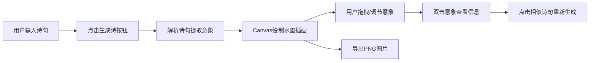

## 1. 产品概述

诗词画境是一款将中国古诗词转化为水墨风格插画的创意工具。用户输入一句古诗词，系统自动解析意象并生成可交互的水墨画卷，支持意象微调与文化探索。

- 核心价值：让古典诗词以可视化的水墨艺术形式呈现，融合文化欣赏与创意交互
- 目标用户：诗词爱好者、学生、设计师、文化创意从业者

## 2. 核心功能

### 2.1 功能模块

1. **诗词输入区**：用户输入古诗词文本
2. **意象解析引擎**：自动识别诗句中的意象元素
3. **水墨画布渲染**：Canvas绘制水墨风格插画
4. **意象调色板**：列注意象并提供参数调节
5. **信息卡片**：展示意象文化内涵与相似诗句
6. **工具栏**：生成、导出、清空操作

### 2.2 页面详情

| 页面名称 | 模块名称 | 功能描述 |
|-----------|-------------|---------------------|
| 主页面 | 诗词输入区 | 高300px文本框，背景#F5F0EB，圆角12px，支持多行输入 |
| 主页面 | 意象调色板 | 宽260px侧栏，每个意象卡片展示颜色预览与位置/大小/透明度滑块 |
| 主页面 | 水墨画布 | 自适应尺寸Canvas，白色渐变背景，可拖拽意象元素，十字定位线，晕染效果 |
| 主页面 | 信息卡片 | 双击意象弹出，展示诗词出处、意象寓意、相似诗句列表 |
| 主页面 | 顶部工具栏 | 生成诗、导出PNG、清空画布三个操作按钮 |

## 3. 核心流程

## 4. 用户界面设计

### 4.1 设计风格

- **主色调**：深棕 #3D2B1F（背景）、米白 #FDFAF5（画布）、暖棕 #8B7355（交互元素）
- **字体**：楷体用于文化文字，系统字体用于UI交互
- **整体风格**：古典雅致，水墨意境，留白充足
- **按钮**：圆角6px，悬停有颜色渐变反馈
- **布局**：桌面端三栏布局（输入区-画布-调色板），移动端上下堆叠

### 4.2 页面设计概览

| 页面名称 | 模块名称 | UI元素 |
|-----------|-------------|-------------|
| 主页面 | 工具栏 | 深色背景，三个按钮水平居中，间距12px |
| 主页面 | 输入区 | 米色背景文本框，古典配色边框 |
| 主页面 | 调色板 | 卡片式意象列表，滑块采用棕色系配色 |
| 主页面 | 画布 | 白色渐变背景，水墨笔触晕染，拖拽时十字线反馈 |
| 主页面 | 信息卡片 | 浮动圆角卡片，阴影柔和，楷体寓意文字 |

### 4.3 响应式设计

- 桌面端（≥768px）：左中右三栏水平布局
- 移动端（<768px）：输入区在上，画布居中，调色板在下
- 画布最小尺寸：宽600px，高500px
- 触控设备优化拖拽体验

### 4.4 动效设计

- 意象移动动画：300ms ease-out 平滑过渡
- 画布生成动画：帧率≥50FPS
- 拖拽响应延迟：≤30ms
- 按钮悬停：背景色平滑过渡
