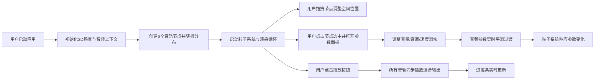

## 1. 产品概述

3D空间音乐混音器是一个交互式音乐可视化应用，让用户在三维空间中直观感受和调整音乐节奏与空间位置关系，解决传统音乐制作软件中多维参数调整不直观、缺乏空间感的问题。

- 主要用途：帮助音乐创作者和爱好者通过可视化方式进行空间音频混音和创意探索
- 解决问题：传统DAW软件参数调整抽象，无法直观感受声音空间定位
- 目标用户：音乐制作人、声音设计师、音乐爱好者

---

## 2. 核心功能

### 2.1 功能模块

1. **3D音轨节点系统**：Six track nodes (guitar, drums, bass, keyboard, vocals, synth) in 3D space
2. **参数调节面板**：Volume, pitch, speed controls with real-time feedback
3. **声波粒子可视化**：Dynamic particle emission based on audio parameters
4. **音频混合播放控制**：Play/pause, progress bar, master volume, play modes
5. **3D场景交互**：Camera rotation, zoom, node dragging

### 2.2 页面详情

| 页面名称 | 模块名称 | 功能描述 |
|---------|---------|---------|
| 主场景 | 3D音轨节点 | 6个可拖拽的球体节点，代表不同乐器音轨，支持XYZ轴空间定位 |
| 主场景 | 声波粒子系统 | 每个节点发射彩色粒子，随音量和位置动态变化 |
| 右侧面板 | 参数控制面板 | 音量、音调、速度滑块，实时数值显示 |
| 底部控制条 | 播放控制区 | 播放/暂停按钮、进度条、总音量、播放模式切换 |
| 左上角 | 性能监控 | FPS计数器和总粒子数显示 |
| 左下角 | 信息提示区 | 悬停显示音轨名称和参数值 |

---

## 3. 核心流程

---

## 4. 用户界面设计

### 4.1 设计风格

- **主色调**：深太空蓝 #0D1117（背景），深紫蓝 #1A1A2E（面板），霓虹紫 #6C63FF（强调色）
- **辅助色**：吉他#F4A261，鼓#E76F51，贝斯#2A9D8F，键盘#E9C46A，人声#F4A261，合成#264653
- **按钮风格**：圆形播放按钮，圆角8px功能按钮，悬停变亮10%，点击缩小5px
- **字体**：无衬线等宽字体，12px性能监控，14px参数标签
- **布局**：全屏3D场景，右侧固定参数面板，底部固定控制条
- **动画**：所有过渡0.3s ease-out，按钮悬停/点击反馈

### 4.2 页面设计概述

| 页面名称 | 模块名称 | UI元素 |
|---------|---------|---------|
| 主场景 | 3D空间 | 深色背景#0D1117，半透明网格地面，节点球体+光晕，粒子流 |
| 主场景 | 相机控制 | 右键拖拽旋转，滚轮缩放（10-300单位），初始位置(0,50,100)俯视 |
| 右侧面板 | 参数面板 | 宽280px，背景#1A1A2E半透明，圆角12px，渐变滑块 |
| 底部控制条 | 播放控制 | 全宽60px高，#0D1117背景，1px顶部分割线，圆形播放按钮 |
| 左上角 | 性能监控 | 白色12px字体，FPS + 粒子计数 |
| 左下角 | 信息提示 | 200x40px，#1A1A2E半透明，圆角8px |

### 4.3 响应性

- 桌面端优先设计，全屏布局
- 参数面板固定右侧280px，控制条固定底部60px
- 3D场景自适应窗口大小
- 不支持移动端触控操作

### 4.4 3D场景指导

- **环境**：纯深色背景，营造太空/工作室氛围，无HDRI
- **光照**：环境光+方向光，确保节点颜色准确呈现，光晕自发光效果
- **相机**：PerspectiveCamera，初始位置(0,50,100)，俯视角度，OrbitControls
- **构图**：节点分布在±200单位空间内，地面网格提供空间参考
- **交互**：Raycaster进行节点拾取，拖拽时Z轴深度感知
- **后处理**：节点光晕使用Bloom效果，粒子淡出使用透明度动画
- **性能**：粒子上限500，超过时降低生成速率，目标30FPS+

---

## 5. 性能要求

- 目标帧率：30FPS以上
- 粒子总数上限：500个
- 性能降级策略：粒子数>500时，生成速率从10/秒降至5/秒
- 音频响应延迟：音量变化0.3s平滑过渡，音调变化实时响应
