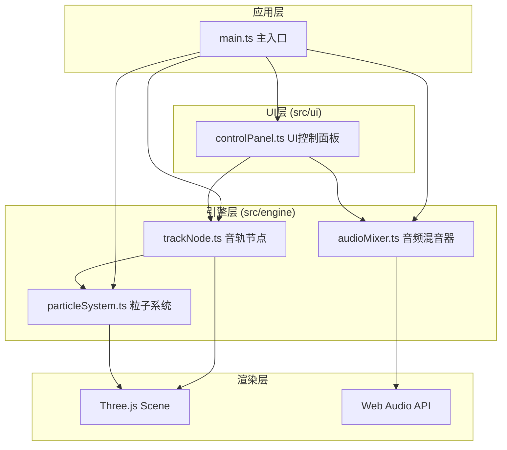

## 1. 架构设计



---

## 2. 技术描述

- **前端框架**：纯 TypeScript（无React/Vue框架），直接操作DOM和Three.js
- **构建工具**：Vite 5.x
- **3D引擎**：Three.js 0.160.x + @types/three
- **音频处理**：Web Audio API（浏览器原生）
- **辅助库**：uuid（生成唯一ID）
- **样式**：原生CSS（通过style标签或CSS文件）

**设计决策说明**：
用户明确指定了文件结构和技术栈（TypeScript + Three.js + Vite），不使用React/Vue等前端框架，采用模块化架构分离3D引擎、音频引擎和UI控制。

---

## 3. 目录结构

```
auto134/
├── .trae/documents/
│   ├── PRD.md
│   └── technical-architecture.md
├── src/
│   ├── engine/
│   │   ├── trackNode.ts       # 音轨节点类
│   │   ├── audioMixer.ts      # 音频混音器
│   │   └── particleSystem.ts  # 粒子系统
│   ├── ui/
│   │   └── controlPanel.ts    # UI控制面板
│   └── main.ts                # 主入口
├── index.html
├── package.json
├── vite.config.js
└── tsconfig.json
```

---

## 4. 模块职责定义

### 4.1 main.ts (主入口)
- 初始化Three.js场景、相机、渲染器
- 设置灯光（环境光+方向光）
- 初始化AudioContext音频上下文
- 创建OrbitControls相机控制
- 创建6个TrackNode实例
- 初始化AudioMixer和ParticleSystem
- 绑定UI事件（参数面板、播放控制）
- 管理主渲染循环（requestAnimationFrame）
- 更新FPS计数器和粒子总数显示

### 4.2 trackNode.ts (音轨节点)
- 属性：position (Vector3)、volume (0-100)、pitch (-5~+5)、speed (0.5-2.0)、name、color
- 创建THREE.Mesh球体（半径50px）
- 创建半透明光晕效果（Sprite或放大的半透明球体）
- 支持鼠标拖拽移动（限制在±200单位范围）
- 节点大小随音量动态缩放（半径40-70px）
- 粒子发射源，根据音量生成粒子
- 被选中时高亮显示

### 4.3 audioMixer.ts (音频混音器)
- 管理6个音轨的AudioBuffer（使用Web Audio API生成合成音频）
- 每个音轨独立的GainNode（音量控制）
- 每个音轨独立的PlaybackRate（速度控制）
- 音调调整通过detune参数实现（100 cents = 1半音）
- 主音量控制（Master Gain）
- 平滑过渡：音量变化使用linearRampToValueAtTime（0.3s）
- 播放控制：play/pause/stop/seek
- 三种播放模式：循环/单曲/随机
- 进度跟踪与事件回调

### 4.4 particleSystem.ts (粒子系统)
- 管理所有粒子的生命周期
- 粒子为PlaneGeometry（4x4px正方形）
- 粒子属性：position、velocity、color、life、opacity
- 粒子从节点表面随机方向发射（速度2-8px/帧）
- 粒子数量上限：每节点200，总数500
- 粒子3秒后淡出消失
- 粒子密度受空间位置影响（靠近中心更密集）
- 性能优化：粒子数>500时降低生成速率

### 4.5 controlPanel.ts (UI控制面板)
- 创建右侧参数面板（280px宽）
- 创建底部播放控制条（60px高）
- 创建左上角FPS/粒子计数显示
- 创建左下角信息提示区
- 音量滑块（0-100，默认60）
- 音调滑块（-5~+5，默认0）
- 速度滑块（0.5-2.0，默认1.0）
- 播放/暂停按钮、进度条、总音量
- 播放模式切换按钮
- 所有UI元素绑定事件到引擎层
- 悬停/点击动画反馈

---

## 5. 核心数据结构

### 5.1 TrackType 枚举
```typescript
enum TrackType {
  GUITAR = 'guitar',
  DRUMS = 'drums',
  BASS = 'bass',
  KEYBOARD = 'keyboard',
  VOCALS = 'vocals',
  SYNTH = 'synth'
}
```

### 5.2 TrackConfig 接口
```typescript
interface TrackConfig {
  type: TrackType;
  name: string;
  color: string;
  defaultPosition: { x: number; y: number; z: number };
}
```

### 5.3 Particle 接口
```typescript
interface Particle {
  id: string;
  mesh: THREE.Mesh;
  velocity: THREE.Vector3;
  life: number;      // 剩余生命（秒）
  maxLife: number;   // 总生命（3秒）
  trackId: string;
}
```

### 5.4 PlayMode 枚举
```typescript
enum PlayMode {
  LOOP = 'loop',
  SINGLE = 'single',
  SHUFFLE = 'shuffle'
}
```

---

## 6. 音频合成方案

由于无法加载外部音频文件，使用Web Audio API生成合成音频：

- **吉他**：OscillatorNode + 三角波 + 快速ADSR包络
- **鼓**：噪声生成器 + 低通滤波 + 快速衰减
- **贝斯**：OscillatorNode + 锯齿波 + 低八度
- **键盘**：OscillatorNode + 正弦波 + 和弦
- **人声**：OscillatorNode + 脉冲波 + 颤音
- **合成**：OscillatorNode + 方波 + 高通滤波

每种音轨生成8秒循环音频片段，使用不同的音阶和节奏模式。

---

## 7. 性能优化策略

1. **对象池**：粒子使用对象池复用，避免频繁创建销毁
2. **帧率控制**：目标60FPS，最低保持30FPS
3. **粒子限流**：总数>500时生成速率减半
4. **网格合并**：粒子使用InstancedMesh（如性能需要）
5. **音频节流**：参数变化防抖，避免频繁音频API调用
6. **Raycaster优化**：仅在鼠标事件时进行拾取检测

---

## 8. 构建配置

### vite.config.js
```javascript
export default {
  root: '.',
  server: {
    port: 5173,
    open: true
  },
  build: {
    outDir: 'dist',
    target: 'esnext'
  }
}
```

### tsconfig.json
```json
{
  "compilerOptions": {
    "target": "ES2020",
    "module": "ESNext",
    "strict": true,
    "moduleResolution": "node",
    "esModuleInterop": true,
    "skipLibCheck": true,
    "forceConsistentCasingInFileNames": true
  },
  "include": ["src/**/*"]
}
```
