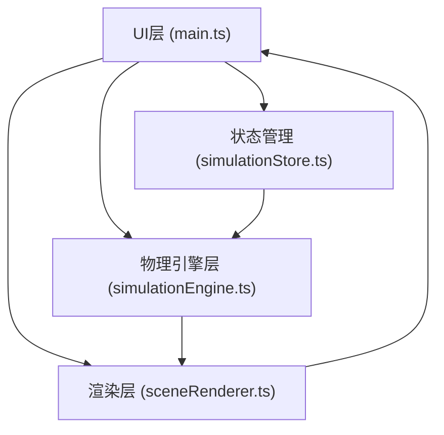

## 1. 架构设计



```mermaid
graph TD
    subgraph "应用入口"
        M["main.ts<br/>(场景初始化、动画循环、UI挂载)
    end
    
    subgraph "状态管理层"
        S["simulationStore.ts<br/>(Zustand状态管理)"]
    end
    
    subgraph "物理引擎层"
        E["simulationEngine.ts<br/>(LJ势能计算、粒子积分器)"]
    end
    
    subgraph "渲染层"
        R["sceneRenderer.ts<br/>(Three.js场景、粒子渲染、特效)"]
    end
    
    subgraph "用户交互层"
        UI["ControlPanel<br/>(参数控制面板)"]
        PERF["PerformanceMonitor<br/>(FPS监控)"]
    end
    
    M --> S
    M --> R
    M --> E
    S --> E
    E --> R
    UI --> S
    PERF --> R
```

## 2. 技术描述

- **前端框架**：原生 TypeScript + Three.js
- **构建工具**：Vite + @vitejs/plugin-basic
- **状态管理**：Zustand
- **3D渲染**：Three.js (WebGLRenderer)
- **相机控制**：Three.js OrbitControls
- **唯一标识**：uuid

## 3. 核心模块说明

### 3.1 项目结构
```
src/
├── main.ts                      # 应用入口
├── engine/
│   └── simulationEngine.ts    # 物理引擎模块
├── renderer/
│   └── sceneRenderer.ts      # 渲染模块
├── stores/
│   └── simulationStore.ts    # Zustand状态管理
└── types/
    └── index.ts           # 类型定义
```

### 3.2 核心数据结构

```typescript
interface Particle {
  id: string;
  position: THREE.Vector3;
  velocity: THREE.Vector3;
  color: string;
}

interface SimulationParams {
  particleCount: number;
  temperature: number;
  gravityCoeff: number;
  repulsionCoeff: number;
  isRunning: boolean;
}

interface RenderMode {
  mode: 'sphere' | 'points';
  showBonds: boolean;
  showTrails: boolean;
}
```

### 3.3 物理引擎核心算法

**Lennard-Jones 势能公式：**
```
V(r) = 4ε[(σ/r)^12 - (σ/r)^6]
其中：
- ε = 1.0 (势阱深度)
- σ = 1.5 (粒子直径)
- r = 粒子间距
```

**欧拉积分器：**
```
a(t) = F(t) / m
v(t+Δt) = v(t) + a(t) * Δt
x(t+Δt) = x(t) + v(t+Δt) * Δt
```

## 4. 性能优化策略

| 条件 | 措施 |
|------|------|
| FPS < 30 | 降级为 PointsMaterial 点渲染，关闭连接线 |
| FPS > 45 | 恢复 SphereGeometry 球体渲染，开启连接线 |
| 粒子数 > 200 | 关闭粒子拖尾效果 |
| 粒子数 > 300 | 限制连接线最大显示50条 |
