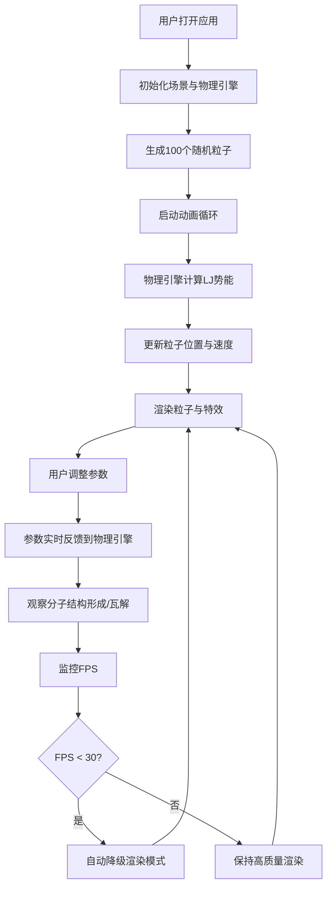

## 1. 产品概述

分子动力学模拟沙盒是一款基于WebGL的3D交互可视化应用，让用户在三维空间中观察并操控多个原子粒子的运动。通过调整温度、引力和斥力参数，实时观察分子结构的形成与瓦解过程。

- 面向对分子动力学、物理模拟感兴趣的学习者和科研人员
- 提供直观的可视化交互体验，将抽象的物理概念可视化
- 教育价值：帮助理解分子间作用力、温度对分子运动的影响

## 2. 核心功能

### 2.1 用户角色
| 角色 | 注册方式 | 核心权限 |
|------|----------|---------|
| 普通用户 | 无需注册 | 完整使用所有模拟功能，调整参数，观察模拟运行 |

### 2.2 功能模块
1. **3D粒子模拟场景：实时物理引擎驱动的粒子运动可视化
2. **参数控制面板：温度、引力、斥力、粒子数量调节
3. **物理引擎：Lennard-Jones势能计算，粒子间作用力模拟
4. **性能监控：FPS实时监控与自动降级机制
5. **可视化增强：粒子拖尾、分子键连接线、自发光效果

### 2.3 页面详情
| 页面名称 | 模块名称 | 功能描述 |
|-----------|----------|-------------|
| 主界面 | 3D场景渲染 | 渲染粒子运动、网格地面、边界球体、相机控制 |
| 主界面 | 控制面板 | 参数滑块控制、重置按钮、参数实时显示 |
| 主界面 | 性能监控 | FPS显示、粒子数量显示、自动降级机制 |

## 3. 核心流程

## 4. 用户界面设计

### 4.1 设计风格
- **主色调**：深蓝黑 (#0B0B1A)、紫色 (#6C63FF)
- **辅助色**：青绿 (#4ECDC4)、暖红 (#FF6B6B)
- **粒子调色板**：#FF6B6B, #4ECDC4, #45B7D1, #96CEB4, #FFEAA7
- **字体**：monospace 等宽字体
- **控制面板**：半透明磨砂玻璃效果，圆角设计
- **整体风格**：深色科幻风格，HUD科技感

### 4.2 页面设计概述
| 页面名称 | 模块名称 | UI元素 |
|-----------|----------|--------|
| 主界面 | 3D场景 | 深色背景、网格地面、半透明边界球体、可旋转相机 |
| 主界面 | 控制面板 | 左上角浮动面板，滑块控件，重置按钮，平滑过渡动画 |
| 主界面 | 性能监控 | 右上角绿色荧光字体，半透明背景 |
| 主界面 | 粒子系统 | 彩色发光球体，运动拖尾，分子键连接线 |

### 4.3 响应式
- 桌面端优先设计
- 全屏3D画布自适应窗口大小
- 控制面板固定定位，不随窗口大小影响3D场景
- 触控设备支持触摸旋转缩放

### 4.4 3D场景设计
- **环境**：纯深色背景，无HDRI，营造深空感
- **光照**：环境光 + 方向光，粒子自发光
- **相机**：PerspectiveCamera，初始位置(15,12,15)，OrbitControls控制
- **交互**：鼠标拖拽旋转，滚轮缩放，阻尼效果
- **特效**：粒子拖尾（LineSegments）、分子键连接线、自发光材质
- **性能**：动态LOD，FPS低于30自动降级为点渲染
