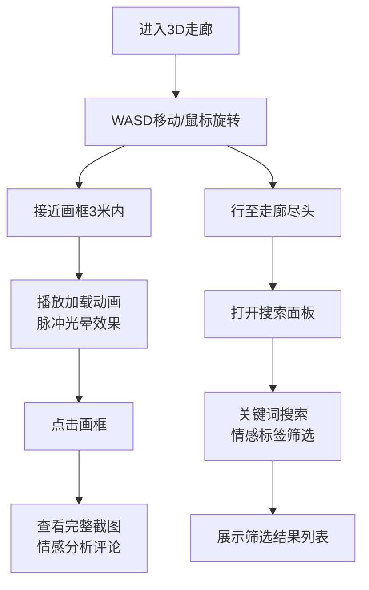

## 1. 产品概述

网页记忆回廊是一个沉浸式3D网页浏览体验应用，用户可以在虚拟走廊中漫步，浏览按时间顺序排列的网页快照，每个快照如画作般悬挂于墙面。

- 核心价值：将网页浏览历史转化为可探索的3D记忆空间，结合情感分析为每个网页赋予独特的情感标签和智能评论
- 目标用户：希望以创新方式回顾和探索网页浏览历史的用户

## 2. 核心功能

### 2.1 用户角色

| 角色 | 注册方式 | 核心权限 |
|------|----------|----------|
| 普通用户 | 无需注册 | 浏览3D走廊、查看快照详情、使用搜索筛选功能 |

### 2.2 功能模块

1. **3D走廊场景**：Three.js构建的沉浸式走廊，包含画框、环境光、地面网格
2. **快照画框系统**：网页快照展示、加载动画、脉冲光晕效果、点击交互
3. **情感分析引擎**：基于关键词映射的情感分类、强度计算、智能评论生成
4. **搜索筛选面板**：关键词搜索、情感标签筛选、结果列表展示
5. **第一人称控制系统**：WASD移动、鼠标视角旋转、碰撞检测

### 2.3 页面详情

| 页面名称 | 模块名称 | 功能描述 |
|----------|----------|----------|
| 主场景 | 3D走廊渲染 | Three.js场景初始化、相机控制、画框生成与动画 |
| 主场景 | 第一人称控制 | WASD移动（2单位/秒）、鼠标拖动旋转（灵敏度0.002） |
| 主场景 | 画框交互 | 接近3米内播放加载动画、脉冲光晕、点击查看详情 |
| 搜索面板 | 搜索输入 | 关键词搜索快照、聚焦发光效果 |
| 搜索面板 | 标签筛选 | positive/negative/neutral三态筛选按钮、平滑过渡 |
| 搜索面板 | 结果列表 | 缩略图+标题+标签徽章展示 |
| 情感引擎 | 情感分析 | 接收标题和描述，返回标签、强度、评论 |

## 3. 核心流程

用户进入应用后，默认位于走廊入口（位置0,1.6,5）。通过WASD在走廊中移动，鼠标控制视角方向。当接近画框3米范围内时，画框自动播放网页加载动画（进度条、元素渐显）并发出脉冲光晕。点击画框可查看完整截图和情感分析评论。行至走廊尽头可使用搜索面板，按关键词或情感标签筛选快照。

## 4. 用户界面设计

### 4.1 设计风格

- **主题**：暗黑科幻风，赛博朋克氛围
- **主背景**：#0A0A14（深空黑）
- **走廊墙壁**：#1A1A2E（暗紫蓝）
- **地面网格**：#2A2A40（半透明网格线）
- **点缀色**：霓虹蓝 #6C63FF（用于所有交互元素高亮）
- **字体**：现代无衬线字体，标题使用显示字体增强未来感
- **动效**：平滑过渡（0.3s ease）、脉冲光晕、渐显动画

### 4.2 页面设计概述

| 页面名称 | 模块名称 | UI元素 |
|----------|----------|--------|
| 主场景 | 3D走廊 | 两侧墙壁每隔2.5米挂画框（宽2高1.5）、地面半透明网格、环境光随位置渐变（3000K→4000K） |
| 主场景 | 画框 | 白色边框、截图纹理、接近时播放1.5秒加载动画、rgba(108,99,255,0.3)脉冲光晕 |
| 搜索面板 | 浮动面板 | 半透明背景rgba(20,20,30,0.85)、圆角16px、宽400px高500px、距地面1.2米 |
| 搜索面板 | 输入框 | 宽100%高48px、背景#2D2D44、边框1px solid #6C63FF、圆角8px、聚焦时box-shadow 0 0 12px rgba(108,99,255,0.6) |
| 搜索面板 | 标签按钮 | 宽120px高40px、背景#3A3A50、选中时#6C63FF、圆角20px、14px白色文字、transition 0.3s ease |
| 搜索面板 | 结果列表 | 每个条目高80px、缩略图60x60px圆角8px、标题、标签徽章 |

### 4.3 响应式

- 桌面端优先，Canvas占满视口
- 移动端支持触摸手势控制视角
- 搜索面板在小屏幕上自适应宽度

### 4.4 3D场景指导

- **环境**：暗黑走廊，两侧无限延伸的墙壁，地面半透明网格线营造科技感
- **光照**：环境光+定向光，色温随用户位置从冷白3000K过渡到暖白4000K（靠近搜索面板时）
- **相机**：第一人称视角，初始位置(0,1.6,5)，视野75度
- **画框**：每隔2.5米一个，宽2高1.5，悬浮于墙面，带有微妙的阴影
- **动画**：加载动画1.5秒内完成（进度条从0到100%、元素从上到下渐显）、脉冲光晕缓慢呼吸
- **性能**：requestAnimationFrame控制渲染循环，20个画框同时加载维持60fps
