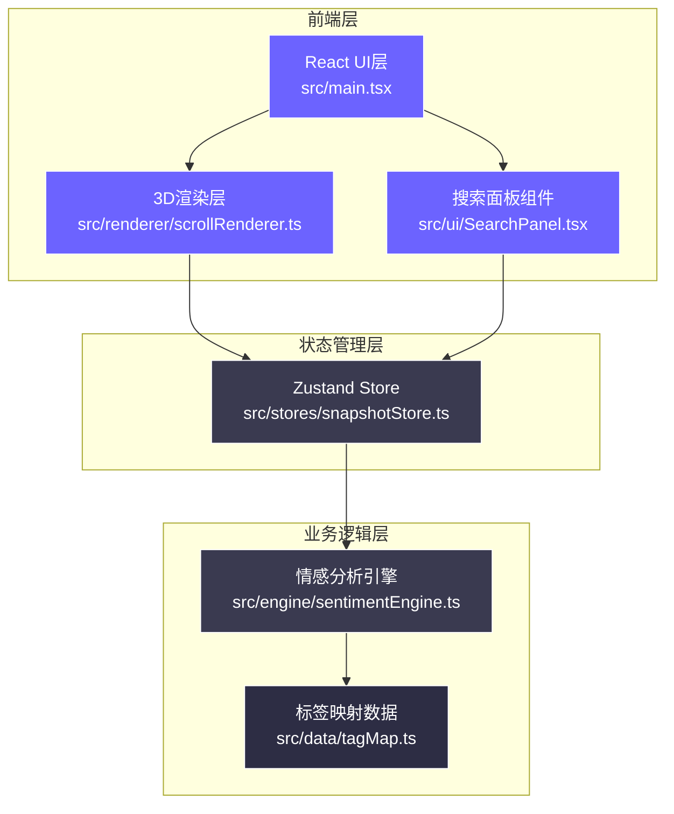
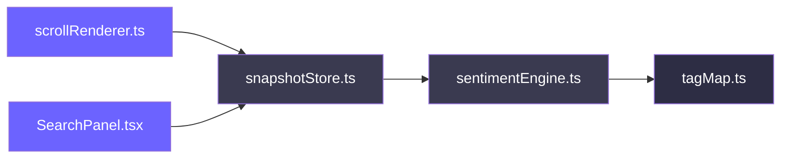
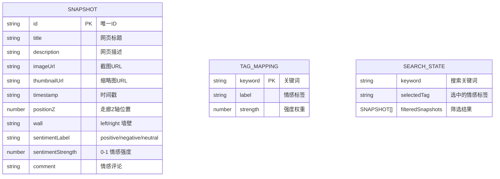

## 1. 架构设计



## 2. 技术描述

- **前端框架**：React 18 + TypeScript
- **3D引擎**：Three.js 最新版
- **状态管理**：Zustand 4.x
- **构建工具**：Vite 5.x + @vitejs/plugin-react
- **类型定义**：@types/three
- **工具库**：uuid（生成唯一ID）
- **无后端**：所有数据为Mock数据，情感分析在前端完成

## 3. 目录结构

```
auto137/
├── index.html                    # 入口HTML
├── package.json                  # 依赖配置
├── vite.config.ts                # Vite配置
├── tsconfig.json                 # TypeScript配置
└── src/
    ├── main.tsx                  # React入口
    ├── renderer/
    │   └── scrollRenderer.ts     # Three.js场景渲染器
    ├── stores/
    │   └── snapshotStore.ts      # Zustand全局状态
    ├── engine/
    │   └── sentimentEngine.ts    # 情感分析引擎
    ├── data/
    │   └── tagMap.ts             # 关键词-标签映射
    ├── ui/
    │   └── SearchPanel.tsx       # 搜索面板组件
    └── types/                    # 类型定义（可选）
```

## 4. 调用链



## 5. 数据模型

### 5.1 数据结构定义



### 5.2 TypeScript类型定义

```typescript
// Snapshot 类型
interface Snapshot {
  id: string;
  title: string;
  description: string;
  imageUrl: string;
  thumbnailUrl: string;
  timestamp: string;
  positionZ: number;
  wall: 'left' | 'right';
  sentimentLabel: 'positive' | 'negative' | 'neutral';
  sentimentStrength: number;
  comment: string;
}

// 情感分析结果
interface SentimentResult {
  label: 'positive' | 'negative' | 'neutral';
  strength: number;
  comment: string;
}

// 标签映射
interface TagMapping {
  label: 'positive' | 'negative' | 'neutral';
  strength: number;
}

// Store状态
interface SnapshotState {
  snapshots: Snapshot[];
  searchKeyword: string;
  selectedTag: 'positive' | 'negative' | 'neutral' | null;
  addSnapshot: (snapshot: Omit<Snapshot, 'id' | 'sentimentLabel' | 'sentimentStrength' | 'comment'>) => void;
  filterSnapshots: () => Snapshot[];
  setSearchKeyword: (keyword: string) => void;
  setSelectedTag: (tag: 'positive' | 'negative' | 'neutral' | null) => void;
}
```

## 6. 核心模块说明

### 6.1 scrollRenderer.ts
- 负责Three.js场景初始化、相机控制、画框生成
- 处理WASD移动（速度2单位/秒）、鼠标旋转（灵敏度0.002）
- 检测用户与画框距离，3米内触发加载动画
- 管理加载动画（1.5秒）和脉冲光晕效果
- 环境光色温随位置渐变（3000K→4000K）
- 使用requestAnimationFrame维持60fps

### 6.2 snapshotStore.ts
- Zustand全局状态管理
- 存储快照列表、搜索关键词、选中标签
- addSnapshot方法：添加新快照并调用情感分析
- filterSnapshots方法：根据关键词和标签筛选
- 初始化Mock数据（20个快照）

### 6.3 sentimentEngine.ts
- analyze(title: string, description: string): SentimentResult
- 基于tagMap.ts的关键词匹配
- 计算情感标签和强度
- 生成风格化评论（科技类冷峻短句，生活类温暖长文）
- 评论长度≤80字

### 6.4 tagMap.ts
- 导出Record<string, TagMapping>
- 至少15个关键词映射
- 覆盖科技、生活、娱乐、新闻等领域

### 6.5 SearchPanel.tsx
- React组件，半透明浮动面板
- 搜索输入框（聚焦发光效果）
- 三个标签筛选按钮（平滑过渡动画）
- 结果列表（缩略图+标题+标签徽章）
- 通过snapshotStore连接状态和操作
