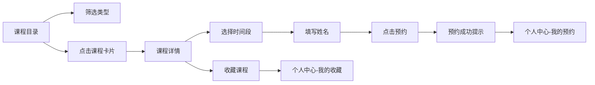

## 1. 产品概述

在线手工坊课程预约与作品展示平台，为手工艺爱好者提供陶艺、皮具、木工等课程的浏览、预约与作品展示服务，用户可在个人中心管理预约记录和收藏课程。

- 目标用户：手工艺爱好者、想体验手工制作的普通用户
- 产品价值：连接手工坊与用户，简化课程预约流程，展示精美手工作品

## 2. 核心功能

### 2.1 用户角色
| 角色 | 注册方式 | 核心权限 |
|------|----------|----------|
| 普通用户 | 无需注册（本地模拟） | 浏览课程、预约课程、管理预约、收藏课程 |

### 2.2 功能模块
1. **课程目录页**：类型筛选、课程卡片展示、网格布局
2. **课程详情页**：课程大图、课程信息、简介、作品展示、预约表单
3. **个人中心页**：我的预约列表、我的收藏列表、Tab切换

### 2.3 页面详情
| 页面名称 | 模块名称 | 功能描述 |
|----------|----------|----------|
| 课程目录页 | 类型筛选区 | 四个筛选按钮（全部、陶艺、皮具、木工），点击切换筛选类型 |
| 课程目录页 | 课程卡片网格 | CSS Grid自适应布局，卡片展示缩略图、名称、类型标签、导师、价格 |
| 课程详情页 | 顶部信息区 | 大图展示、课程名称、类型标签、导师、价格、时长 |
| 课程详情页 | 作品展示区 | flex-wrap布局展示缩略图，点击弹窗放大查看 |
| 课程详情页 | 预约表单 | 时间选择下拉框、姓名输入框、预约按钮，成功后弹层提示 |
| 个人中心页 | 我的预约Tab | 列表展示预约课程、时间段、状态标签、取消预约按钮 |
| 个人中心页 | 我的收藏Tab | 展示收藏课程卡片，点击跳转详情 |
| 全局导航 | 导航栏 | 固定顶部，Logo、首页链接、我的链接，当前页下划线标识 |

## 3. 核心流程

用户浏览课程目录 → 按类型筛选课程 → 点击课程卡片查看详情 → 选择时间段并填写姓名 → 提交预约 → 收到预约成功提示 → 跳转个人中心查看预约记录

用户浏览课程 → 点击收藏 → 进入个人中心"我的收藏"查看 → 点击收藏卡片跳转详情

## 4. 用户界面设计

### 4.1 设计风格
- **主色调**：#5B9279（草绿）、#DDB892（陶土色）、#F5F0EB（米白背景）
- **辅助色**：#E76F51（价格红）、#F5A623（已预约标签）、#E74C3C（取消按钮红）
- **文字色**：#2D3436（深灰标题）、#636E72（中灰正文）
- **按钮风格**：圆角8px，主按钮背景#5B9279，hover变#4A7A63
- **字体**：系统默认无衬线（-apple-system, BlinkMacSystemFont, sans-serif）
- **布局风格**：卡片式布局，圆角8-12px，柔和阴影（0 2px 8px rgba(0,0,0,0.08)）
- **图标风格**：简约线性风格

### 4.2 页面设计概述
| 页面名称 | 模块名称 | UI元素 |
|----------|----------|----------|
| 课程目录页 | 类型筛选区 | 圆角20px胶囊按钮，选中态#5B9279白字，未选中态#F0F0F0深灰字 |
| 课程目录页 | 课程卡片 | 宽280px，白背景，圆角8px，阴影；hover上移8px，阴影加深 |
| 课程详情页 | 顶部信息 | 大图600x300px圆角8px；名称24px加粗；价格#E76F51 |
| 课程详情页 | 作品展示 | 缩略图120x120px，间距8px，圆角4px，hover放大1.1倍 |
| 课程详情页 | 预约按钮 | 背景#5B9279，宽200px高48px，圆角8px |
| 个人中心页 | Tab切换 | 下划线指示，高3px，颜色#5B9279，过渡0.2s |
| 个人中心页 | 状态标签 | 圆角12px，已预约#F5A623，已完成#5B9279 |
| 全局 | 导航栏 | 高60px，白背景，下阴影，Logo 24px加粗#5B9279 |

### 4.3 响应式设计
- **桌面端（≥768px）**：课程卡片网格自适应多列，筛选区垂直排列，大图600px宽
- **移动端（<768px）**：筛选区横向滑动，卡片1-2列，大图100%宽度，作品缩略图每行3-4个
- **最小宽度**：320px下无溢出或错位
- **导航栏响应式**：移动端Logo字号缩小至18px，链接间距缩小为12px

### 4.4 动画与交互
- 页面切换：淡入淡出（opacity 0→1，0.3s）
- 卡片hover：translateY(-8px)，阴影加深（0.3s ease-out）
- 按钮点击：scale(0.95)，0.1s过渡
- 预约成功弹层：从顶部滑入（translateY(-100%)→0，0.4s cubic-bezier）
- 作品图片hover：scale(1.1)，0.3s过渡
- 取消预约：半透明遮罩模态框确认
