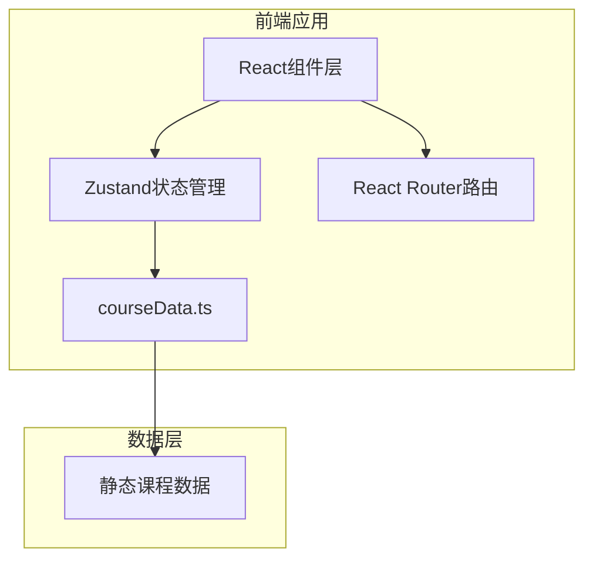

## 1. 架构设计



## 2. 技术描述
- **前端框架**：React 18 + TypeScript
- **构建工具**：Vite
- **状态管理**：Zustand
- **路由**：React Router DOM
- **数据**：本地静态数据模块（courseData.ts）
- **样式**：原生CSS（组件内样式）
- **唯一ID**：uuid

## 3. 路由定义
| 路由 | 页面 | 说明 |
|------|------|------|
| / | 课程目录 | 课程列表展示与类型筛选 |
| /course/:id | 课程详情 | 课程完整信息、作品展示、预约表单 |
| /profile | 个人中心 | 我的预约与我的收藏管理 |

## 4. 数据模型

### 4.1 数据类型定义

```typescript
// 课程类型
type CourseType = '陶艺' | '皮具' | '木工';

// 课程数据
interface Course {
  id: string;
  name: string;
  type: CourseType;
  teacher: string;
  duration: string;
  price: number;
  description: string;
  thumbnail: string;
  coverImage: string;
  works: string[];
  availableTimes: string[];
}

// 预约记录
interface Appointment {
  id: string;
  courseId: string;
  time: string;
  name: string;
  status: '已预约' | '已完成';
  createdAt: number;
}

// 应用状态
interface AppState {
  filterType: '全部' | CourseType;
  favoriteIds: string[];
  appointments: Appointment[];
  setFilterType: (type: AppState['filterType']) => void;
  toggleFavorite: (courseId: string) => void;
  addAppointment: (appointment: Omit<Appointment, 'id' | 'status' | 'createdAt'>) => void;
  removeAppointment: (appointmentId: string) => void;
}
```

### 4.2 课程数据模块
- **文件位置**：`src/data/courseData.ts`
- **导出内容**：
  - `catalog: Course[]` — 全量课程数据
  - `getCourseById: (id: string) => Course | undefined` — 根据ID获取课程

### 4.3 状态管理
- **文件位置**：`src/stores/appStore.ts`
- **状态**：
  - `filterType`：当前筛选类型
  - `favoriteIds`：用户收藏的课程ID数组
  - `appointments`：预约记录列表
- **动作**：
  - `setFilterType(type)`：设置筛选类型
  - `toggleFavorite(courseId)`：切换收藏状态
  - `addAppointment({ courseId, time, name })`：新增预约
  - `removeAppointment(appointmentId)`：取消预约

## 5. 项目文件结构

```
auto138/
├── package.json
├── vite.config.js
├── tsconfig.json
├── index.html
└── src/
    ├── main.tsx              # 应用入口
    ├── App.tsx               # 根组件（路由+导航+页面过渡）
    ├── data/
    │   └── courseData.ts     # 课程静态数据
    ├── stores/
    │   └── appStore.ts       # Zustand全局状态
    ├── components/
    │   ├── Navbar.tsx        # 导航栏组件
    │   ├── CourseCatalog.tsx # 课程目录
    │   ├── CourseCard.tsx    # 课程卡片（可复用）
    │   ├── CourseDetail.tsx  # 课程详情
    │   ├── UserProfile.tsx   # 个人中心
    │   ├── AppointmentList.tsx   # 预约列表
    │   ├── FavoriteList.tsx      # 收藏列表
    │   ├── ImageModal.tsx        # 图片放大弹窗
    │   ├── ConfirmModal.tsx      # 确认弹窗
    │   └── Toast.tsx             # 提示消息
    └── styles/
        └── global.css        # 全局样式与CSS变量
```

## 6. 组件层级与数据流

```
App (路由容器)
├── Navbar (导航栏)
├── 页面容器 (过渡动画)
│   ├── CourseCatalog (/)
│   │   ├── 筛选按钮组
│   │   └── CourseCard[]
│   ├── CourseDetail (/course/:id)
│   │   ├── 课程信息展示
│   │   ├── 作品展示区 (ImageModal)
│   │   └── 预约表单 (Toast)
│   └── UserProfile (/profile)
│       ├── Tab切换
│       ├── AppointmentList (ConfirmModal)
│       └── FavoriteList → CourseCard[]
└── Toast (全局提示)
```

- 数据流：Zustand store → 组件props → 子组件
- 状态更新：用户交互 → 组件调用store action → store更新 → 订阅组件重渲染
