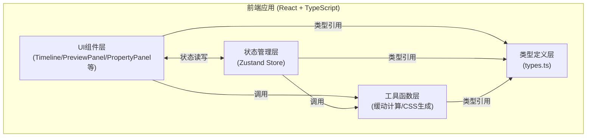

## 1. 架构设计



## 2. 技术栈说明

- **前端框架**：React@18 + TypeScript
- **构建工具**：Vite@5 + @vitejs/plugin-react
- **状态管理**：Zustand@4
- **唯一标识**：uuid@9
- **样式方案**：原生CSS（CSS变量 + BEM命名规范）
- **字体**：Fira Code（代码展示）、系统默认UI字体

## 3. 文件组织结构

| 文件路径 | 职责说明 |
|-----------|-------------|
| `package.json` | 项目依赖与脚本配置 |
| `vite.config.js` | Vite构建配置（React插件） |
| `tsconfig.json` | TypeScript编译配置（严格模式+JSX preserve） |
| `index.html` | 应用入口页面，标题"CSS动画编辑器" |
| `src/main.tsx` | React应用挂载入口 |
| `src/App.tsx` | 主应用组件，布局整合与全局样式 |
| `src/types.ts` | 类型定义：AnimationTimeline/KeyframeNode/AnimatableElement等接口 |
| `src/stores/animationStore.ts` | Zustand Store：时间轴、关键帧、元素、播放状态管理 |
| `src/utils/easing.ts` | 缓动函数计算工具（贝塞尔曲线插值） |
| `src/utils/cssGenerator.ts` | CSS @keyframes代码生成工具 |
| `src/components/Timeline.tsx` | 时间轴组件：刻度、关键帧节点、缓动曲线、拖拽交互 |
| `src/components/PreviewPanel.tsx` | 实时预览组件：动画目标元素渲染、播放控制 |
| `src/components/PropertyPanel.tsx` | 属性编辑面板：CSS属性输入控件、添加属性 |
| `src/components/ElementList.tsx` | 元素管理列表：添加/切换元素 |
| `src/components/ExportModal.tsx` | 导出模态框：代码展示、复制功能 |
| `src/styles/globals.css` | 全局样式与CSS变量定义 |

## 4. 数据模型

### 4.1 核心类型定义

```typescript
// 动画元素
interface AnimatableElement {
  id: string;
  name: string;
  color: string;
  initialStyles: CSSProperties;
}

// CSS属性键值对
type PropertyValue = string | number;
interface PropertyMap {
  [propertyPath: string]: PropertyValue;
}

// 贝塞尔缓动控制点
interface BezierControlPoints {
  x1: number; y1: number;
  x2: number; y2: number;
}

// 关键帧节点
interface KeyframeNode {
  id: string;
  elementId: string;
  time: number;        // 毫秒
  properties: PropertyMap;
  easing: BezierControlPoints; // 到下一个关键帧的缓动
}

// 播放状态
type PlayState = 'stopped' | 'playing' | 'paused';
type PlaybackSpeed = 0.5 | 1 | 2;

// 时间轴状态
interface AnimationTimeline {
  duration: number;    // 1-10秒（毫秒存储）
  currentTime: number;
  playState: PlayState;
  playbackSpeed: PlaybackSpeed;
}

// 应用全局状态
interface AnimationStore {
  elements: AnimatableElement[];
  selectedElementId: string | null;
  keyframes: KeyframeNode[];
  selectedKeyframeId: string | null;
  timeline: AnimationTimeline;
  // Actions
  addElement: () => void;
  selectElement: (id: string) => void;
  addKeyframe: (elementId: string, time: number) => void;
  updateKeyframe: (id: string, updates: Partial<KeyframeNode>) => void;
  deleteKeyframe: (id: string) => void;
  selectKeyframe: (id: string | null) => void;
  setTimelineDuration: (ms: number) => void;
  setCurrentTime: (ms: number) => void;
  play: () => void;
  pause: () => void;
  stop: () => void;
  setPlaybackSpeed: (speed: PlaybackSpeed) => void;
  addProperty: (keyframeId: string, name: string, value: PropertyValue) => void;
  updateProperty: (keyframeId: string, name: string, value: PropertyValue) => void;
  deleteProperty: (keyframeId: string, name: string) => void;
  resetAll: () => void;
}
```

## 5. 状态管理策略

### 5.1 Zustand Store 核心动作

| Action | 触发场景 | 副作用 |
|-----------|-------------|-------------|
| `addKeyframe` | 时间轴空白区域点击 | 自动继承前一关键帧属性值 |
| `updateKeyframe` | 拖拽关键帧节点/修改属性 | 触发预览面板重绘 |
| `setCurrentTime` | 播放动画/拖拽播放头/点击时间轴 | requestAnimationFrame循环驱动 |
| `play/pause/stop` | 点击播放控制按钮 | 启动/停止RAF循环 |
| `resetAll` | 点击Reset All按钮 | 清空状态回到初始配置 |

### 5.2 播放循环实现

- 使用`requestAnimationFrame`驱动，根据`performance.now()`计算时间增量
- 应用`playbackSpeed`倍率修正时间推进
- 超过`duration`时自动回绕（循环播放）或停止（按需求实现）

## 6. 关键算法

### 6.1 贝塞尔缓动插值

```
输入: t ∈ [0,1], 控制点 (x1,y1,x2,y2)
通过牛顿迭代法求解 x(t') = t → 得到 t'
输出: y(t') 即为缓动后的插值进度
```

### 6.2 CSS @keyframes 生成策略

1. 按元素分组收集关键帧
2. 每组关键帧按时间排序
3. 将毫秒转换为百分比（time/duration×100%）
4. 属性值序列化（transform组合、颜色保留原格式）
5. 输出标准化@keyframes规则
