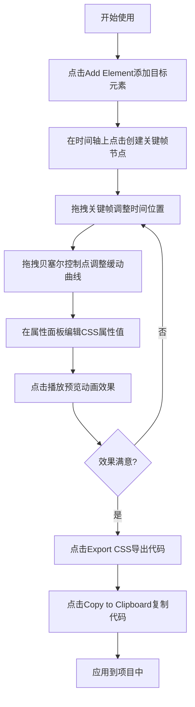

## 1. 产品概述

CSS动画编辑器是一款面向网页设计师的交互式动画搭建工具，通过可视化时间轴操作替代传统的代码编辑-保存-刷新循环，大幅提升CSS动画开发效率。设计师可通过拖拽关键帧、调整缓动曲线、编辑属性参数，实时预览动画效果，并一键导出可复用的CSS @keyframes代码片段。

## 2. 核心功能

### 2.1 功能模块

1. **主编辑界面**：时间轴系统、实时预览面板、属性编辑面板、元素管理列表
2. **动画控制**：播放/暂停/停止、速度调节（0.5x/1x/2x）、播放头定位
3. **代码导出**：CSS @keyframes代码生成、一键复制到剪贴板
4. **项目重置**：清空所有关键帧和元素配置

### 2.2 页面详情

| 页面名称 | 模块名称 | 功能描述 |
|-----------|-------------|---------------------|
| 主编辑界面 | 时间轴系统 | 横向时间轴展示（毫秒刻度）、关键帧节点添加/删除/拖拽、贝塞尔缓动曲线绘制与控制点调节 |
| 主编辑界面 | 实时预览面板 | 60%区域显示动画目标元素、播放头同步指示、动画实时渲染 |
| 主编辑界面 | 播放控制栏 | 播放/暂停/停止按钮、速度切换标签（0.5x/1x/2x） |
| 主编辑界面 | 属性编辑面板 | 选中关键帧的CSS属性列表、数值输入框/颜色选择器/下拉菜单、Add Property按钮新增自定义属性 |
| 主编辑界面 | 元素管理列表 | Add Element按钮（最多5个元素）、垂直元素菜单、多元素颜色区分标识 |
| 主编辑界面 | 导出/重置区 | Export CSS按钮（模态框展示代码+复制按钮）、Reset All按钮 |
| 导出模态框 | 代码展示区 | 等宽字体展示@keyframes代码、Copy to Clipboard按钮 |

## 3. 核心流程

用户创建动画的典型流程：添加元素 → 在时间轴上点击创建关键帧 → 拖拽调整关键帧位置 → 调整缓动曲线控制点 → 在属性面板编辑CSS属性值 → 使用播放控制预览动画效果 → 重复调整直至满意 → 点击导出获取CSS代码。

## 4. 用户界面设计

### 4.1 设计风格

- **主色调**：#0D1117（深空背景）
- **辅色**：#1A1A2E（次级面板）、#16213E（右侧面板）、#0F3460（输入框背景）
- **高亮色**：#E94560（关键帧/边框高亮）、#533483（按钮强调）、#00B4D8（导出按钮）
- **中性色**：#6C6C8A（刻度/曲线）、#FFFFFF（控制点）
- **元素预设色**：#4E8CFF、#FF6B6B、#4ECDC4、#FFE66D
- **圆角规范**：小元素6px、中等元素8-10px、大元素12-16px
- **按钮交互**：悬停缩放transform: scale(1.05)，过渡0.2s ease
- **整体过渡**：所有交互元素过渡时间0.3s

### 4.2 页面布局概览

| 区域 | 位置 | 尺寸/样式 |
|-----------|-------------|-------------|
| 元素列表 | 左侧垂直 | 宽160px，背景#1A1A2E，条目高48px圆角8px |
| 预览面板 | 中上区域 | 宽60%×高60%，200px×200px方块圆角12px |
| 播放控制 | 预览下方 | 按钮40×32px背景#2D2D44圆角6px |
| 属性面板 | 右侧 | 宽240px背景#16213E，输入框180×36px圆角6px |
| 时间轴 | 底部 | 高120px背景#1A1A2E，刻度高80px |
| 顶部操作 | 右上角 | Export 140×44px背景#00B4D8，Reset 120×40px背景#E94560 |
| 导出模态框 | 居中弹窗 | 600×400px背景#1A1A2E圆角16px，Fira Code等宽字体 |

### 4.3 响应式适配

- 桌面端（≥900px）：左右分栏布局，预览60% + 属性面板240px + 元素列表160px
- 移动端（<900px）：属性面板移至底部自适应高度，预览面板扩展全宽
- 触控优化：关键帧节点和控制点触控区域适当放大

### 4.4 性能指标

| 指标 | 目标值 |
|-----------|-------------|
| 时间轴拖拽响应延迟 | ≤50ms |
| 实时预览帧率 | 稳定60fps |
| 导出代码生成时间 | ≤200ms |
