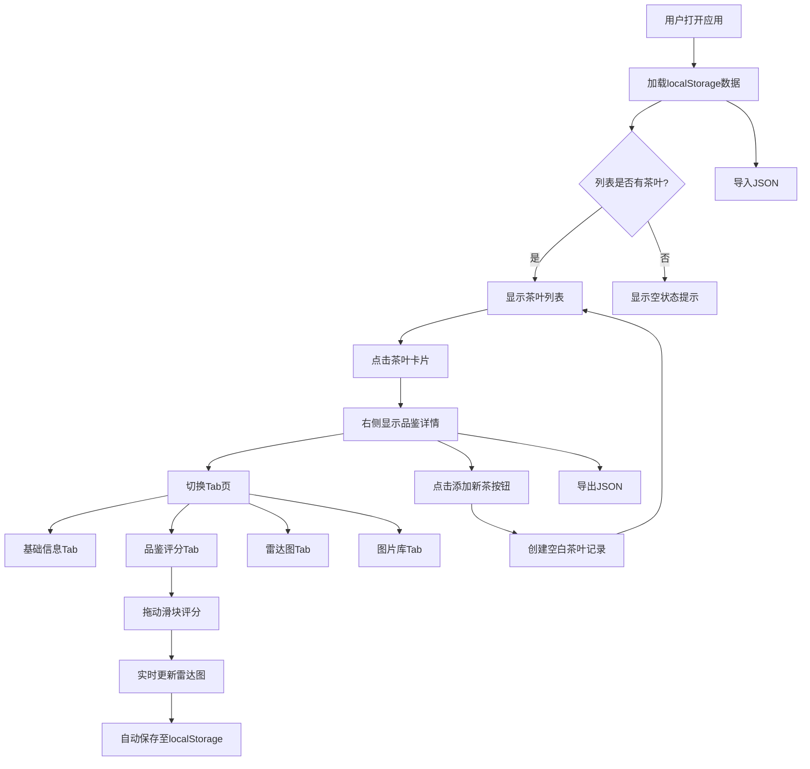

## 1. 产品概述

茶香品鉴手册是一款面向茶叶爱好者的私人品鉴记录工具，让用户能够系统地记录和管理每款茶叶的多维度品鉴数据（外形、汤色、香气、滋味、叶底等），并通过六边形雷达图直观展示茶叶的综合表现，构建个人的茶叶风味数据库。

- **目标用户**：茶叶品鉴爱好者、茶艺学习者、茶叶收藏者
- **核心价值**：将碎片化的品鉴体验转化为结构化、可视化的数据资产，帮助用户发现风味偏好、对比不同茶叶特质

## 2. 核心功能

### 2.1 功能模块

1. **主界面**：左右两栏布局，左侧茶叶列表 + 右侧品鉴详情区
2. **茶叶列表**：卡片式展示茶名、产地、年份，点击高亮并展开详情
3. **品鉴详情**：四个 Tab 页（基础信息、品鉴评分、雷达图、图片库），平滑淡入切换
4. **品鉴评分**：横向滑块评分（0-10分），实时显示分值，数值跳动动画
5. **雷达图**：Canvas 绘制六边形雷达图，颜色渐变，悬停显示分数
6. **图片库**：上传和管理茶叶照片
7. **数据管理**：localStorage 持久化，JSON 导入导出

### 2.2 页面详情

| 页面名称 | 模块名称 | 功能描述 |
|----------|----------|----------|
| 主界面 | 左侧茶叶列表 | 宽280px，背景#FAF0E6，圆角12px，毛玻璃效果，卡片高80px，显示茶名/产地/年份，点击高亮 |
| 主界面 | 右侧品鉴详情 | 顶部添加新茶按钮（#6B8E23），四个Tab页切换（0.3s淡入过渡） |
| 基础信息Tab | 茶叶表单 | 名称、产地、年份、备注等基础信息编辑 |
| 品鉴评分Tab | 评分滑块组 | 外形/汤色/香气/滋味/叶底/综合 六维度横向滑块，宽320px，轨道#D2B48C，滑块#6B8E23，数值跳动动画 |
| 雷达图Tab | Canvas雷达图 | 六边形边线#8B7355，填充透明度0.6，低分#CD853F→高分#6B8E23渐变，顶点圆点，悬停显示分数 |
| 图片库Tab | 图片管理 | 上传茶叶照片，缩略图预览，删除功能 |
| 数据管理 | 导入导出 | localStorage持久化，JSON文件导入导出 |

## 3. 核心流程

用户打开应用 → 查看已有茶叶列表 → 点击某款茶查看详情 → 在Tab页间切换查看/编辑信息 → 拖动滑块调整评分 → 雷达图实时更新 → 导出数据备份

## 4. 用户界面设计

### 4.1 设计风格

- **主色调**：浅米色背景 #FFF8DC，橄榄绿强调色 #6B8E23
- **辅助色**：驼色 #D2B48C（轨道）、深棕 #8B7355（边线）、秘鲁色 #CD853F（低分）、亚麻色 #FAF0E6（列表背景）
- **按钮风格**：圆角按钮，主按钮背景#6B8E23，悬停变亮
- **字体**：衬线体（中文用宋体/楷体风格，英文用Georgia/Playfair Display）
- **布局风格**：左右分栏卡片布局，柔和阴影（0 4px 12px rgba(0,0,0,0.08)）
- **动效**：Tab切换0.3s淡入，滑块数值跳动动画，卡片悬停效果
- **整体风格**：东方风雅，自然素雅，留白与层次感

### 4.2 页面设计概述

| 页面名称 | 模块名称 | UI元素 |
|----------|----------|--------|
| 主界面 | 左侧列表 | 宽280px，背景#FAF0E6，圆角12px，毛玻璃效果（backdrop-filter: blur），卡片高80px，选中态左侧绿色竖线 |
| 主界面 | 右侧详情 | 顶部操作栏（添加按钮+导入导出），Tab栏，内容区0.3s淡入过渡 |
| 品鉴评分 | 滑块组 | 每行：维度标签 + 滑块(320px, 轨道#D2B48C) + 分值显示，滑块圆点#6B8E23 |
| 雷达图 | Canvas | 六边形，边线#8B7355，渐变填充（#CD853F→#6B8E23），顶点小圆点，悬停tooltip |

### 4.3 响应式设计

- 桌面端（≥768px）：左右两栏布局，左侧固定280px列表，右侧自适应详情
- 移动端（<768px）：左栏收窄为顶部水平导航条，卡片水平滚动，详情区全宽展示
- 触摸优化：滑块触摸区域增大，Tab切换支持滑动手势
