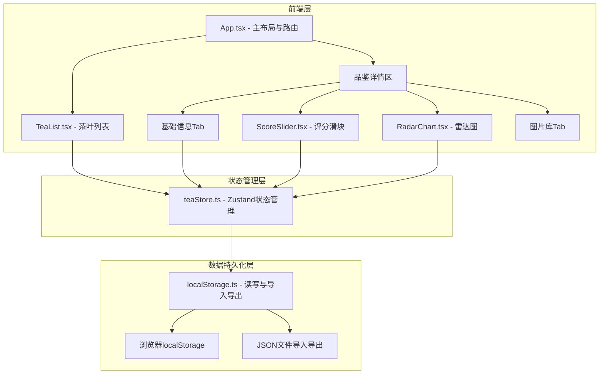
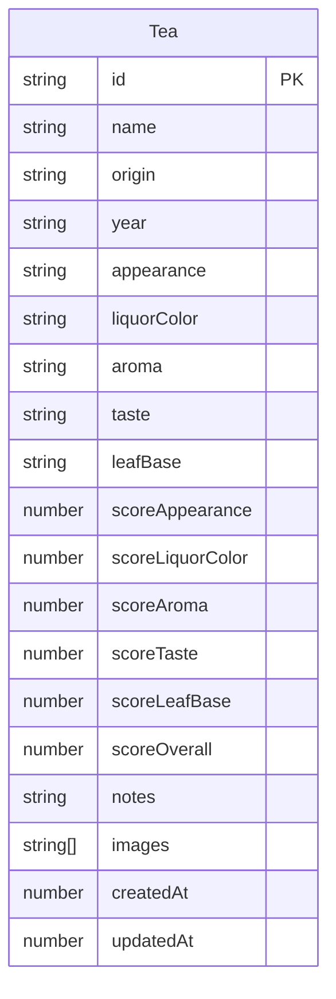

## 1. 架构设计



## 2. 技术说明

- **前端**：React 18 + TypeScript + Vite
- **状态管理**：Zustand（轻量级，无需Provider包裹）
- **样式方案**：CSS Modules / 内联样式（保持东方风雅风格，不使用Tailwind）
- **唯一标识**：uuid 生成茶叶ID
- **持久化**：localStorage + JSON文件导入导出
- **后端**：无（纯前端应用）
- **数据库**：无（localStorage本地存储）

## 3. 路由定义

本项目为单页应用，不使用路由库，通过组件内状态切换Tab页：

| 状态 | 用途 |
|------|------|
| activeTab | 控制右侧详情区显示哪个Tab（基础信息/品鉴评分/雷达图/图片库） |
| selectedTeaId | 当前选中的茶叶ID，控制左侧高亮和右侧内容 |

## 4. API定义

无后端API，所有数据操作通过Zustand store和localStorage工具函数完成。

## 5. 数据模型

### 5.1 数据模型定义



### 5.2 TypeScript 类型定义

```typescript
interface Tea {
  id: string;
  name: string;
  origin: string;
  year: string;
  scoreAppearance: number;
  scoreLiquorColor: number;
  scoreAroma: number;
  scoreTaste: number;
  scoreLeafBase: number;
  scoreOverall: number;
  notes: string;
  images: string[];
  createdAt: number;
  updatedAt: number;
}

interface TeaState {
  teas: Tea[];
  selectedTeaId: string | null;
  addTea: (tea: Tea) => void;
  updateTea: (id: string, updates: Partial<Tea>) => void;
  deleteTea: (id: string) => void;
  setSelectedTeaId: (id: string | null) => void;
}
```

## 6. 文件结构

```
├── package.json
├── vite.config.js
├── tsconfig.json
├── index.html
└── src/
    ├── App.tsx
    ├── main.tsx
    ├── index.css
    ├── stores/
    │   └── teaStore.ts
    ├── components/
    │   ├── TeaList.tsx
    │   ├── ScoreSlider.tsx
    │   └── RadarChart.tsx
    └── utils/
        └── localStorage.ts
```

## 7. 性能要求

- 雷达图Canvas更新帧率 ≥ 30fps：使用requestAnimationFrame，仅在各维度分数变化时重绘
- 搜索响应 < 200ms：Zustand内存计算，无网络请求延迟
- Tab切换动画0.3s，CSS transition实现
