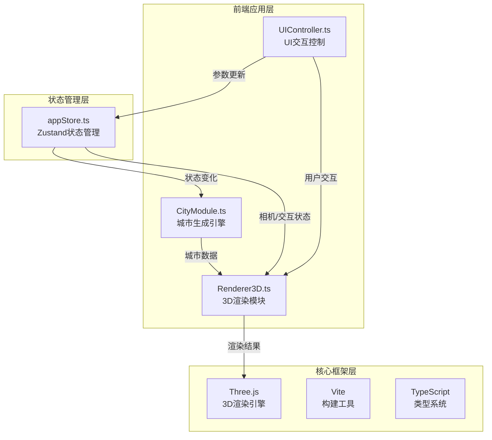

## 1. 架构设计



## 2. 技术描述

- **前端框架**：TypeScript + Three.js + Vite
- **状态管理**：Zustand 4.x
- **构建工具**：Vite 5.x
- **类型支持**：@types/three
- **辅助工具**：uuid（唯一标识符生成）
- **Vite插件**：@vitejs/plugin-basic-ssl（开发服务器HTTPS支持）

**初始化方式**：通过 `npm create vite@latest` 初始化Vanilla TypeScript项目，手动添加Three.js和Zustand依赖。

## 3. 目录结构

```
src/
├── main.ts                 # 应用入口
├── stores/
│   └── appStore.ts         # Zustand状态管理
├── modules/
│   ├── CityModule.ts       # 城市生成核心模块
│   ├── Renderer3D.ts       # 3D渲染模块
│   └── UIController.ts     # 用户界面控制模块
└── types/
    └── index.ts            # 类型定义
```

## 4. 核心数据模型

### 4.1 城市参数类型

```typescript
interface CityParams {
  gridSize: number;          // 街区规模 2-8
  minBuildingHeight: number; // 最小建筑高度
  maxBuildingHeight: number; // 最大建筑高度
  buildingDensity: number;   // 建筑密度 1-5
  treeCoverage: number;      // 树木覆盖率 0-100
  trafficEnabled: boolean;   // 交通流开关
}

interface BuildingData {
  id: string;
  position: { x: number; z: number };
  height: number;
  color: string;
  blockIndex: { row: number; col: number };
}

interface RoadSegment {
  start: { x: number; z: number };
  end: { x: number; z: number };
  isHorizontal: boolean;
}

interface TreeData {
  id: string;
  position: { x: number; z: number };
  scale: number;
}

interface CarData {
  id: string;
  position: { x: number; y: number; z: number };
  direction: { x: number; z: number };
  color: string;
  speed: number;
  currentRoad: RoadSegment;
  turning: boolean;
  turnProgress: number;
}

interface CityData {
  buildings: BuildingData[];
  roads: RoadSegment[];
  trees: TreeData[];
  cars: CarData[];
  blockSize: number;
  roadWidth: number;
  sidewalkWidth: number;
}
```

### 4.2 应用状态类型

```typescript
interface AppState {
  cityParams: CityParams;
  cameraPosition: { x: number; y: number; z: number };
  cameraTarget: { x: number; y: number; z: number };
  selectedBuildingId: string | null;
  interactionMode: 'orbit' | 'fly';
  isTransitioning: boolean;
  setCityParams: (params: Partial<CityParams>) => void;
  setCameraPosition: (pos: { x: number; y: number; z: number }) => void;
  setCameraTarget: (target: { x: number; y: number; z: number }) => void;
  setSelectedBuilding: (id: string | null) => void;
  setInteractionMode: (mode: 'orbit' | 'fly') => void;
  setIsTransitioning: (value: boolean) => void;
}
```

## 5. 模块接口定义

### 5.1 CityModule 接口

```typescript
class CityModule {
  generateCity(params: CityParams): CityData;
  updateCars(cars: CarData[], deltaTime: number, cityData: CityData): CarData[];
  private calculateBuildingColor(height: number, minH: number, maxH: number): string;
  private generateRoads(gridSize: number, blockSize: number): RoadSegment[];
  private generateTrees(params: CityParams, buildings: BuildingData[]): TreeData[];
  private generateCars(params: CityParams, roads: RoadSegment[]): CarData[];
}
```

### 5.2 Renderer3D 接口

```typescript
class Renderer3D {
  constructor(container: HTMLElement, store: Store<AppState>);
  init(): void;
  renderCity(cityData: CityData, transitionDuration?: number): void;
  update(deltaTime: number): void;
  flyToBuilding(buildingId: string, duration?: number): void;
  highlightBuilding(buildingId: string | null): void;
  dispose(): void;
}
```

### 5.3 UIController 接口

```typescript
class UIController {
  constructor(container: HTMLElement, store: Store<AppState>);
  init(): void;
  showBuildingInfo(buildingData: BuildingData, screenPos: { x: number; y: number }): void;
  hideBuildingInfo(): void;
  dispose(): void;
}
```

## 6. 数据流向

1. **参数更新流**：UI滑块 → UIController → Zustand store → CityModule → 生成新CityData → Renderer3D → 更新场景
2. **交互反馈流**：Three.js Raycaster → 点击建筑 → Renderer3D → store更新selectedBuilding → UIController显示信息卡 → Renderer3D执行相机飞行
3. **渲染循环流**：requestAnimationFrame → 更新汽车位置 → 更新粒子系统 → 渲染场景
