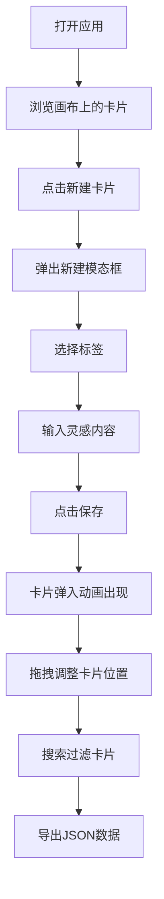

## 1. 产品概述

灵感速写板是一款轻量级的创意记录工具，帮助用户在白板风格的无限画布上快速捕捉一闪而过的灵感。通过彩色卡片、标签分类和流畅的交互动画，让记录创意变得有仪式感且充满乐趣。

- 核心价值：降低创意记录门槛，以视觉化、游戏化的方式激励用户捕捉灵感
- 目标用户：创意工作者、学生、产品经理等需要频繁记录想法的人群
- 产品定位：极简、美观、高效的灵感管理工具

## 2. 核心功能

### 2.1 用户角色
| 角色 | 注册方式 | 核心权限 |
|------|----------|----------|
| 普通用户 | 无需注册 | 创建、编辑、删除灵感卡片，拖拽排序，搜索过滤，导出数据 |

### 2.2 功能模块
1. **主画布界面**：无限画布、工具栏、卡片展示区
2. **卡片管理**：新建卡片、删除卡片、拖拽排序、标签分类
3. **搜索过滤**：实时搜索、高亮匹配、非匹配淡化
4. **数据导出**：JSON 格式导出所有卡片数据

### 2.3 页面详情
| 页面名称 | 模块名称 | 功能描述 |
|----------|----------|----------|
| 主画布页 | 顶部工具栏 | 应用名称、新建卡片按钮、搜索按钮、导出按钮 |
| 主画布页 | 无限画布 | 卡片展示、拖拽交互、视觉呈现 |
| 新建模态框 | 标签选择 | 预设标签（创意/工作/学习/生活）切换 |
| 新建模态框 | 内容输入 | 多行文本输入，自动聚焦 |
| 卡片组件 | 内容展示 | 标签名称、灵感内容、删除按钮 |
| 卡片组件 | 拖拽交互 | 拖拽移动、碰撞检测、平滑归位 |

## 3. 核心流程

用户打开应用 → 在无限画布上浏览已有卡片 → 点击「新建卡片」按钮 → 弹出模态框 → 选择标签 → 输入灵感内容 → 点击保存 → 卡片以弹入动画出现在画布上 → 用户可拖拽调整位置 → 搜索时实时过滤卡片 → 点击导出获取 JSON 数据

## 4. 用户界面设计

### 4.1 设计风格
- 主题：浅色极简风格，主色调 #6C63FF（紫罗兰）
- 卡片风格：圆角彩色卡片，根据标签区分颜色
- 字体：系统字体栈，中文友好
- 动画：平滑过渡、弹入效果、悬停微交互
- 布局：顶部固定工具栏 + 无限画布自由布局

### 4.2 页面设计概述
| 页面名称 | 模块名称 | UI 元素 |
|----------|----------|---------|
| 主画布页 | 工具栏 | 56px 高白色背景，底部浅灰阴影 #E0E0E0，左侧应用名 500 字重 #333，右侧三个按钮 |
| 主画布页 | 新建按钮 | #6C63FF 底色白色文字，圆角 8px，悬停变亮 #7B73FF |
| 主画布页 | 搜索按钮 | 图标按钮，透明背景，点击弹出搜索框 |
| 主画布页 | 导出按钮 | 纯文本按钮，无底色 |
| 新建模态框 | 整体 | 宽 400px，白色背景，圆角 16px，背景模糊遮罩 #00000033 |
| 新建模态框 | 标签选择 | pill 形状高 28px，选中 #6C63FF 白字，未选 #E8E8E8 灰字 |
| 新建模态框 | 输入框 | 高 120px，1px #DDD 边框，圆角 8px，占位符「记录你的灵感...」 |
| 新建模态框 | 底部按钮 | 取消灰字、保存 #6C63FF 白字圆角 8px |
| 卡片组件 | 整体 | 宽 220px，最小高 120px，6px 圆角，淡阴影 0 2px 8px rgba(0,0,0,0.06) |
| 卡片组件 | 标签色 | 创意 #FFE2E2、工作 #E2F0FF、学习 #FFF3E0、生活 #E8F5E9 |
| 卡片组件 | 标签文字 | 12px，对应深色版 |
| 卡片组件 | 内容文字 | 14px，#444，行高 1.6 |
| 卡片组件 | 删除按钮 | 右下角图标，hover 变红 #FF5252 |
| 卡片组件 | 悬停效果 | 阴影加深 0 4px 16px rgba(0,0,0,0.12)，上移 2px，0.2s 过渡 |
| 搜索高亮 | 匹配卡片 | 2px #6C63FF 边框，闪烁动画 0.5s 两次 |
| 搜索高亮 | 不匹配卡片 | 透明度 0.2，不可交互 |

### 4.3 响应式
- 桌面端优先设计
- 支持触摸设备拖拽操作
- 画布支持鼠标滚轮/触摸平移

### 4.4 动画效果
- 卡片入场：从中心缩放弹入，0.3s ease-out
- 卡片悬停：阴影加深 + 上移 2px，0.2s 过渡
- 拖拽中：半透明 opacity 0.7
- 搜索匹配：边框闪烁动画 0.5s 两次
- 拖拽归位：平滑过渡 0.15s
