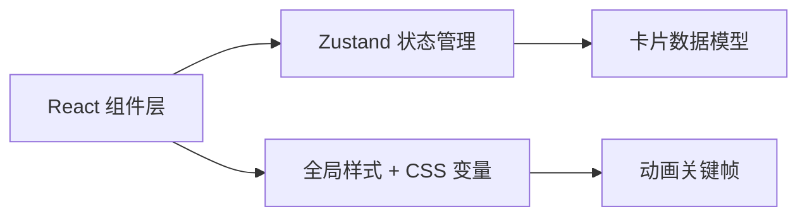

## 1. 架构设计



## 2. 技术描述
- 前端：React 18 + TypeScript + Vite
- 状态管理：Zustand
- 构建工具：Vite（端口 3000）
- 唯一 ID 生成：uuid
- 样式方案：原生 CSS + CSS 变量
- 无后端，纯前端应用，数据可导出为 JSON

## 3. 文件结构
| 文件路径 | 作用 |
|----------|------|
| package.json | 项目依赖和脚本 |
| vite.config.js | Vite 配置（React 插件、端口 3000） |
| tsconfig.json | TypeScript 配置（严格模式、JSX react-jsx、ESNext） |
| index.html | 入口页面 |
| src/main.tsx | React 应用入口 |
| src/App.tsx | 主应用组件 |
| src/components/Card.tsx | 卡片组件 |
| src/stores/cardStore.ts | Zustand 状态管理 |
| src/styles/global.css | 全局样式和动画 |

## 4. 数据模型

### 4.1 卡片数据结构
```typescript
interface Card {
  id: string;
  content: string;
  tag: '创意' | '工作' | '学习' | '生活';
  x: number;
  y: number;
}
```

### 4.2 标签颜色映射
```typescript
const TAG_COLORS = {
  '创意': { bg: '#FFE2E2', text: '#C62828' },
  '工作': { bg: '#E2F0FF', text: '#1565C0' },
  '学习': { bg: '#FFF3E0', text: '#E65100' },
  '生活': { bg: '#E8F5E9', text: '#2E7D32' },
};
```

## 5. 状态管理（Zustand）

### Store 方法
| 方法名 | 参数 | 作用 |
|--------|------|------|
| addCard | content: string, tag: string | 添加新卡片，自动计算位置 |
| removeCard | id: string | 删除指定卡片 |
| updateCardPosition | id: string, x: number, y: number | 更新卡片位置 |
| setSearchQuery | query: string | 设置搜索关键词 |
| filteredCards | getter | 根据搜索过滤后的卡片列表 |

## 6. 性能优化
- 100 张卡片首次渲染 FPS ≥ 45
- 使用 CSS transform 实现拖拽，避免重排
- 搜索时使用 CSS 类切换而非条件渲染
- 入场动画使用 CSS keyframes + animation-delay 错峰
- 拖拽时使用 will-change 提升合成层性能
