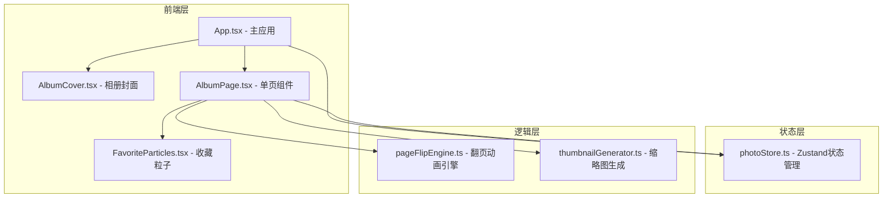

## 1. 架构设计



## 2. 技术描述
- **前端框架**：React@18 + TypeScript
- **构建工具**：Vite@5 + @vitejs/plugin-react
- **状态管理**：Zustand@4
- **工具库**：uuid（生成唯一ID）
- **样式方案**：原生 CSS（CSS Modules），不使用 Tailwind（按用户要求自定义复古质感）

## 3. 目录结构

```
src/
├── App.tsx                 # 主应用组件
├── main.tsx               # 入口文件
├── index.css              # 全局样式
├── data/
│   └── photoStore.ts      # Zustand状态管理
├── animation/
│   └── pageFlipEngine.ts  # 翻页动画引擎
├── components/
│   ├── AlbumPage.tsx      # 单页照片组件
│   └── AlbumCover.tsx     # 相册封面组件
├── utils/
│   └── thumbnail.ts       # 缩略图生成工具
└── types/
    └── index.ts           # 类型定义
```

## 4. 数据模型

### 4.1 TypeScript 类型定义

```typescript
interface Photo {
  id: string;
  url: string;
  thumbnail: string;
  takenAt: string;       // 拍摄时间 ISO格式
  location: string;      // 地点标签
  note: string;          // 用户笔记
  isFavorite: boolean;
  createdAt: number;     // 添加时间戳
}

interface PhotoState {
  photos: Photo[];
  currentPage: number;   // 当前翻页索引
  favoriteCount: number;
  isFlipping: boolean;
}
```

### 4.2 Zustand Store Actions
- `addPhoto(photo: Omit<Photo, 'id' | 'createdAt' | 'thumbnail' | 'isFavorite'>)`: 添加照片
- `toggleFavorite(id: string)`: 切换收藏状态
- `updateNote(id: string, note: string)`: 更新笔记
- `goToNextPage()`: 下一页
- `goToPrevPage()`: 上一页
- `setCurrentPage(page: number)`: 跳转到指定页

## 5. 翻页动画引擎 API

```typescript
interface FlipTransform {
  transform: string;       // CSS transform 值
  boxShadow: string;       // 动态阴影
  opacity: number;         // 阴影区域透明度
  zIndex: number;          // 层级
}

interface FlipEngineOptions {
  duration: number;        // 默认 400ms
  easing: string;          // cubic-bezier(0.4, 0, 0.2, 1)
  pageWidth: number;
  pageHeight: number;
}

class PageFlipEngine {
  constructor(options: FlipEngineOptions);
  startFlip(direction: 'next' | 'prev', onProgress: (t: FlipTransform) => void): Promise<void>;
  getTransformAtProgress(progress: number, mouseX?: number, mouseY?: number): FlipTransform;
  cancel(): void;
}
```

## 6. 性能优化策略
1. **缩略图预渲染**：首屏展开前用 canvas 生成缩略图（最大200px宽）
2. **大图懒加载**：IntersectionObserver，视口外100px触发加载
3. **React.memo**：AlbumPage 组件 memo 化避免无关重渲染
4. **粒子池**：最多同时 3 个粒子动画实例，复用 DOM 节点
5. **requestAnimationFrame**：翻页动画使用 RAF 驱动，避免掉帧
6. **CSS will-change**：翻页元素标记 will-change: transform
