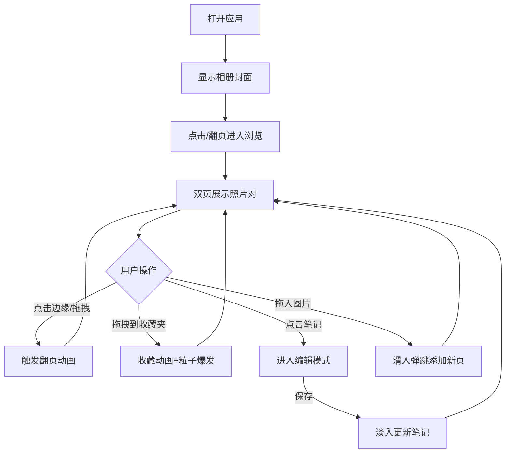

## 1. 产品概述
复古翻页相册是一款模拟实体精装相册的 Web 应用，让用户在浏览器中体验翻阅真实相册的沉浸感，解决传统网格相册交互单调的问题。
- 核心目标：通过翻页动画、收藏特效、视觉叙事节奏，将照片浏览变成一种情感体验
- 目标用户：喜欢收藏照片、追求浪漫体验的个人用户

## 2. 核心功能

### 2.1 用户角色
无需登录认证，所有操作在本地完成。

| 角色 | 说明 | 核心权限 |
|------|------|----------|
| 访客用户 | 直接访问应用的用户 | 浏览、收藏、编辑笔记、添加照片 |

### 2.2 功能模块
1. **相册浏览**：双页对开布局，翻页动画，单/双页响应式切换
2. **收藏管理**：拖拽收藏，星星粒子特效，收藏数量显示
3. **笔记编辑**：毛玻璃编辑框，淡入保存效果
4. **照片添加**：本地拖拽上传，滑入弹跳动画
5. **性能优化**：缩略图预渲染，大图懒加载，粒子并发控制

### 2.3 页面详情

| 页面名称 | 模块名称 | 功能描述 |
|----------|----------|----------|
| 相册主页 | 相册封面 | 精装复古封面设计，显示标题和照片总数，收藏夹图标 |
| 相册主页 | 双页浏览区 | 左右对页布局，每页展示一张4:3照片，最大宽度400px |
| 相册主页 | 翻页控制 | 点击边缘/拖拽右下角触发400ms贝塞尔翻页动画，弯曲阴影跟随鼠标 |
| 相册主页 | 照片信息卡 | 拍摄时间、地点标签、可编辑文字笔记 |
| 相册主页 | 笔记编辑器 | 毛玻璃效果编辑框，保存后淡入显示 |
| 相册主页 | 收藏夹 | 左上角图标，拖拽照片飞入收藏，30个金色粒子爆发 |
| 相册主页 | 图片上传区 | 拖拽JPG/PNG到页面自动添加，新照片下滑弹跳动画 |

## 3. 核心流程

用户打开应用 → 看到复古相册封面 → 点击进入浏览 → 左右翻页查看照片
→ 可拖拽照片到左上角收藏 → 可点击笔记编辑 → 可拖入本地图片添加

## 4. 用户界面设计

### 4.1 设计风格
- **主色调**：暖棕色 #8B5E3C，米白色 #F5F0E1
- **辅助色**：金色 #FFD700（收藏粒子），深棕色 #5D3A1A（书脊）
- **字体**：标题使用衬线字体（Playfair Display/宋体），正文使用优雅无衬线字体
- **质感**：封面硬壳用多层 box-shadow 模拟（内阴影、外阴影、书脊高光）
- **背景**：浅色木纹纹理（CSS 渐变模拟）
- **按钮交互**：悬停 scale(1.02)，点击按压 scale(0.98)，所有过渡带 ease-in-out

### 4.2 页面设计概述

| 页面名称 | 模块名称 | UI 元素 |
|----------|----------|---------|
| 相册主页 | 相册封面 | 精装硬壳质感、烫金标题、收藏夹图标（hover时上下浮动） |
| 相册主页 | 书页 | 4:3比例照片区域、柔和阴影、弯曲翻转动画、光影渐变 |
| 相册主页 | 照片信息卡 | 时间（小号衬线）、地点标签（圆角胶囊）、笔记（可编辑区域） |
| 相册主页 | 笔记编辑框 | backdrop-filter: blur(8px) 半透明毛玻璃 |
| 相册主页 | 收藏特效 | 30个#FFD700粒子，600ms爆发扩散 |

### 4.3 响应式设计
- **桌面端（>768px）**：双页对开布局，左右翻页动画
- **平板竖屏及以下（≤768px）**：单页上下滚动模式，触屏滑动翻页
- 所有照片和文字自适应容器宽度

### 4.4 动画性能要求
- 翻页动画帧率稳定 55FPS 以上
- 使用 requestAnimationFrame 驱动
- 收藏粒子动画同时播放不超过 3 个实例
- 视口外 100px 开始懒加载大图
