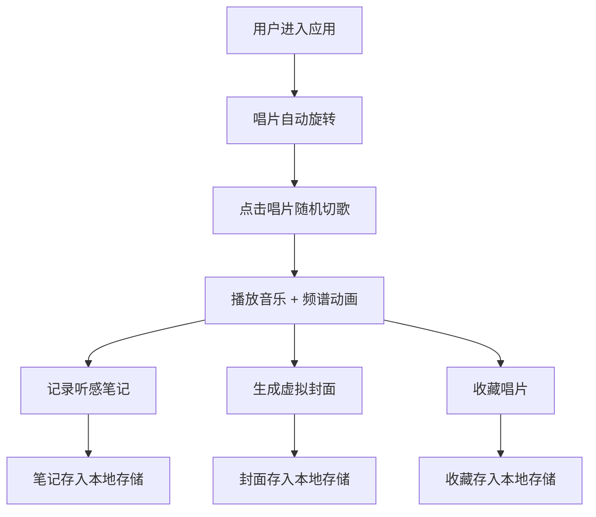

## 1. 产品概述

唱片时光机是一款为独立黑胶唱片店打造的沉浸式音感档案应用，让用户能像翻唱机一样随机播放店内珍藏唱片，记录听感笔记，并生成专属虚拟黑胶唱片封面。

- 核心价值：将实体唱片店的文化氛围延伸至线上，为音乐爱好者提供沉浸式的黑胶探索体验
- 目标用户：黑胶唱片爱好者、独立音乐发烧友、追求个性化音乐体验的年轻人

## 2. 核心功能

### 2.1 用户角色
| 角色 | 注册方式 | 核心权限 |
|------|----------|----------|
| 普通用户 | 无需注册（本地存储） | 播放唱片、记录笔记、生成封面、收藏唱片 |

### 2.2 功能模块
1. **主播放区**：唱片随机播放、3D封面展示、频谱动画、播放控制
2. **听感笔记**：笔记记录面板、瀑布流笔记展示、笔记存储
3. **虚拟封面生成**：风格选择、关键词选择、SVG封面生成、封面保存
4. **收藏与历史**：唱片收藏、播放历史记录、时间线展示

### 2.3 页面详情
| 页面名称 | 模块名称 | 功能描述 |
|---------|----------|----------|
| 主界面 | 中央播放区 | 唱片3D旋转、鼠标倾斜交互、进度条展示、频谱动画 |
| 主界面 | 左侧笔记面板 | 笔记瀑布流展示、笔记卡片截断显示 |
| 主界面 | 右侧收藏历史面板 | 收藏唱片列表、播放历史时间线 |
| 模态窗口 | 笔记记录 | 文本输入、笔记提交、时间戳记录 |
| 模态窗口 | 封面生成 | 风格关键词选择、SVG预览、保存重生成 |

## 3. 核心流程

用户进入应用后，中央唱片自动开始旋转。点击唱片随机切换曲目，播放过程中可随时记录听感笔记或生成专属封面。所有操作数据自动保存在本地存储中。

## 4. 用户界面设计

### 4.1 设计风格
- 主色调：深色科幻主题，背景#1A1A2E，次要色#16213E
- 强调色：#E94560（霓虹红），点缀色#533483（深紫）
- 按钮风格：圆角8px，悬停时背景变亮或缩放1.05倍，过渡ease-in-out 200ms
- 字体：主标题使用艺术感字体，正文使用现代无衬线字体
- 布局：左中右三段式，中央留白丰富，唱片居中展示
- 视觉特效：3D倾斜、毛玻璃、渐变阴影、唱片旋转动画

### 4.2 页面设计概述
| 页面名称 | 模块名称 | UI元素 |
|---------|----------|--------|
| 主界面 | 中央播放区 | 3D旋转唱片、渐变扇形进度条、频谱柱状图、控制按钮、毛玻璃信息卡 |
| 主界面 | 左侧笔记面板 | 瀑布流卡片、3行截断、滚动容器、笔记图标按钮 |
| 主界面 | 右侧面板 | 心形收藏按钮（缩放动画）、圆形唱片节点时间线、渐变连线 |
| 模态窗口 | 笔记记录 | 居中浮动面板、textarea输入框、渐变按钮 |
| 模态窗口 | 封面生成 | 全屏遮罩、风格关键词标签、SVG缩略图预览 |

### 4.3 响应式
- 桌面端（>768px）：左中右三段式布局
- 移动端（≤768px）：左右面板折叠为顶部和底部横向滑动抽屉，汉堡按钮控制弹出
- 抽屉样式：宽100vw，高60vh，背景#16213E

### 4.4 交互动效
- 唱片旋转：每圈4秒，恒速旋转
- 鼠标倾斜：-5°到10°响应鼠标移动
- 收藏按钮：点击缩放至110%再恢复，200ms动画
- 频谱动画：稳定30FPS以上
- 封面悬停：毛玻璃信息卡，模糊8px
