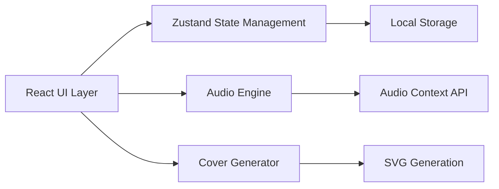

## 1. 架构设计



## 2. 技术描述

- 前端框架：React 18 + TypeScript
- 构建工具：Vite 5
- 状态管理：Zustand 4
- 图标库：Lucide React
- 音频处理：Web Audio API + AudioContext
- 封面生成：纯SVG生成，无需外部服务
- 数据持久化：LocalStorage（用户数据本地存储）
- 初始化工具：vite-init，使用 react-ts 模板

## 3. 目录结构

```
auto147/
├── src/
│   ├── engine/
│   │   ├── audioEngine.ts      # 音频播放引擎
│   │   └── coverGenerator.ts   # 封面生成引擎
│   ├── stores/
│   │   └── userStore.ts        # 用户数据状态管理
│   ├── components/
│   │   ├── PlayerPanel.tsx     # 播放器面板
│   │   ├── NotePanel.tsx       # 笔记面板
│   │   ├── CoverModal.tsx      # 封面生成模态框
│   │   ├── SpectrumVisualizer.tsx  # 频谱动画
│   │   └── VinylDisc.tsx       # 黑胶唱片组件
│   ├── types/
│   │   └── index.ts            # 类型定义
│   ├── data/
│   │   └── mockRecords.ts      # 模拟唱片数据
│   ├── App.tsx                 # 主应用组件
│   └── main.tsx                # 入口文件
├── package.json
├── vite.config.ts
├── tsconfig.json
└── index.html
```

## 4. 核心模块设计

### 4.1 音频引擎 (audioEngine.ts)
- 接口：`play(albumId)`, `pause()`, `resume()`, `seek(progress)`, `next()`
- 输出：当前播放状态、进度、频谱数据（每16ms更新）
- 模拟音频流：使用Web Audio API生成模拟音频和频谱数据

### 4.2 封面生成器 (coverGenerator.ts)
- 输入：风格（爵士暖调/电子冷感/民谣清新/古典典雅）+ 关键词（慵懒/深邃/明亮/忧郁）
- 输出：SVG字符串，包含主色调、几何纹理、装饰元素
- 性能目标：解析渲染<100ms

### 4.3 用户状态 (userStore.ts)
- 状态：笔记列表、收藏唱片、已生成封面、播放历史
- 操作：添加笔记、切换收藏、保存封面、记录播放历史
- 持久化：自动同步到LocalStorage

## 5. 数据模型

```typescript
interface VinylRecord {
  id: string;
  title: string;
  artist: string;
  year: number;
  coverUrl: string;
  genre: string;
  duration: number;
}

interface Note {
  id: string;
  recordId: string;
  recordTitle: string;
  content: string;
  timestamp: number;
}

interface GeneratedCover {
  id: string;
  svg: string;
  style: string;
  keyword: string;
  timestamp: number;
}

interface UserState {
  notes: Note[];
  favorites: string[];
  covers: GeneratedCover[];
  playHistory: { recordId: string; timestamp: number }[];
}
```

## 6. 性能约束

- 频谱动画：requestAnimationFrame，稳定30FPS+
- 笔记卡片：≤30张时初次渲染<200ms，使用CSS column实现瀑布流
- 封面生成：纯SVG字符串拼接，避免DOM操作，<100ms
- 状态更新：Zustand浅比较，避免不必要的重渲染
