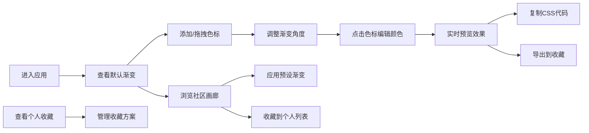

## 1. 产品概述

渐变回响是一款交互式色彩渐变生成与分享工具，让用户通过可视化操作创建精美的CSS渐变效果，浏览社区创意并收藏个人喜爱的方案。

- 核心价值：简化CSS渐变创作流程，提供直观的拖拽式交互体验
- 目标用户：前端开发者、UI设计师、创意工作者
- 市场定位：专业且易用的渐变设计工具，结合社区分享功能

## 2. 核心特性

### 2.1 用户角色
| 角色 | 注册方式 | 核心权限 |
|------|----------|----------|
| 普通用户 | 无需注册（本地存储） | 创建渐变、导出代码、浏览社区、收藏方案 |

### 2.2 功能模块
1. **渐变编辑器**：色标管理、角度调整、实时预览、CSS代码生成
2. **颜色编辑面板**：拾色器、位置调整、色标删除
3. **社区画廊**：预设渐变展示、一键应用、收藏功能
4. **个人收藏**：收藏管理、本地持久化、网格展示

### 2.3 页面详情
| 页面名称 | 模块名称 | 功能描述 |
|----------|----------|----------|
| 主页面 | 渐变画布 | 支持添加/拖拽最多6个色标，实时渲染渐变效果 |
| 主页面 | 角度选择器 | 圆形控件，0-360度拖动调整渐变方向 |
| 主页面 | 颜色编辑面板 | react-colorful拾色器、位置输入框、删除按钮 |
| 主页面 | CSS代码展示 | 实时生成代码，一键复制，导出收藏 |
| 主页面 | 社区画廊 | 12+预设渐变缩略图，支持应用和收藏 |
| 主页面 | 个人收藏 | 网格布局展示收藏，支持删除 |

## 3. 核心流程

用户进入应用后，在渐变画布上通过添加和拖拽色标节点创建渐变效果，可调整渐变角度。点击色标打开颜色编辑面板进行精确调整。满意后可复制CSS代码或导出到个人收藏。同时可浏览社区画廊中的预设方案，一键应用或收藏到个人列表。

## 4. 用户界面设计

### 4.1 设计风格
- **主色调**：深色主题，背景#1A1A2E，文字#E0E0E0
- **强调色**：#FF6B6B（珊瑚红）、#4ECDC4（青绿）
- **按钮风格**：圆角8px，悬停放大1.05倍，平滑过渡200ms
- **字体**：系统无衬线字体（system-ui, -apple-system, sans-serif）
- **布局风格**：左右分栏（桌面）/ 上下分栏（移动端），半透明面板（rgba(255,255,255,0.05)）
- **图标**：使用lucide-react图标库

### 4.2 页面设计概览
| 页面名称 | 模块名称 | UI元素 |
|----------|----------|----------|
| 主页面 | 渐变画布 | 70%宽度，渐变背景，色标节点（直径16px圆形，黑色边框），拖拽阴影效果 |
| 主页面 | 角度选择器 | 直径80px圆形，中心指针，顺时针拖动 |
| 主页面 | 颜色编辑面板 | 30%宽度，最小300px，react-colorful拾色器(240x240px)，数字输入框，红色删除按钮 |
| 主页面 | CSS代码块 | 背景#2D2D2D，等宽字体，复制按钮 |
| 主页面 | 社区画廊 | 横向滚动，缩略图100x60px圆角，自定义滚动条 |
| 主页面 | 个人收藏 | 每行3个网格，卡片200px宽，删除按钮 |

### 4.3 响应式设计
- **桌面端**（>768px）：左侧画布70%，右侧编辑面板30%（最小300px）
- **移动端**（≤768px）：上方画布70%高度，底部编辑面板占满宽度
- **触摸优化**：色标触摸区域扩大，滑动手势支持

### 4.4 动效设计
- 所有交互元素过渡动画：transition 200ms ease
- 按钮悬停：transform: scale(1.05)
- 色标拖拽：box-shadow 阴影效果
- 面板滑入/滑出动画
- 滚动条自定义样式（薄且半透明）
