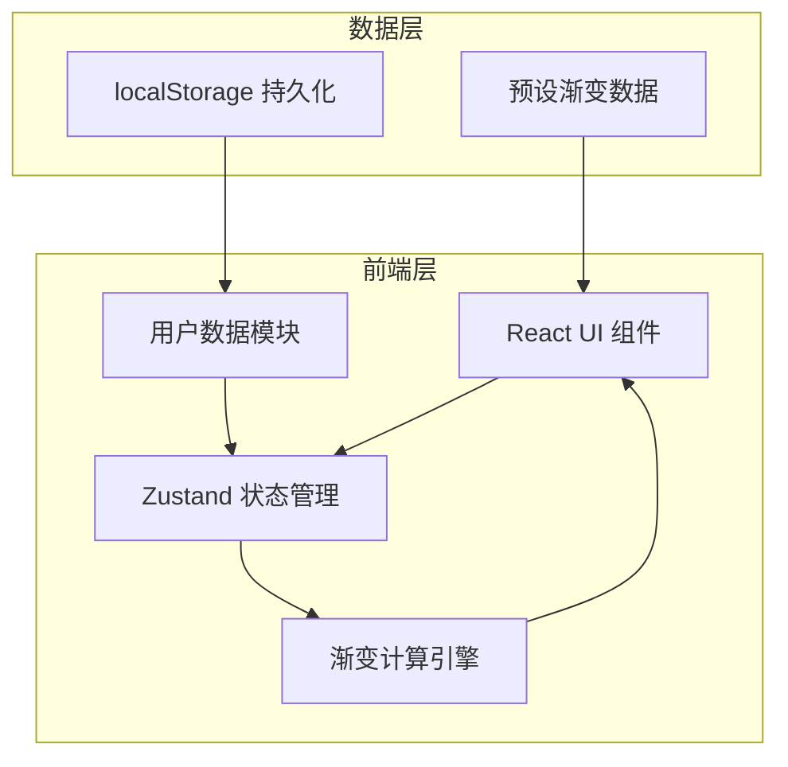

## 1. 架构设计



## 2. 技术描述

- **前端**：React@18 + TypeScript + Vite
- **状态管理**：Zustand
- **样式**：CSS Modules / 内联样式（按需求）
- **图标**：lucide-react
- **拾色器**：react-colorful
- **唯一ID**：uuid
- **构建工具**：Vite
- **数据持久化**：localStorage
- **无后端**：纯前端应用，社区数据为预设静态数据

## 3. 目录结构

```
src/
├── engine/
│   └── gradientEngine.ts    # 渐变计算引擎
├── stores/
│   └── userStore.ts         # 用户状态管理
├── components/
│   ├── GradientCanvas.tsx   # 渐变画布
│   ├── ColorPickerPanel.tsx # 颜色编辑面板
│   └── CommunityGallery.tsx # 社区画廊
├── App.tsx                  # 主应用
├── main.tsx                 # 入口
└── index.css                # 全局样式
```

## 4. 数据模型

### 4.1 色标数据结构

```typescript
interface ColorStop {
  id: string;
  color: string;
  position: number; // 0-100
}
```

### 4.2 渐变方案数据结构

```typescript
interface GradientScheme {
  id: string;
  name: string;
  colorStops: ColorStop[];
  angle: number; // 0-360
  createdAt: number;
}
```

### 4.3 核心类型定义

```typescript
// gradientEngine.ts
interface GradientResult {
  cssString: string;
  previewColors: string[];
}

function generateGradient(colorStops: ColorStop[], angle: number): GradientResult;

// userStore.ts
interface UserState {
  favorites: GradientScheme[];
  addFavorite: (scheme: GradientScheme) => void;
  removeFavorite: (id: string) => void;
  isFavorite: (id: string) => boolean;
}
```

## 5. 预设渐变数据

社区画廊包含至少12个预设渐变方案，每个方案包含：
- 唯一ID
- 名称
- 色标数组（2-6个色标）
- 角度

## 6. 性能要求

- 色标拖拽响应：≤50ms
- CSS代码生成：≤100ms
- 画廊初始渲染：≤300ms
- 使用React.memo优化重渲染
- 渐变计算使用纯函数避免重复计算
