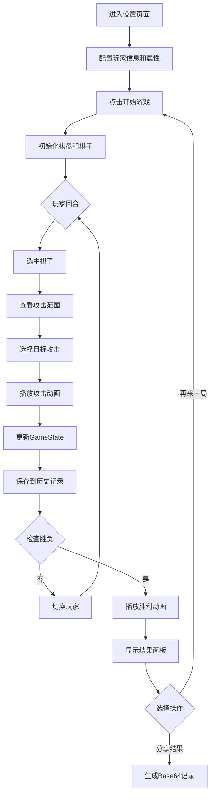

## 1. 产品概述

魔法棋局是一款基于Web的双人回合制策略游戏，玩家在8x8网格棋盘上轮流放置和操控四种属性（火、冰、风、地）的魔法棋子进行对战，通过策略布局和技能释放消灭对方全部棋子获得胜利。

- 核心玩法：回合制策略对战，四种属性各具特色，支持AI对战和双人对战
- 目标用户：休闲游戏玩家、策略游戏爱好者

## 2. 核心特性

### 2.1 用户角色

| 角色 | 注册方式 | 核心权限 |
|------|----------|----------|
| 玩家1 | 进入游戏设置 | 放置棋子、攻击敌方、撤销操作 |
| 玩家2 | 进入游戏设置（或AI） | 放置棋子、攻击敌方、撤销操作 |

### 2.2 功能模块

1. **设置页面**：玩家昵称输入、属性选择、棋盘预览、开始游戏
2. **游戏主界面**：8x8棋盘渲染、棋子渲染、攻击范围高亮、粒子特效
3. **信息面板**：回合倒计时、玩家信息、棋子剩余数量
4. **战斗系统**：攻击动画、受击动画、生命值管理、胜负判定
5. **历史系统**：操作记录、撤销功能、状态回放
6. **结果面板**：获胜展示、统计数据、再来一局、分享功能

### 2.3 页面详情

| 页面名称 | 模块名称 | 功能描述 |
|-----------|-------------|---------------------|
| 设置页面 | 棋盘预览 | 200x200px缩略图展示棋盘效果 |
| 设置页面 | 玩家配置 | 左右两侧昵称输入框+属性下拉框 |
| 设置页面 | 开始按钮 | 渐变色圆角按钮，悬停和点击动效 |
| 游戏主界面 | 棋盘渲染 | 深褐色木纹背景，8x8网格，80px格子 |
| 游戏主界面 | 棋子渲染 | 3D风格圆形，径向渐变，玩家归属光环 |
| 游戏主界面 | 攻击系统 | 选中高亮范围，粒子特效，受击抖动 |
| 游戏主界面 | 信息面板 | 双玩家信息、倒计时进度条、棋子计数 |
| 游戏主界面 | 操作控制 | 回合切换、撤销按钮 |
| 结果面板 | 胜利展示 | 获胜者头像放大、旗帜升起动画 |
| 结果面板 | 数据统计 | 总回合数、击杀数、总伤害量 |
| 结果面板 | 操作按钮 | 再来一局、分享结果 |

## 3. 核心流程

玩家进入设置页面配置信息，点击开始进入游戏。双方轮流操作：选中己方棋子→查看攻击范围→选择目标→触发攻击动画→更新棋盘状态→检查胜负。若一方棋子全灭则显示结果面板，可选择再来一局或分享。

## 4. 用户界面设计

### 4.1 设计风格

- 主色调：深褐色木纹背景 #3E2723，网格线 #5D4037
- 属性色：火系 #FF4500→#8B0000，冰系 #00BFFF→#00008B，风系 #32CD32→#006400，地系 #8B4513→#3E2723
- 玩家色：玩家1蓝色 #4169E1，玩家2红色 #DC143C
- 按钮风格：圆角渐变按钮（#E94560→#533483），悬停亮度1.2倍，点击缩放0.95倍
- 字体：现代无衬线字体，数字渐变白色→浅灰
- 布局：设置页面居中对称，游戏界面棋盘居中+右上角信息面板
- 动效：粒子特效（火球/冰锥/旋风/岩石），受击抖动（3px/200ms/ease-out），旗帜飘动（1.5s周期）

### 4.2 页面设计概览

| 页面名称 | 模块名称 | UI元素 |
|-----------|-------------|-------------|
| 设置页面 | 背景 | 深灰渐变 #1A1A2E→#16213E |
| 设置页面 | 棋盘预览 | 200x200px居中展示 |
| 设置页面 | 输入区域 | 左右对称布局，深蓝色输入框+下拉框 |
| 设置页面 | 开始按钮 | 底部居中，渐变圆角按钮 |
| 游戏界面 | 棋盘区域 | 左侧居中，640x640px 8x8网格 |
| 游戏界面 | 信息面板 | 右上角，200px宽半透明深色卡片 |
| 游戏界面 | 倒计时 | 渐变色进度条（绿→黄→红） |
| 游戏界面 | 棋子 | 60px直径3D圆形+半透明光环 |
| 结果面板 | 遮罩层 | 半透明黑色全屏覆盖 |
| 结果面板 | 结果卡片 | 400x300px白色圆角卡片居中 |
| 结果面板 | 统计区 | 回合数、击杀数、伤害量展示 |

### 4.3 响应式设计

- 桌面端优先：棋盘固定640x640px居中展示
- 信息面板固定在右上角
- 设置页面自适应居中布局

### 4.4 动效设计

- 棋子选中：棋盘边缘粒子光效（3-6px，属性色，800ms生命周期）
- 攻击范围：闪烁六边形网格高亮
- 攻击动画：属性对应粒子特效（火球/冰锥/旋风/岩石）
- 受击效果：位移3px，时长200ms，缓动ease-out
- 胜利动画：旗帜从底部升起到顶部，飘动周期1.5s
- 撤销操作：反向播放动画，时长300ms
