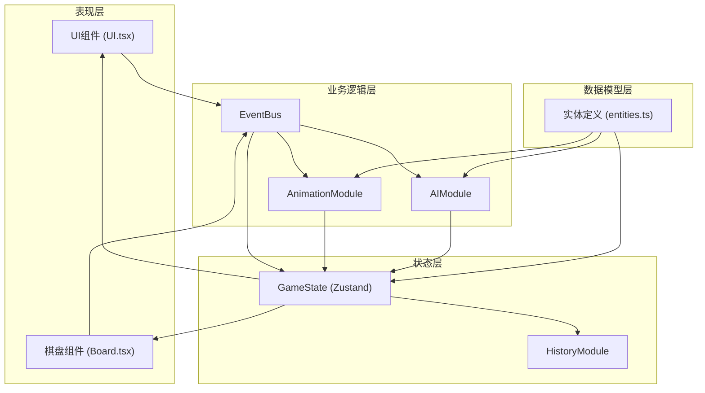
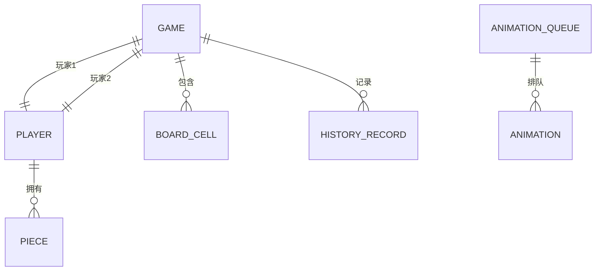

## 1. 架构设计



## 2. 技术说明

- 前端框架：React@18 + TypeScript@5
- 构建工具：Vite@5
- 状态管理：Zustand@4
- 动画实现：CSS Transitions + requestAnimationFrame
- 事件系统：自定义EventBus（发布-订阅模式）
- 后端服务：无（纯前端应用）
- 数据持久化：内存HistoryModule数组，最多20步

## 3. 模块文件定义

| 文件路径 | 模块职责 |
|----------|----------|
| package.json | 项目依赖配置（react, react-dom, zustand, typescript, vite, @vitejs/plugin-react） |
| index.html | 入口HTML页面 |
| tsconfig.json | TypeScript严格模式配置 |
| vite.config.js | Vite构建配置 |
| src/entities.ts | 棋子、玩家、棋盘等数据模型TypeScript接口定义 |
| src/GameState.ts | Zustand状态管理：棋盘数组、当前玩家、倒计时、动画队列、历史记录 |
| src/EventBus.ts | 自定义事件总线，UI和逻辑模块间解耦通信 |
| src/AIModule.ts | AI策略算法：优先攻击最低血量，否则随机移动 |
| src/AnimationModule.ts | 动画控制器：攻击/受击/胜利动画，requestAnimationFrame循环 |
| src/Board.tsx | 棋盘渲染：8x8网格、棋子、攻击范围高亮、粒子特效 |
| src/UI.tsx | UI组件：设置页面、信息面板、结果面板 |
| src/main.tsx | 应用入口，创建React根节点 |

## 4. 数据模型

### 4.1 实体关系图



### 4.2 核心类型定义

```typescript
// 属性类型
type ElementType = 'fire' | 'ice' | 'wind' | 'earth';

// 玩家ID
type PlayerId = 1 | 2;

// 棋子接口
interface Piece {
  id: string;
  element: ElementType;
  player: PlayerId;
  hp: number;
  maxHp: number;
  attack: number;
  range: number;
  position: { x: number; y: number };
  killCount: number;
}

// 玩家接口
interface Player {
  id: PlayerId;
  name: string;
  element: ElementType;
  avatar: string;
}

// 棋盘格子
interface BoardCell {
  x: number;
  y: number;
  piece: Piece | null;
}

// 游戏状态
interface GameState {
  board: BoardCell[][];
  currentPlayer: PlayerId;
  players: Record<PlayerId, Player>;
  countdown: number;
  selectedPiece: Piece | null;
  animationQueue: Animation[];
  history: HistoryRecord[];
  gamePhase: 'setup' | 'playing' | 'ended';
  winner: PlayerId | null;
  statistics: GameStatistics;
}

// 动画类型
interface Animation {
  type: 'attack' | 'hit' | 'victory' | 'particle';
  payload: Record<string, unknown>;
}

// 历史记录
interface HistoryRecord {
  stateSnapshot: Partial<GameState>;
  action: string;
  timestamp: number;
}

// 游戏统计
interface GameStatistics {
  totalTurns: number;
  totalDamage: number;
  pieceKills: Record<string, number>;
}
```

## 5. 事件定义（EventBus）

| 事件名 | 触发时机 | 负载数据 |
|--------|----------|----------|
| `GAME_START` | 点击开始游戏 | `{ player1: Player, player2: Player }` |
| `PIECE_SELECT` | 选中棋子 | `{ pieceId: string }` |
| `PIECE_ATTACK` | 发起攻击 | `{ attackerId: string, targetId: string }` |
| `TURN_END` | 回合结束 | `{ nextPlayer: PlayerId }` |
| `ANIMATION_COMPLETE` | 动画完成 | `{ animationType: string }` |
| `UNDO_REQUEST` | 请求撤销 | `{ steps: number }` |
| `GAME_END` | 游戏结束 | `{ winner: PlayerId }` |
| `RESTART_GAME` | 重新开始 | `void` |
| `SHARE_RESULT` | 分享结果 | `{ record: string }` |
| `AI_ACTION` | AI行动触发 | `void` |

## 6. 性能指标

| 指标 | 目标值 | 实现方案 |
|------|--------|----------|
| 操作延迟 | ≤50ms | 事件总线解耦+状态原子更新 |
| 渲染帧率 | 稳定60fps | requestAnimationFrame驱动动画，CSS transform/GPU加速 |
| 棋盘渲染 | ≤1ms | 纯函数渲染，React.memo优化，shouldComponentUpdate |
| 内存占用 | 合理 | HistoryModule限制20条，动画资源即时释放 |
