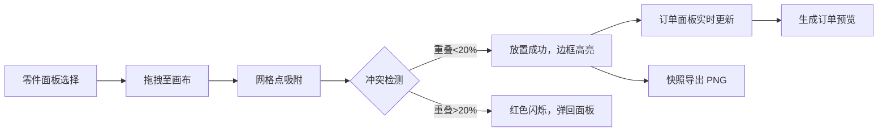

## 1. 产品概述

零件拼搭工坊是一款面向独立手作爱好者的在线交互式设计平台，让用户能够以"拼积木"的方式组合不同材质的手作零件（木质、布艺、金属），设计属于自己的虚拟手作作品，并一键生成材料包订单。

- 核心价值：降低手作创作门槛，提供可视化拼装体验，衔接设计与购买环节
- 目标用户：手作爱好者、DIY创作者、手工礼品定制用户

## 2. 核心功能

### 2.1 功能模块

1. **零件选择面板**：展示可选零件库，按材质分类，支持拖拽
2. **工作区画布**：Canvas 800x600 网格画布，支持零件拖拽放置、吸附对齐、冲突检测
3. **订单面板**：实时计算材料包清单，生成订单预览，支持复制清单
4. **快照导出**：将拼装结果导出为 2x 分辨率 PNG，支持本地保存

### 2.2 页面详情

| 页面名称 | 模块名称 | 功能描述 |
|---------|---------|---------|
| 主设计页 | 零件选择面板 | 左栏 220px，展示木质/布艺/金属零件，支持拖拽预览 |
| 主设计页 | 工作区画布 | 中央 Canvas 800x600，网格吸附，拖拽放置，冲突检测 |
| 主设计页 | 订单面板 | 右栏 260px，材料清单统计，订单生成，复制功能 |
| 主设计页 | 快照功能 | 相机按钮导出 PNG，昵称保存到 localStorage |

## 3. 核心流程

用户从左栏选择零件 → 拖拽至中央画布 → 零件自动吸附网格 → 系统检测冲突（重叠>20%弹回）→ 右栏实时更新材料清单 → 点击生成订单预览 → 点击相机导出作品快照

## 4. 用户界面设计

### 4.1 设计风格

- **主色调**：暖木色 #D4A373，米白色 #FAFAF0
- **零件材质色**：木质 #8B5E3C，布艺 #B565A7，金属 #708090
- **交互色**：连接高亮 #4ADE80，冲突警告 #EF4444
- **按钮**：圆角 8px，1px 边框 #BF8C6F，悬停背景加深 10%
- **布局**：三栏布局，左 220px / 中自适应 / 右 260px，圆角 12px
- **动画**：拖拽缓动 ease-out 200ms，放置弹跳 3px 200ms

### 4.2 页面设计概览

| 页面 | 模块 | UI 要素 |
|-----|-----|--------|
| 主设计页 | 零件面板 | 毛玻璃背景 #F5F0EB，圆角 12px，零件图标 CMYK 四色区分 |
| 主设计页 | 工作区 | 背景 #FAFAF0，20px 网格线，Canvas 800x600 |
| 主设计页 | 订单面板 | 背景 #E8E0D0，圆角 12px，清单表格 + 生成按钮 |
| 主设计页 | 顶部工具栏 | 相机快照按钮，居中标题 |

### 4.3 响应式适配

- 桌面端（>768px）：三栏布局并排展示
- 移动端（≤768px）：左栏折叠为顶部可滑动抽屉，右栏折叠为底部可滑动抽屉，工作区居中自适应
