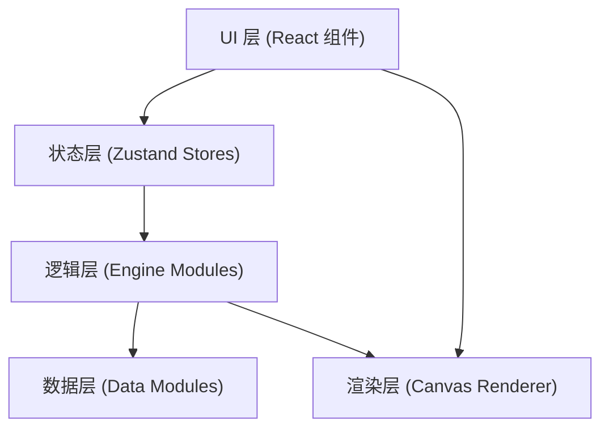

## 1. 架构设计



## 2. 技术选型

- **前端框架**：React 18 + TypeScript
- **构建工具**：Vite 5
- **状态管理**：Zustand 4
- **唯一 ID**：uuid 9
- **渲染方式**：原生 Canvas 2D API
- **无后端**：纯前端应用，数据持久化使用 localStorage

## 3. 目录结构

```
src/
├── data/
│   └── partData.ts          # 零件数据模型与初始数据
├── engine/
│   └── assemblyEngine.ts    # 拼装引擎：放置逻辑、冲突检测、网格吸附
├── renderer/
│   └── workspaceRenderer.ts # Canvas 渲染：零件绘制、拖拽预览、动画
├── stores/
│   └── orderStore.ts        # 订单状态：材料清单、订单操作
├── components/
│   ├── PartPanel.tsx        # 左栏零件选择面板
│   ├── Workspace.tsx        # 中央工作区画布
│   ├── OrderPanel.tsx       # 右栏订单面板
│   └── Toolbar.tsx          # 顶部工具栏（快照按钮）
├── hooks/
│   └── useDragDrop.ts       # 拖拽交互 Hook
├── types/
│   └── index.ts             # 全局类型定义
├── App.tsx                  # 主应用组件（三栏布局）
├── main.tsx                 # 入口文件
└── index.css                # 全局样式
```

## 4. 核心数据模型

```typescript
// 零件类型
type PartMaterial = 'wood' | 'fabric' | 'metal';

interface PartTemplate {
  id: string;
  name: string;
  material: PartMaterial;
  width: number;   // 像素
  height: number;  // 像素
  price: number;   // 单价（元）
  color: string;   // 渲染颜色
}

// 画布上已放置的零件实例
interface PlacedPart {
  instanceId: string;
  templateId: string;
  x: number;       // 网格对齐后的 X
  y: number;       // 网格对齐后的 Y
  rotation: number;
  isHighlighted: boolean; // 与其他零件相连时高亮
}

// 订单条目
interface OrderItem {
  templateId: string;
  name: string;
  quantity: number;
  unitPrice: number;
  totalPrice: number;
}
```

## 5. 模块职责与数据流

### 5.1 data/partData.ts
- 定义 PartTemplate、PlacedPart 等核心类型
- 导出初始零件库数据（木质、布艺、金属各若干）
- 被 assemblyEngine.ts 和 workspaceRenderer.ts 读取

### 5.2 engine/assemblyEngine.ts
- `snapToGrid(x, y, gridSize)`：坐标吸附到最近网格点
- `checkCollision(partA, partB)`：计算两零件重叠面积百分比
- `checkAdjacency(partA, partB)`：检测零件是否相连/相邻
- `placePart(templateId, x, y, existingParts)`：执行放置逻辑，返回放置结果 + 冲突状态
- 接收用户交互输入 → 处理逻辑 → 输出给渲染模块和状态模块

### 5.3 renderer/workspaceRenderer.ts
- `renderGrid(ctx, width, height, gridSize)`：绘制网格背景
- `renderPart(ctx, part, template, options)`：绘制单个零件（支持半透明、边框高亮）
- `renderDragPreview(ctx, template, x, y)`：绘制拖拽跟随的半透明预览
- `exportToPNG(canvas, scale)`：导出 2x 分辨率透明背景 PNG
- 读取 assemblyEngine 输出 → 渲染到 Canvas

### 5.4 stores/orderStore.ts
- Zustand store 管理材料包清单
- `addItem(templateId)` / `removeItem(templateId)` / `clear()`
- `getTotalPrice()` 计算总价
- `generateOrderPreview()` 生成含假地址的订单预览文本
- 被订单面板 UI 组件调用

## 6. 性能约束实现方案

| 约束 | 实现方案 |
|-----|---------|
| 拖拽帧率 ≥ 55FPS | 使用 requestAnimationFrame 批量渲染，避免每 mousemove 都重绘全图；只重绘变化区域 |
| 零件上限 30 个 | 在 placePart 前检查数量，超限拒绝并提示 |
| 冲突检测 ≤ 5ms | 使用 AABB 包围盒快速排除 + 精确重叠面积计算；O(n) 线性扫描，单次最多 29 次比较 |
