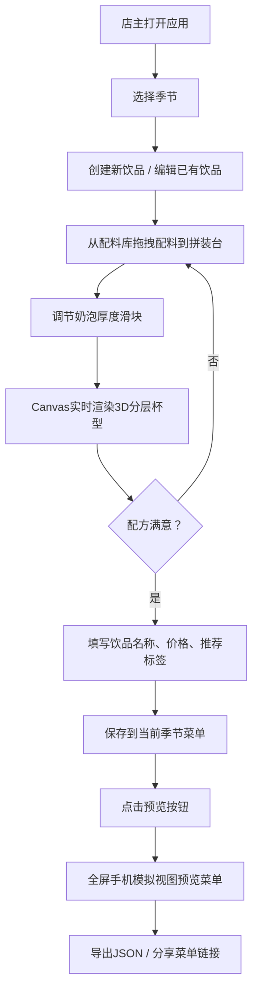
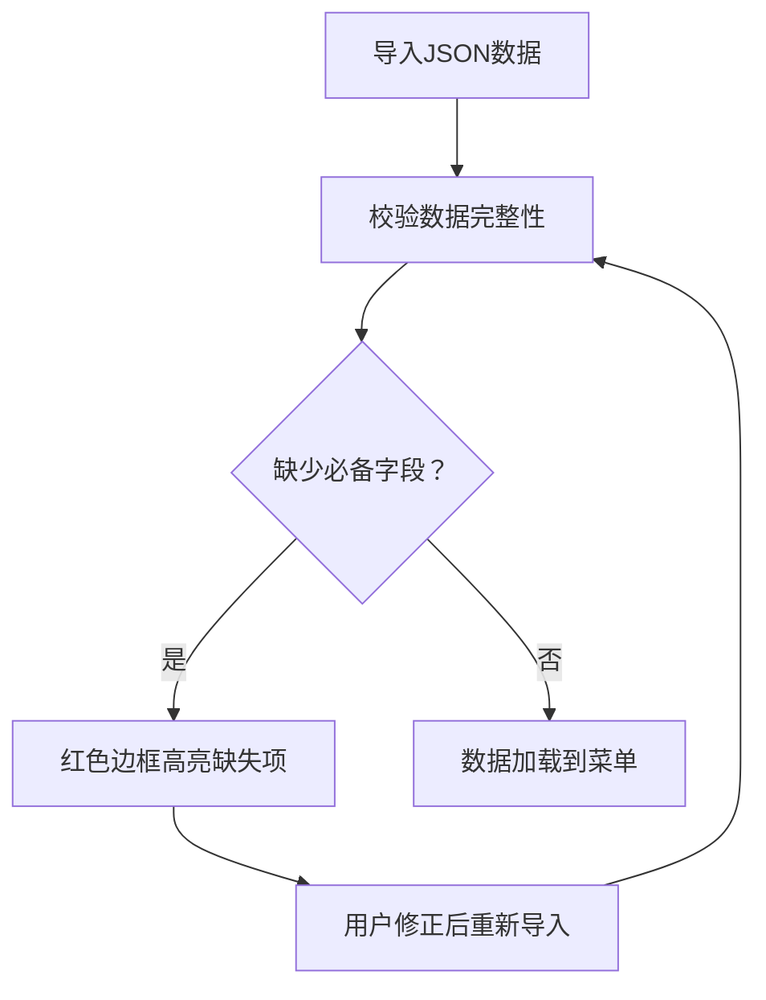

## 1. 产品概述

季节性饮品菜单创作器——面向小型独立咖啡馆的在线菜单管理工具，解决纸质菜单更新慢、无法动态展示饮品详情和用户反馈的问题。咖啡馆老板可通过拖拽配料组合饮品配方，预览3D分层杯型效果，并一键生成带定价和推荐标签的在线菜单页面。

- 目标用户：小型独立咖啡馆店主
- 核心价值：像搭积木一样组合饮品配方，数字化菜单实时更新与分享

## 2. 核心功能

### 2.1 用户角色

| 角色 | 注册方式 | 核心权限 |
|------|----------|----------|
| 咖啡馆店主 | 无需注册，本地使用 | 创建/编辑/删除饮品配方，管理季节菜单，预览与分享菜单 |

### 2.2 功能模块

1. **饮品配方编辑器页**：配料库、拼装台、3D杯型预览
2. **季节性菜单管理页**：季节切换、饮品卡片管理、拖拽排序
3. **菜单预览与分享页**：全屏手机模拟视图、饮品详情、用户评价

### 2.3 页面详情

| 页面名称 | 模块名称 | 功能描述 |
|----------|----------|----------|
| 饮品配方编辑器 | 配料库面板 | 展示饮品基底、糖浆、奶泡、装饰四类配料，每类用对应色块标识，支持拖拽 |
| 饮品配方编辑器 | 拼装台 | 虚线边框拖拽接受区，用户拖入配料组合配方，实时调用Canvas渲染3D分层杯型 |
| 饮品配方编辑器 | 3D杯型预览 | 300px高Canvas，半透明杯壁，分层渐变，气泡上浮动画 |
| 季节性菜单管理 | 季节选择栏 | 春夏秋冬圆角标签，选中时背景变为对应季节色 |
| 季节性菜单管理 | 饮品卡片列表 | 每个季节最多8款饮品，展示名称、价格、推荐标签，支持拖拽排序 |
| 菜单预览与分享 | 手机模拟视图 | 375px宽竖屏布局，饮品列表从上到下展示，带3D杯缩略图 |
| 菜单预览与分享 | 饮品详情区 | 完整配料列表、制作步骤、最近3条用户评价（星星评分） |
| 数据持久化 | 导入导出 | localStorage存储，支持JSON导出/导入，导入时校验数据完整性 |

## 3. 核心流程

## 4. 用户界面设计

### 4.1 设计风格

- 主色调：奶咖色系 `#F5E6D3` 为主背景，深咖 `#3E2723` 为文字主色
- 配料色块：基底 `#D4A574`、糖浆 `#A8C0A8`、奶泡滑块轨道 `#F0E6D3`、装饰 `#6B3A2E`
- 季节色：春 `#B8D4A5`、夏 `#FFB07C`、秋 `#D4A574`、冬 `#A8C0D8`
- 推荐标签：圆角4px，背景 `#B22222`（推荐/限量）或 `#2E8B57`（人气爆款）
- 按钮：圆角8px，预览按钮 `#3B8B3B`/悬停 `#4CAF50`，导出按钮 `#555`/悬停 `#777`
- 卡片与面板：柔和阴影 `box-shadow: 0 2px 8px rgba(0,0,0,0.08)`
- 按钮悬停：微缩放大 `transform: scale(1.02)` 过渡0.2s
- 拖拽拖影：`opacity: 0.5`
- 错误提示：淡入动画 `fadeIn 0.3s`
- 字体：选用具有咖啡店气质的衬线体搭配无衬线体

### 4.2 页面设计概览

| 页面名称 | 模块名称 | UI元素 |
|----------|----------|--------|
| 饮品配方编辑器 | 配料库面板 | 左侧固定宽度面板，四类配料按category分组，色块+文字标签，拖拽手柄 |
| 饮品配方编辑器 | 拼装台 | 右侧主区域，虚线边框，背景 `#FFF8EE`，已添加配料列表+奶泡厚度滑块 |
| 饮品配方编辑器 | 3D杯型预览 | 拼装台下方Canvas 300px高，半透明杯壁，分层渐变+气泡动画 |
| 季节性菜单管理 | 季节选择栏 | 顶部水平排列四季圆角标签 |
| 季节性菜单管理 | 饮品卡片网格 | 卡片式布局，名称+价格+推荐标签，拖拽排序手柄 |
| 菜单预览与分享 | 手机模拟框 | 居中375px宽竖屏容器，背景 `#FDF5E6`，饮品列表纵向滚动 |
| 菜单预览与分享 | 饮品缩略图 | 120x180px 3D杯缩略图，点击滚动到详情区 |
| 菜单预览与分享 | 评价区 | ★和☆显示星级，16px，颜色 `#FFD700` |

### 4.3 响应式适配

- 桌面/平板（≥768px）：编辑器左右并排布局（配料库 | 拼装台）
- 手机（<768px）：上下堆叠布局（配料库在上，拼装台在下）
- 菜单预览始终以375px手机模拟视图居中展示

### 4.4 性能要求

- 拖拽交互和Canvas渲染帧率稳定在45fps以上
- Canvas气泡动画每帧移动3px，透明度0.6
- 所有状态变更通过Zustand高效更新，避免不必要的重渲染
