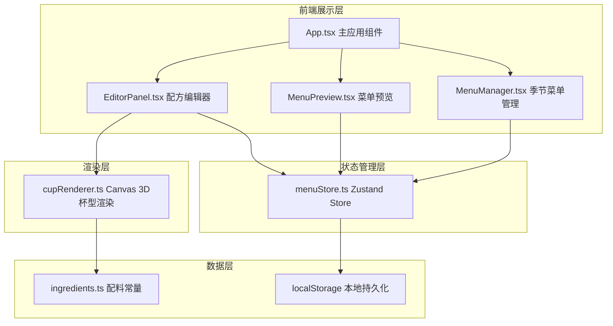
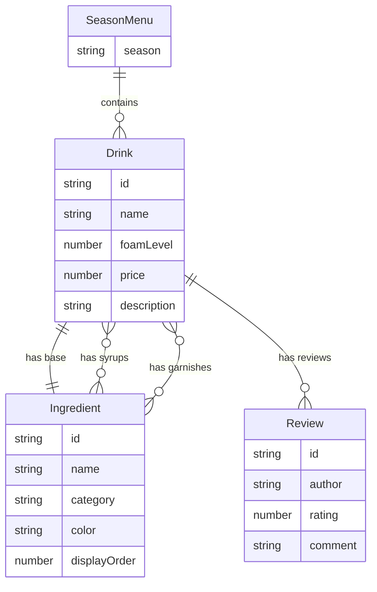

## 1. 架构设计



## 2. 技术说明

- 前端：React@18 + TypeScript + Vite
- 初始化工具：vite-init（react-ts 模板）
- 状态管理：Zustand
- 样式：Tailwind CSS + 自定义CSS变量
- 数据持久化：localStorage
- 渲染引擎：Canvas 2D API（3D分层杯型效果）
- 包管理：npm

## 3. 路由定义

| 路由 | 用途 |
|------|------|
| / | 主页面，包含季节菜单管理和配方编辑器 |
| /preview | 全屏菜单预览模式，模拟手机竖屏视图 |

## 4. API定义

无后端API，所有数据通过localStorage持久化。

### 数据类型定义

```typescript
interface Ingredient {
  id: string;
  name: string;
  category: 'base' | 'syrup' | 'foam' | 'garnish';
  color: string;
  displayOrder: number;
}

interface RecipeIngredient {
  ingredient: Ingredient;
  quantity?: number;
}

interface Drink {
  id: string;
  name: string;
  base: Ingredient;
  syrups: Ingredient[];
  foamLevel: number;
  garnishes: Ingredient[];
  price: number;
  tags: ('recommended' | 'limited' | 'popular')[];
  description: string;
  steps: string[];
  reviews: Review[];
}

interface Review {
  id: string;
  author: string;
  rating: number;
  comment: string;
  date: string;
}

type Season = 'spring' | 'summer' | 'autumn' | 'winter';

interface SeasonMenu {
  season: Season;
  drinks: Drink[];
}
```

## 5. 服务端架构图

无后端服务，纯前端应用。

## 6. 数据模型

### 6.1 数据模型定义



### 6.2 数据存储

- localStorage key: `cafe-menu-data`
- 存储格式：JSON序列化的 `SeasonMenu[]`
- 导出格式：JSON文件，包含完整的 `SeasonMenu[]` 数据
- 导入校验：检查每条Drink记录的 `name`, `base`, `syrups`, `foamLevel` 必备字段
