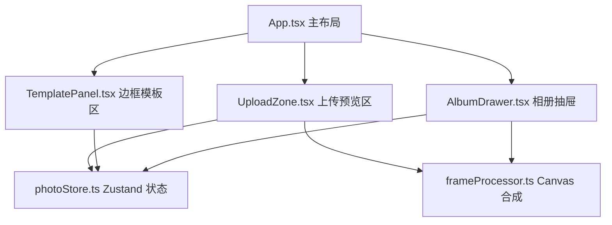

## 1. 架构设计

纯前端单页应用，采用 React + TypeScript + Vite 技术栈，使用 Zustand 进行状态管理，Canvas API 实现图片合成与边框叠加。



## 2. 技术描述

- **前端框架**：React 18 + TypeScript
- **构建工具**：Vite
- **状态管理**：Zustand
- **样式方案**：CSS Modules / 内联样式（无需 Tailwind，使用原生 CSS 变量管理主题色）
- **图标库**：lucide-react
- **工具库**：uuid
- **图像处理**：HTML5 Canvas API（像素级合成）
- **初始化方式**：使用 Vite React TypeScript 模板

## 3. 目录结构

```
src/
├── App.tsx              # 主布局组件
├── main.tsx             # 应用入口
├── components/
│   ├── UploadZone.tsx   # 上传与预览区
│   ├── TemplatePanel.tsx # 边框模板面板
│   └── AlbumDrawer.tsx  # 相册抽屉
├── stores/
│   └── photoStore.ts    # Zustand 状态管理
└── utils/
    └── frameProcessor.ts # Canvas 图片合成工具
```

## 4. 状态管理设计（Zustand Store）

```typescript
interface PhotoState {
  // 上传的原始图片数据
  originalImage: string | null;
  // 当前选中的边框样式 ID
  selectedFrameId: string;
  // 已保存的作品列表
  artworks: Artwork[];
  // 相册当前页码
  albumPage: number;
  // 相册抽屉是否展开
  albumDrawerOpen: boolean;
  
  // Actions
  setOriginalImage: (img: string | null) => void;
  setSelectedFrame: (id: string) => void;
  addArtwork: (artwork: Artwork) => void;
  removeArtwork: (id: string) => void;
  setAlbumPage: (page: number) => void;
  toggleAlbumDrawer: () => void;
  resetUpload: () => void;
}

interface Artwork {
  id: string;
  imageData: string; // base64
  frameId: string;
  frameName: string;
  createdAt: Date;
}
```

## 5. 边框样式定义

```typescript
interface FrameStyle {
  id: string;
  name: string;
  // 色调参数
  colorFilter: {
    r: number; // 红色通道偏移
    g: number; // 绿色通道偏移
    b: number; // 蓝色通道偏移
    contrast: number; // 对比度
    brightness: number; // 亮度
    saturation: number; // 饱和度
  };
  // 边框配置
  border: {
    width: number; // 边框宽度占比
    color: string; // 边框颜色
  };
  // 颗粒纹理强度
  grainIntensity: number;
  // 漏光效果
  leakLight: {
    color: string;
    opacity: number;
    position: 'top-left' | 'top-right' | 'bottom-left' | 'bottom-right';
  };
}
```

预设 5 种边框：
1. 复古棕调（Vintage Sepia）
2. 日系青蓝（Japanese Cyan）
3. 赛博紫绿（Cyber Purple-Green）
4. 黑白银盐（B&W Silver）
5. 暖调柯达（Warm Kodak）

## 6. 核心算法

### 6.1 图片合成流程（frameProcessor.ts）

1. 创建目标尺寸 Canvas
2. 绘制白色边框底色
3. 裁剪并绘制原图至内框区域（object-fit: cover 算法）
4. 应用颜色滤镜（逐像素 RGBA 调整）
5. 叠加颗粒纹理（随机噪声）
6. 叠加漏光效果（径向渐变）
7. 添加水印和日期文字
8. 导出为 base64 / ImageData

### 6.2 性能优化

- 使用离屏 Canvas 进行合成
- 防抖处理边框切换预览
- 图片缩放使用高质量插值
- 动画使用 CSS transform/opacity 触发 GPU 加速

## 7. 组件划分原则

- **UploadZone**：负责上传交互、Canvas 渲染预览，单一职责
- **TemplatePanel**：纯展示组件，接收边框列表和选中状态，发出选择事件
- **AlbumDrawer**：管理翻页状态、动画、作品展示
- **App**：组合布局，协调各组件通信，管理全局 UI 状态
