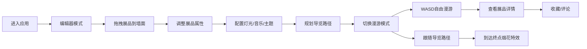

## 1. 产品概述

3D虚拟展览空间是一款面向个人策展人的沉浸式Web应用，解决传统线上展览以2D网页呈现、缺乏空间感和互动性的问题。策展人可通过拖拽和配置将展品（图片、视频、3D模型）摆放在三维空间中的虚拟墙面上，设置灯光、背景音乐和引导路径；观众以第一人称视角漫游参观，点击展品查看详情并留下评论。

- 核心目标：让策展人零门槛创建沉浸式3D展览，让观众获得真实的观展体验
- 目标用户：独立策展人、艺术家、画廊主理人
- 产品价值：将展览从平面网页升级为立体空间，增强观众代入感和互动性

## 2. 核心功能

### 2.1 用户角色

| 角色 | 使用方式 | 核心权限 |
|------|----------|----------|
| 策展人 | 编辑器模式 | 放置展品、调整属性、配置灯光音乐、规划导览路径 |
| 观众 | 漫游模式 | 自由漫游、查看展品详情、收藏、发表评论、跟随导览 |

### 2.2 功能模块

1. **3D场景编辑器**：鼠标拖拽放置展品、画框悬停发光、属性面板实时调整
2. **多模态展品**：图片（jpg/png）、视频（循环播放+音量控制）、glTF 3D模型（自转展示）
3. **展览漫游**：第一人称视角、WASD移动、鼠标旋转视角、悬浮标题、详情弹窗
4. **空间氛围配置**：环境光/点光源调节、背景音乐、主题风格预置（极简白/暖木色/冷灰调）
5. **互动反馈**：爱心收藏动画、评论区半透明面板、淡入动画
6. **导览路径规划**：路径点标记、平滑曲线连接、粒子路径、自动跟随、烟花特效

### 2.3 页面详情

| 页面名称 | 模块名称 | 功能描述 |
|----------|----------|----------|
| 主场景 | 3D渲染区 | 占视口85%宽度，展示虚拟展厅、展品、光照效果 |
| 左侧面板 | 展品列表+属性编辑 | 宽320px，毛玻璃效果，展示展品列表和选中展品的属性表单 |
| 底部面板 | 工具栏+时间轴 | 高120px，包含编辑/漫游模式切换、操作按钮 |
| 右侧控制面板 | 氛围配置 | 灯光、音乐、主题风格调节 |
| 评论区 | 互动反馈 | 固定在左下角，半透明面板，展示评论列表 |

## 3. 核心流程

### 3.1 策展人流
策展人进入编辑器 → 从展品列表拖拽展品到墙面 → 点击画框打开属性面板调整尺寸/位置/旋转 → 打开右侧面板配置灯光和音乐 → 添加导览路径点 → 切换漫游模式预览 → 完成展览

### 3.2 观众漫游流
观众进入漫游模式 → WASD自由移动+鼠标旋转视角 → 靠近展品查看悬浮标题 → 双击查看详情弹窗 → 点击爱心收藏 → 发表评论 → 点击跟随按钮沿导览路径参观 → 到达终点触发烟花特效

## 4. 用户界面设计

### 4.1 设计风格
- 设计风格：暗色主题 + 奢华金点缀，营造高端艺术展馆氛围
- 主色调：深空蓝 `#1a1a2e`，面板色 `rgba(30,30,50,0.85)`
- 强调色：金色 `#D4AF37`（画框边框）、深红 `#C0392B`（主操作按钮）
- 辅助色：暖白 `#FFF5E6`（环境光默认色）、金色粒子 `#FFD700`
- 按钮风格：圆形图标按钮（直径32px），悬停亮度提升20%，点击scale(0.95)按压动画
- 字体：现代无衬线字体，白色为主，金色强调
- 布局：主场景居中，左侧/底部浮动面板，毛玻璃backdrop-filter效果
- 动效：画框发光过渡（0.5s）、墙面颜色渐变（1.5s）、收藏爱心弹跳（0.3s）、评论淡入

### 4.2 页面设计概览

| 页面名称 | 模块名称 | UI元素 |
|----------|----------|--------|
| 主场景 | 3D展厅 | 四面墙+地面、画框展品、灯光、路径粒子、烟花特效 |
| 左侧面板 | 展品列表 | 图标分类（📷图片/🎬视频/🧊模型）、列表项、拖拽源 |
| 左侧面板 | 属性编辑 | 宽度/高度/旋转/距地高度滑块、实时预览 |
| 底部面板 | 工具栏 | 模式切换按钮、撤销/重做、保存、跟随导览按钮 |
| 右侧面板 | 氛围配置 | 颜色选择器、滑块、主题预设按钮、音乐上传 |
| 评论区 | 互动面板 | 半透明圆角面板、评论列表、输入框、爱心收藏按钮 |

### 4.3 响应式
- 桌面端优先，主场景占85%宽度
- 浮动面板固定定位，不随滚动移动
- 支持窗口大小变化时自适应调整3D渲染区域

### 4.4 3D场景指引
- 环境：封闭展厅空间，四面墙+地面，初始主题极简白
- 光照：环境光（默认#FFF5E6，强度0.6）+ 可调节点光源
- 相机：编辑器模式轨道相机，漫游模式第一人称相机（高度1.6，速度3单位/秒）
- 构图：展品分布在四周墙面，观众可环绕参观
- 交互：画框悬停发光、点击弹出面板、收藏动画、路径粒子脉动
- 性能目标：30FPS以上，并发渲染15个展品无卡顿
