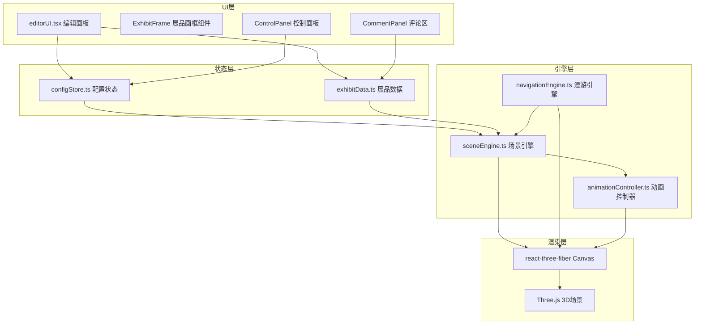

## 1. 架构设计



## 2. 技术描述

- 前端框架：React 18 + TypeScript
- 构建工具：Vite 5
- 3D渲染：Three.js + @react-three/fiber + @react-three/drei
- 状态管理：Zustand
- 唯一ID：uuid
- CSS方案：原生CSS + CSS变量，毛玻璃效果
- 动画：CSS过渡 + Three.js动画 + Luma（动画控制器）
- 无后端，纯前端应用，数据存储在内存中

## 3. 文件结构

```
d:\Pro\tasks\auto156\
├── package.json
├── vite.config.js
├── tsconfig.json
├── index.html
└── src/
    ├── data/
    │   └── exhibitData.ts          # 展品类型定义、增删改查
    ├── stores/
    │   └── configStore.ts          # 灯光/音乐/主题配置状态
    ├── engine/
    │   ├── sceneEngine.ts          # 3D场景、展品对象、碰撞检测
    │   ├── navigationEngine.ts     # 第一人称漫游、路径跟随
    │   └── animationController.ts  # 高亮、粒子、烟花特效
    ├── ui/
    │   └── editorUI.tsx            # 编辑面板、属性表单、工具栏
    ├── components/
    │   ├── ExhibitFrame.tsx        # 展品画框组件
    │   ├── PathPoint.tsx           # 路径点标记
    │   └── Particles.tsx           # 粒子效果
    ├── App.tsx                     # 主应用组件
    ├── main.tsx                    # 入口文件
    └── styles.css                  # 全局样式
```

## 4. 数据模型

### 4.1 展品数据模型

```typescript
interface Exhibit {
  id: string;
  type: 'image' | 'video' | 'model';
  title: string;
  description: string;
  src: string;
  width: number;     // 画框宽度 1-4单位
  height: number;    // 画框高度 1-3单位
  rotation: number;  // 旋转角度 0-360度
  heightAboveGround: number; // 距地高度 1-3单位
  position: { x: number; y: number; z: number };
  wall: 'front' | 'back' | 'left' | 'right';
  favorites: number;
  comments: Comment[];
}

interface Comment {
  id: string;
  author: string;
  content: string;
  timestamp: number;
}
```

### 4.2 配置数据模型

```typescript
interface ConfigState {
  ambientLight: { color: string; intensity: number };
  pointLight: { x: number; y: number; z: number; color: string; intensity: number };
  backgroundMusic: { src: string | null; volume: number; playing: boolean };
  theme: 'minimal' | 'warmWood' | 'coolGray';
  wallColors: {
    front: string;
    back: string;
    left: string;
    right: string;
    floor: string;
  };
  isEditMode: boolean;
  selectedExhibitId: string | null;
  pathPoints: { x: number; z: number }[];
  isFollowingPath: boolean;
}
```

### 4.3 主题预设

| 主题 | 墙面颜色 | 地面颜色 | 环境光 |
|------|----------|----------|--------|
| 极简白 | #FFFFFF | #F5F5F5 | #FFF5E6 |
| 暖木色 | #D4A574 | #8B6914 | #FFE4B5 |
| 冷灰调 | #4A5568 | #2D3748 | #B0C4DE |

## 5. 核心模块说明

### 5.1 sceneEngine.ts 场景引擎
- 创建Three.js场景、相机、渲染器
- 管理展品对象组（根据exhibitData生成对应Mesh）
- 实现碰撞检测（AABB碰撞）
- 监听configStore变化更新光照和材质
- 管理墙面和地面几何体

### 5.2 navigationEngine.ts 漫游引擎
- 第一人称控制器（基于PointerLockControls或自定义实现）
- WASD键盘输入处理
- 鼠标视角旋转
- 路径跟随（CatmullRomCurve3平滑曲线）
- 相机高度1.6单位，移动速度3单位/秒，碰撞半径0.3

### 5.3 animationController.ts 动画控制器
- 画框悬停发光（emissive强度0.3→0.8，0.5s过渡）
- 收藏爱心动画（scale 1→1.2回弹，0.3s）
- 路径粒子脉动（2Hz，颜色#FFD700）
- 烟花粒子特效（100个粒子，随机颜色，2秒持续）
- 墙面颜色渐变过渡（1.5s）
- 3D模型自转（1圈/分钟）

### 5.4 exhibitData.ts 展品数据
- 展品CRUD操作
- 提供默认示例展品
- 类型定义和验证

### 5.5 configStore.ts 配置状态
- Zustand store管理所有配置
- 主题切换逻辑
- 订阅机制通知场景引擎更新

## 6. 性能优化

- 展品使用InstancedMesh（如适用）减少draw call
- 纹理贴图使用mipmap和适当尺寸
- 粒子系统使用BufferGeometry
- 离屏展品剔除（视锥体剔除）
- 动画使用requestAnimationFrame批量更新
- 限制并发渲染15个展品目标
