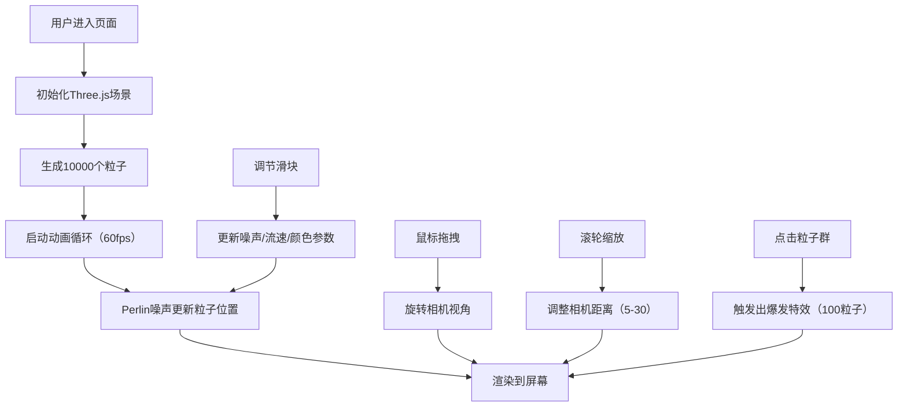

## 1. 产品概述
流体星云生成器是一个基于WebGL的交互式粒子系统可视化工具，让用户通过调节参数实时生成并探索动态的星云状流体粒子系统。目标用户为对数字艺术、粒子物理、创意编程感兴趣的爱好者和创作者。

产品价值在于提供沉浸式的星云探索体验，通过Perlin噪声算法模拟真实流体运动，结合交互式控制和爆发特效，创造独特的视觉艺术体验。

## 2. 核心功能

### 2.1 用户角色
| 角色 | 注册方式 | 核心权限 |
|------|---------|---------|
| 访客用户 | 无需注册 | 完整使用所有交互功能 |

### 2.2 功能模块
1. **主场景渲染**：Three.js 3D粒子系统渲染，支持相机视角控制
2. **控制面板**：参数调节（噪声缩放、流速、颜色混合）
3. **粒子引擎**：Perlin噪声驱动的粒子运动系统
4. **交互特效**：点击爆发粒子特效
5. **状态监控**：粒子数量和帧率实时显示

### 2.3 页面详情
| 页面名称 | 模块名称 | 功能描述 |
|---------|---------|----------|
| 主页面 | 3D场景 | 全屏星云粒子渲染，鼠标拖拽旋转、滚轮缩放 |
| 主页面 | 控制面板 | 右侧毛玻璃面板，三个滑块参数调节 |
| 主页面 | 状态栏 | 底部固定状态栏，显示粒子数和帧率 |
| 主页面 | 爆发特效 | 点击粒子群触发短暂绽放的粒子爆发 |

## 3. 核心流程

用户进入页面 → 自动初始化星云粒子系统 → 鼠标拖拽旋转视角/滚轮缩放观察 → 调节右侧控制面板参数实时调整星云形态 → 点击粒子群触发爆发特效 → 实时观察粒子运动和帧率变化

## 4. 用户界面设计

### 4.1 设计风格
- **主色调**：深空背景 #0D0D1A，粒子渐变色 #FF6B6B → #4ECDC4，爆发特效 #FFD700 → #FF4500
- **视觉风格**：深邃宇宙风格，半透明毛玻璃UI元素，粒子发光效果
- **布局风格**：全屏沉浸式3D场景，右侧浮动控制面板，底部固定状态栏
- **字体**：现代无衬线字体，数字使用中等字重

### 4.2 页面设计概述
| 页面名称 | 模块名称 | UI元素 |
|---------|---------|--------|
| 主页面 | 3D场景 | 全屏WebGL画布，深空背景，10000个发光粒子，粒子大小随距离动态变化 |
| 主页面 | 控制面板 | 宽280px毛玻璃面板（rgba(255,255,255,0.08)），1px边框，12px圆角，三个定制滑块 |
| 主页面 | 状态栏 | 高40px深色半透明栏（rgba(0,0,0,0.6)），左侧白色粒子数，右侧绿色帧率 |
| 主页面 | 爆发特效 | 金色到橙红色渐变粒子，随机方向运动，0.5-1.2秒生命周期，逐渐缩小消失 |

### 4.3 响应性
- 桌面端优先设计，全屏自适应
- 控制面板固定右侧，不随缩放移动
- 状态栏固定底部，宽度100%
- 支持触摸设备（虽然主要为桌面设计）

### 4.4 3D场景指导
- **环境**：纯深空背景（#0D0D1A），无额外光源，粒子自发光
- **相机设置**：PerspectiveCamera，初始位置(0,0,15)，拖拽旋转灵敏度0.003，缩放范围5-30
- **粒子材质**：PointsMaterial，顶点颜色，透明，加法混合
- **交互**：轨道球式旋转控制，无平移限制
- **性能**：目标60fps，粒子数>15000时允许降至30fps
- **粒子运动**：三维Perlin噪声驱动，每帧更新位置
