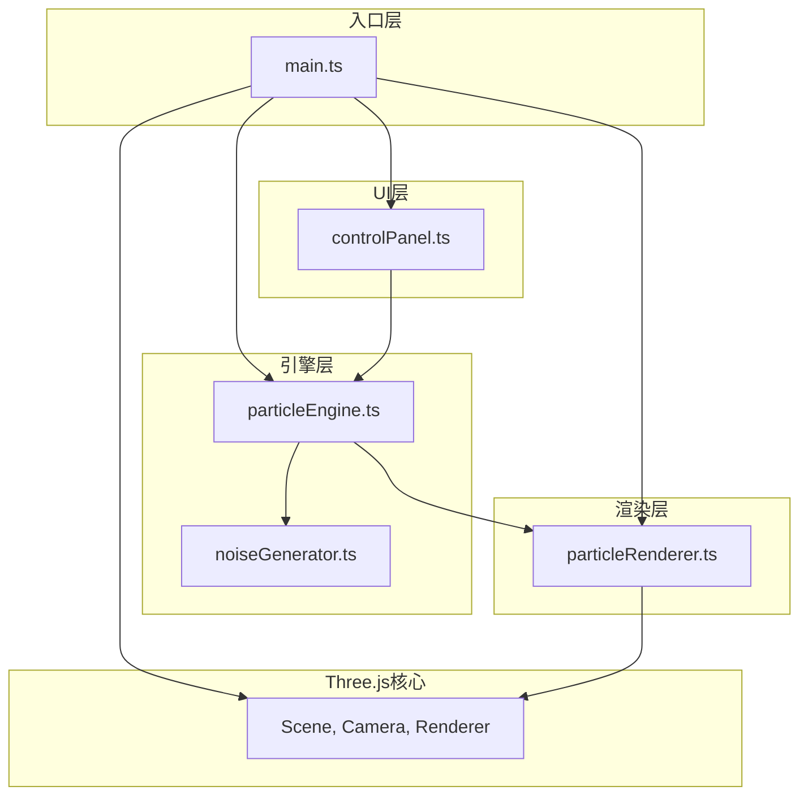

## 1. 架构设计



## 2. 技术描述
- **前端框架**：无UI框架，原生TypeScript + Three.js
- **构建工具**：Vite 5.x + @vitejs/plugin-basic
- **3D引擎**：Three.js 0.160.x
- **类型系统**：TypeScript 5.x 严格模式
- **模块系统**：ESNext，moduleResolution: bundler

## 3. 文件结构

```
d:\Pro\tasks\auto157\
├── package.json
├── index.html
├── vite.config.js
├── tsconfig.json
└── src/
    ├── main.ts
    ├── engine/
    │   ├── particleEngine.ts
    │   └── noiseGenerator.ts
    ├── renderer/
    │   └── particleRenderer.ts
    └── ui/
        └── controlPanel.ts
```

## 4. 模块职责定义

### 4.1 main.ts - 入口协调器
- 初始化Three.js场景、相机、渲染器
- 加载所有子模块（particleEngine, particleRenderer, controlPanel）
- 实现相机控制（拖拽旋转、滚轮缩放）
- 启动动画循环（requestAnimationFrame）
- 协调模块间数据传递
- 管理状态栏（粒子数、帧率）
- 处理点击爆发特效

### 4.2 noiseGenerator.ts - Perlin噪声生成器
- 实现3D改进Perlin噪声算法（梯度噪声）
- 提供`noise3D(x: number, y: number, z: number, scale: number): number`方法
- 内置置换表（permutation table）
- 支持平滑插值（fade函数）
- 梯度向量计算

### 4.3 particleEngine.ts - 粒子引擎
- 粒子数据结构：位置(Vector3)、速度(Vector3)、生命周期、颜色
- 生成指定数量的初始粒子（默认10000）
- 每帧调用noiseGenerator更新粒子位置
- 管理粒子生命周期和边界处理
- 接收控制参数（noiseScale, flowSpeed, colorBlend）
- 提供`update(deltaTime: number)`方法
- 提供`getParticles(): Particle[]`方法
- 支持创建爆发粒子（100个，随机方向）

### 4.4 particleRenderer.ts - 粒子渲染器
- 创建BufferGeometry管理粒子位置和颜色
- 创建PointsMaterial（加法混合、透明、顶点颜色）
- 创建Points对象添加到场景
- 提供`update(particles: Particle[])`方法更新几何体
- 粒子大小根据距离相机动态计算（近处0.3，远处0.1）
- 颜色插值（中心#FF6B6B，边缘#4ECDC4，受colorBlend控制）
- 管理爆发特效粒子

### 4.5 controlPanel.ts - 控制面板UI
- 创建右侧毛玻璃面板DOM元素
- 生成三个滑块控件（噪声缩放、流速、颜色混合）
- 自定义滑块样式（轨道#333，手柄渐变色、悬停放大）
- 监听滑块事件，实时更新particleEngine参数
- 提供参数获取接口

## 5. 核心数据结构

### Particle 接口
```typescript
interface Particle {
  position: THREE.Vector3;
  velocity: THREE.Vector3;
  color: THREE.Color;
  life: number;
  maxLife: number;
  size: number;
  isBurst?: boolean;
}
```

### EngineParams 接口
```typescript
interface EngineParams {
  noiseScale: number;    // 0.5 - 5.0, default 2.0
  flowSpeed: number;     // 0.1 - 2.0, default 0.5
  colorBlend: number;    // 0 - 1, default 0.5
}
```

## 6. 性能策略

### 帧率控制
- 粒子数 < 5000：强制60fps
- 5000 ≤ 粒子数 ≤ 15000：目标60fps
- 粒子数 > 15000：允许降至30fps
- 使用deltaTime控制动画速度，与帧率无关

### 渲染优化
- 使用BufferGeometry而非Geometry
- 批量更新顶点数据（TypedArray）
- 加法混合（AdditiveBlending）减少overdraw视觉影响
- 粒子大小在shader中动态计算
- 爆发粒子对象池复用

## 7. 交互规范

### 相机控制
- 鼠标左键拖拽：旋转视角（灵敏度0.003）
- 滚轮：缩放（距离范围5-30）
- 球坐标系统：theta（水平角）、phi（垂直角）、radius（距离）

### 爆发特效
- 点击屏幕 → Raycaster检测粒子群
- 以点击点为中心发射100个粒子
- 速度：2-5单位/秒，随机方向
- 颜色：#FFD700 → #FF4500 渐变
- 生命周期：0.5-1.2秒随机
- 粒子大小随生命周期线性缩小至0
