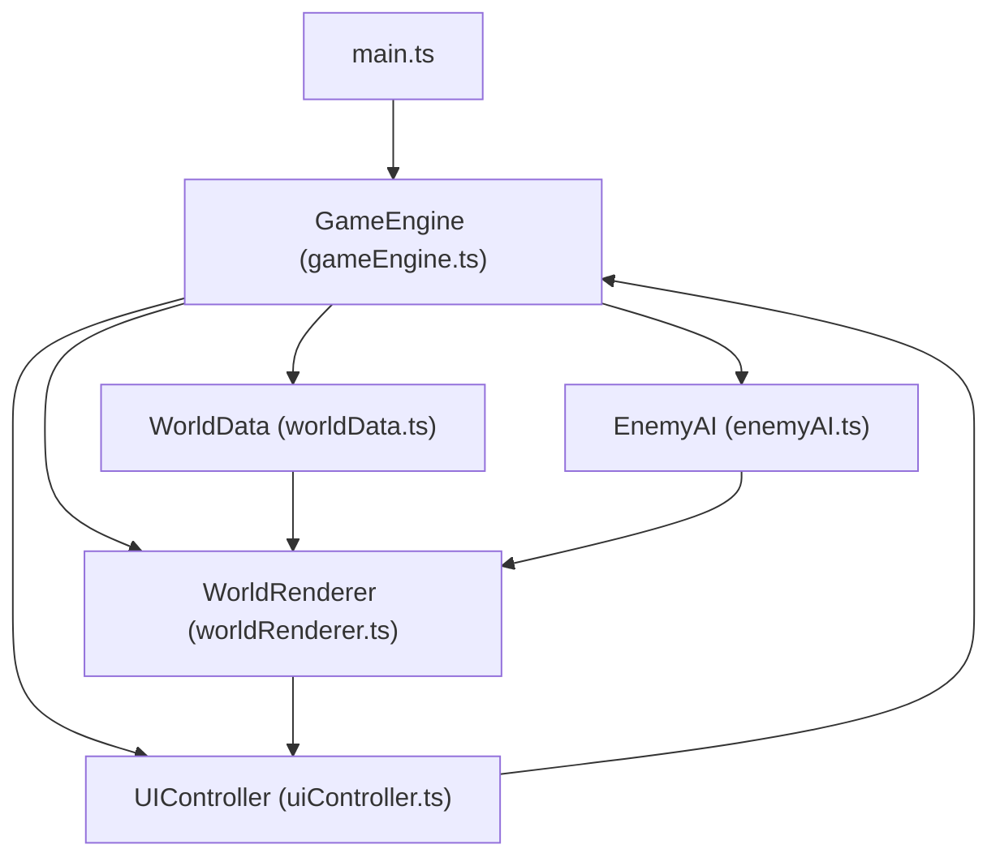

# 像素拓荒记 - 技术架构文档

## 1. 技术选型

| 类别 | 技术 | 说明 |
|-----|------|-----|
| 编程语言 | TypeScript | 类型安全，提升开发效率和代码可维护性 |
| 构建工具 | Vite | 快速开发服务器，热更新，轻量配置 |
| 渲染引擎 | HTML5 Canvas 2D | 原生Canvas API，适合2D像素风游戏渲染 |
| 状态存储 | localStorage | 浏览器本地存储，实现游戏存档功能 |

## 2. 项目目录结构

```
auto158/
├── package.json
├── vite.config.js
├── tsconfig.json
├── index.html
└── src/
    ├── main.ts                    # 应用入口，初始化引擎、挂载UI、启动主循环
    ├── engine/
    │   └── gameEngine.ts          # 游戏引擎：游戏循环、时间系统、碰撞检测、输入处理
    ├── data/
    │   └── worldData.ts           # 数据模块：地图图块、资源点、建筑蓝图数据结构
    ├── ai/
    │   └── enemyAI.ts             # AI模块：怪物BFS寻路、追逐、攻击逻辑
    ├── renderer/
    │   └── worldRenderer.ts       # 渲染模块：地图、建筑、阴影、动画、UI层渲染
    └── ui/
        └── uiController.ts        # UI模块：HUD、建造菜单、背包界面管理
```

## 3. 模块架构与数据流

### 3.1 模块依赖关系图



### 3.2 核心数据流

| 数据流向 | 说明 |
|---------|------|
| worldData → gameEngine | 读取地图数据、资源点列表、建筑蓝图 |
| gameEngine → worldRenderer | 每帧发送tick数据（玩家位置、怪物列表、建筑列表、资源状态） |
| gameEngine → enemyAI | 发送玩家实时坐标、地图碰撞数据 |
| enemyAI → gameEngine | 输出怪物位置数组、攻击事件 |
| uiController → gameEngine | 发送建筑建造指令、玩家交互事件 |
| gameEngine → uiController | 更新HUD数据、资源数量、建筑状态 |

## 4. 数据结构定义

### 4.1 地图与图块

```typescript
enum TileType {
  GRASS = 'grass',    // 草地
  DIRT = 'dirt',      // 泥地
  ROCK = 'rock'       // 岩石
}

interface Tile {
  type: TileType;
  resourceAmount: number;       // 可采集资源量（0表示无资源）
  resourceType?: 'wood' | 'stone' | 'food';
  occupiedByBuilding: boolean;  // 是否被建筑占用
}

type WorldMap = Tile[][];  // 64x64二维数组
```

### 4.2 资源点

```typescript
interface ResourceNode {
  id: string;
  x: number;           // 像素坐标
  y: number;
  type: 'wood' | 'stone' | 'food';
  amount: number;      // 剩余可采集数量
  maxAmount: number;
}
```

### 4.3 建筑蓝图与实例

```typescript
interface BuildingBlueprint {
  type: 'woodWall' | 'stoneWall' | 'tower' | 'warehouse';
  name: string;
  woodCost: number;
  stoneCost: number;
  foodCost: number;
  maxHealth: number;
  height: number;      // 用于计算动态阴影
  color: string;
}

interface Building {
  id: string;
  type: BuildingBlueprint['type'];
  x: number;           // 图块坐标
  y: number;
  health: number;
  maxHealth: number;
  spawnAnimation: number;  // 生成动画进度 0~1
  lastAttackTime?: number;  // 防御塔上次攻击时间
}
```

### 4.4 玩家

```typescript
interface Player {
  x: number;           // 像素坐标
  y: number;
  health: number;
  maxHealth: number;
  resources: {
    wood: number;
    stone: number;
    food: number;
  };
  isGathering: boolean;
  gatherTargetId?: string;
  gatherProgress: number;  // 0~1
}
```

### 4.5 怪物

```typescript
interface Enemy {
  id: string;
  x: number;
  y: number;
  health: number;
  maxHealth: number;
  targetX: number;
  targetY: number;
  speed: number;       // 1.2 单位/秒
  path: { x: number; y: number }[];  // BFS寻路结果
  animationFrame: number;  // 0 或 1
  facing: 'left' | 'right';
}
```

### 4.6 弹丸与粒子

```typescript
interface Projectile {
  id: string;
  x: number;
  y: number;
  targetId: string;
  speed: number;       // 3 单位/秒
  damage: number;
}

interface Particle {
  id: string;
  x: number;
  y: number;
  vx: number;
  vy: number;
  color: string;
  life: number;        // 剩余存活时间（秒）
  maxLife: number;
}
```

## 5. 核心算法设计

### 5.1 游戏主循环

```
requestAnimationFrame驱动
├── 计算deltaTime（上帧到当前帧的时间差）
├── 处理玩家输入（移动、采集、建造、快捷键）
├── 更新游戏时间（日夜循环，每120秒切换）
├── 调用 EnemyAI 更新怪物位置与行为
├── 更新防御塔攻击逻辑与弹丸飞行
├── 粒子效果更新与生命周期管理
├── 碰撞检测（玩家-怪物、弹丸-怪物、怪物-建筑）
├── 调用 WorldRenderer 渲染当前帧
└── 调用 UIController 更新UI状态
```

### 5.2 BFS寻路算法

```
输入：怪物起始格(x1,y1)、玩家目标格(x2,y2)、地图碰撞数据
输出：从起点到终点的最短路径格子数组

算法流程：
1. 初始化队列，将起始格入队，标记为已访问
2. 记录每个格子的前驱节点用于路径回溯
3. 循环出队，探索四个方向（上下左右）的相邻格
4. 若相邻格可行走（非岩石、非建筑）且未访问，则入队
5. 找到目标格后停止，通过前驱节点回溯生成路径
6. 怪物按路径逐格移动，每到达一个路径点后更新下一步
```

### 5.3 碰撞检测

```typescript
// AABB矩形碰撞检测
function checkCollision(
  ax: number, ay: number, aw: number, ah: number,
  bx: number, by: number, bw: number, bh: number
): boolean {
  return ax < bx + bw && ax + aw > bx && ay < by + bh && ay + ah > by;
}
```

### 5.4 地图生成算法

```
使用简单噪声+阈值的方式生成64x64地图：
1. 初始化所有格子为草地
2. 随机撒点生成泥地区域（约15%）
3. 随机撒点生成岩石区域（约8%）
4. 在岩石格子上放置石块资源点
5. 在部分草地上生成树木（木材资源点）
6. 在部分草地上生成浆果丛（食物资源点）
```

## 6. 渲染性能优化策略

| 优化手段 | 说明 |
|---------|------|
| 视口裁剪 | 只渲染屏幕可见范围内的图块和实体 |
| 离屏缓存 | 将静态地图渲染到离屏Canvas，每帧只重绘变化部分 |
| 脏矩形 | 仅重绘发生变化的屏幕区域（本项目简单起见采用全屏重绘） |
| 粒子上限 | 同时存在粒子数不超过50个，超出后淘汰最旧粒子 |
| 资源预计算 | 资源点闪烁动画使用预计算的缩放因子数组 |
| 减少drawCall | 同类型元素批量绘制，减少状态切换 |

## 7. 持久化数据格式

```typescript
interface SaveData {
  version: 1;
  timestamp: number;
  player: {
    x: number; y: number;
    health: number; maxHealth: number;
    resources: { wood: number; stone: number; food: number };
  };
  gameTime: number;     // 累计游戏时间（秒）
  buildings: Building[];
  map: WorldMap;        // 64x64，可考虑压缩存储
  resourceNodes: ResourceNode[];
}
```

**存储键名**：`pixelPioneer_save_v1`

**大小控制**：地图数据采用紧凑格式存储（每个图块2字节），避免JSON冗余。

## 8. 输入处理

| 按键 | 功能 |
|-----|------|
| W/A/S/D 或 方向键 | 玩家移动 |
| E（长按） | 采集附近资源 |
| B | 打开/关闭建造菜单 |
| I | 打开/关闭背包 |
| Ctrl + S | 保存游戏 |
| Ctrl + L | 加载游戏 |
| 鼠标左键 | 菜单交互、建造确认 |
| 鼠标移动 | 菜单悬停、建造预览 |

## 9. 构建与部署配置

### 9.1 Vite配置要点
- entry: `src/main.ts`
- 基础路径相对路径 `./`
- 输出目录 `dist/`
- 使用 `@vitejs/plugin-basic` 处理TypeScript

### 9.2 TypeScript配置要点
- strict: true（严格模式）
- target: ESNext
- module: ESNext
- outDir: dist
- moduleResolution: bundler
