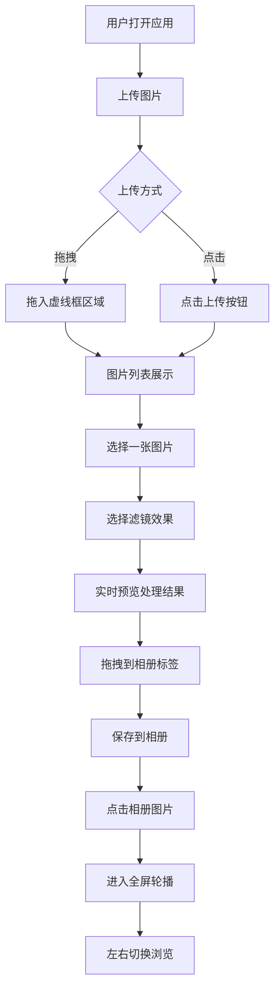

## 1. 产品概述

光影滤镜相册是一款交互式图片风格化与组织工具，用户可上传照片后应用多种实时滤镜效果，并将处理后的图片按主题标签归类到虚拟相册中。

- 主要用途：提供实时图片滤镜处理与相册管理功能
- 目标用户：摄影爱好者、设计师、普通用户
- 核心价值：一站式图片风格化与分类整理体验

## 2. 核心功能

### 2.1 功能模块

1. **图片上传面板**：拖拽上传、点击上传、多图预览
2. **滤镜引擎**：6种以上实时滤镜效果、像素级处理
3. **渲染模块**：Canvas绘制、淡入淡出过渡动画
4. **相册管理**：标签分组、拖拽排序、翻页浏览

### 2.2 页面详情

| 页面名称 | 模块名称 | 功能描述 |
|----------|----------|----------|
| 主界面 | 上传面板 | 支持拖拽/点击上传，最多10张图，显示文件名和大小 |
| 主界面 | 预览区 | 展示当前选中图片原始缩略图，保持宽高比 |
| 主界面 | 滤镜选择器 | 6种滤镜卡片网格，选中高亮带光效 |
| 主界面 | 相册区域 | 标签分组，可折叠，图片卡片支持拖拽排序 |
| 全屏轮播 | 翻页浏览 | 左右箭头/键盘切换，滑动动画，显示标签和序号 |

## 3. 核心流程

用户打开应用 → 上传图片（拖拽/点击） → 选择图片 → 应用滤镜（实时预览） → 拖拽图片到相册标签 → 点击相册图片进入全屏轮播 → 左右浏览图片

## 4. 用户界面设计

### 4.1 设计风格

- **主色调**：紫色系（#9B59B6 主色，#AF7AC5 悬停，#7D3C98 点击）
- **背景色**：深色主题（#121220 主背景，#1E1E2E 预览区，#2D2D44 卡片背景）
- **文字色**：#E0E0E0 浅灰，#AAA 辅助文字
- **按钮风格**：圆角8-12px，悬停阴影加深
- **字体**：现代无衬线字体，14px辅助文字
- **布局**：左右双栏（flex:2 vs flex:1），桌面端响应式，<768px单列

### 4.2 页面设计概览

| 区域 | 模块 | UI元素 |
|------|------|--------|
| 左侧（flex:2） | 上传区域 | 虚线边框2px #9B59B6，200x200px，拖拽提示 |
| 左侧（flex:2） | 预览区 | 600px宽，圆角12px，#1E1E2E背景，最大高度400px |
| 左侧（flex:2） | 图片列表 | 每行一张，显示文件名+文件大小KB |
| 右侧（flex:1） | 滤镜选择器 | 2列网格，间距12px，100x100px方形卡片，选中2px边框+光效 |
| 右侧（flex:1） | 相册区 | 280px宽，圆角16px，#2D2D44，毛玻璃blur(8px)，80x80px缩略图 |
| 全屏层 | 轮播模式 | 黑色背景0.9opacity，40px半透明圆形按钮，slide 300ms动画 |

### 4.3 响应式设计

- **桌面端（≥768px）**：左右双栏布局
- **移动端（<768px）**：单列布局，预览区在上，滤镜和相册在下，垂直滚动

### 4.4 动效设计

- 滤镜切换：500ms淡入淡出 + transform scale(0.95→1.0)
- 翻页动画：slide 300ms ease-in-out
- 悬停效果：阴影加深（0 6px 20px rgba(155,89,182,0.4)）
- 卡片选中：box-shadow 0 0 15px rgba(155,89,182,0.5) 微光效果
