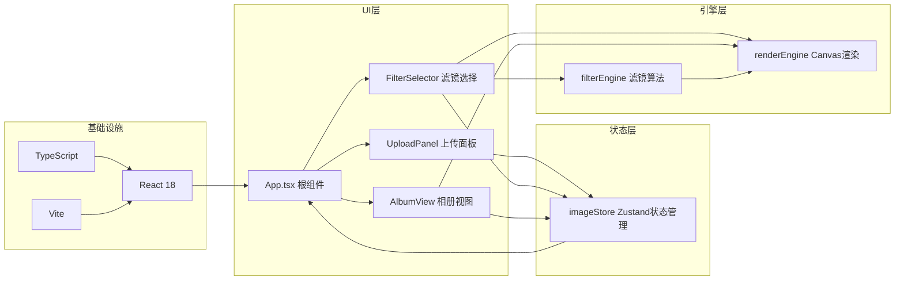

## 1. 架构设计

纯前端应用，采用模块化分层架构：



## 2. 技术栈说明

- **前端框架**：React@18 + TypeScript
- **构建工具**：Vite
- **状态管理**：Zustand
- **唯一ID生成**：uuid
- **UI样式**：原生CSS（模块化设计）
- **图像处理**：HTML5 Canvas + ImageData像素级操作

**依赖版本选择**：
- react: ^18.2.0
- react-dom: ^18.2.0
- zustand: ^4.5.0
- uuid: ^9.0.0
- typescript: ^5.4.0
- vite: ^5.2.0
- @vitejs/plugin-react: ^4.2.0

## 3. 文件结构

```
auto159/
├── package.json
├── vite.config.js
├── tsconfig.json
├── index.html
└── src/
    ├── App.tsx                 # 根组件，布局与状态分发
    ├── main.tsx                # 入口文件
    ├── index.css               # 全局样式
    ├── engine/
    │   ├── filterEngine.ts     # 滤镜算法模块
    │   └── renderEngine.ts     # Canvas渲染模块
    ├── stores/
    │   └── imageStore.ts       # Zustand状态管理
    └── ui/
        ├── UploadPanel.tsx     # 上传面板组件
        ├── FilterSelector.tsx  # 滤镜选择组件
        └── AlbumView.tsx       # 相册视图组件
```

## 4. 数据模型定义

### 4.1 核心类型

```typescript
interface ImageItem {
  id: string;
  file: File;
  name: string;
  size: number;           // bytes
  dataUrl: string;        // 原始图片dataURL
  width: number;
  height: number;
  currentFilter: FilterType;
  processedDataUrl?: string;  // 滤镜处理后的dataURL
  albumId?: string;       // 所属相册ID
  order: number;          // 在相册中的排序
}

interface Album {
  id: string;
  name: string;           // 标签名称：风景、人像、抽象...
  imageIds: string[];     // 图片ID有序列表
  expanded: boolean;      // 是否展开
}

type FilterType = 
  | 'none'
  | 'oil'           // 油画
  | 'watercolor'    // 水彩
  | 'sketch'        // 素描
  | 'pixelate'      // 像素化
  | 'neon'          // 霓虹
  | 'mosaic';       // 马赛克

interface ImageStore {
  images: ImageItem[];
  albums: Album[];
  selectedImageId: string | null;
  carouselOpen: boolean;
  carouselIndex: number;
  carouselAlbumId: string | null;
  
  // Actions
  addImages: (files: File[]) => void;
  removeImage: (id: string) => void;
  selectImage: (id: string | null) => void;
  applyFilter: (imageId: string, filter: FilterType, processedDataUrl: string) => void;
  addAlbum: (name: string) => void;
  removeAlbum: (id: string) => void;
  toggleAlbum: (id: string) => void;
  addImageToAlbum: (imageId: string, albumId: string, index?: number) => void;
  removeImageFromAlbum: (imageId: string, albumId: string) => void;
  reorderAlbumImages: (albumId: string, fromIndex: number, toIndex: number) => void;
  openCarousel: (albumId: string, startIndex: number) => void;
  closeCarousel: () => void;
  setCarouselIndex: (index: number) => void;
}
```

## 5. 引擎模块API

### 5.1 filterEngine.ts

```typescript
export type FilterType = 'none' | 'oil' | 'watercolor' | 'sketch' | 'pixelate' | 'neon' | 'mosaic';

export interface FilterOptions {
  intensity?: number;
  kernelSize?: number;
  pixelSize?: number;
}

export function applyFilter(
  imageData: ImageData,
  filterType: FilterType,
  options?: FilterOptions
): ImageData;
```

**滤镜算法说明**：
- **油画(oil)**：色彩量化 + 中值滤波，模拟油画笔触
- **水彩(watercolor)**：高斯模糊 + 色彩增强，边缘扩散效果
- **素描(sketch)**：灰度转换 + 反相 + 颜色减淡混合
- **像素化(pixelate)**：区域平均采样，生成像素块
- **霓虹(neon)**：边缘检测 + 色彩增强，发光效果
- **马赛克(mosaic)**：块采样，方格化效果

### 5.2 renderEngine.ts

```typescript
export interface RenderOptions {
  transition?: boolean;
  transitionDuration?: number;  // ms，默认500
  scaleStart?: number;          // 默认0.95
  scaleEnd?: number;            // 默认1.0
}

export interface RenderEngine {
  constructor(canvas: HTMLCanvasElement);
  loadImage(dataUrl: string): Promise<HTMLImageElement>;
  drawImage(image: HTMLImageElement): void;
  drawProcessed(imageData: ImageData): void;
  drawWithTransition(newImageData: ImageData, options?: RenderOptions): Promise<void>;
  clear(): void;
  getImageData(): ImageData;
  toDataURL(type?: string): string;
}
```

## 6. 性能优化策略

1. **滤镜处理优化**：
   - 对超过1000px宽度的图片，先等比缩小处理再放大显示
   - 使用TypedArray优化像素遍历
   - 避免在滤镜算法中创建不必要的对象

2. **渲染优化**：
   - Canvas离屏渲染（双缓冲）
   - 滤镜切换使用requestAnimationFrame控制过渡动画
   - 缩略图缓存dataURL，避免重复解码

3. **状态优化**：
   - Zustand选择器模式，避免不必要的重渲染
   - 图片列表虚拟化（虽最多10张，但保持良好实践）

4. **响应式性能**：
   - 使用CSS transform代替top/left实现动画
   - 避免布局抖动，批量DOM操作
