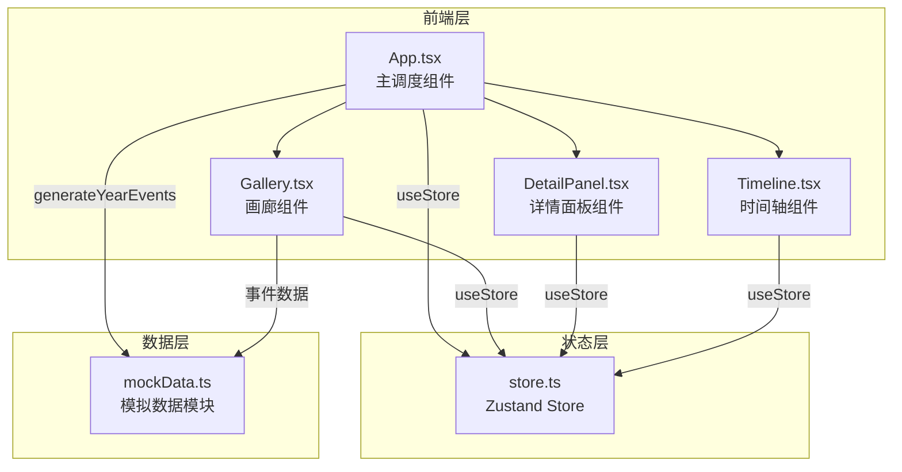
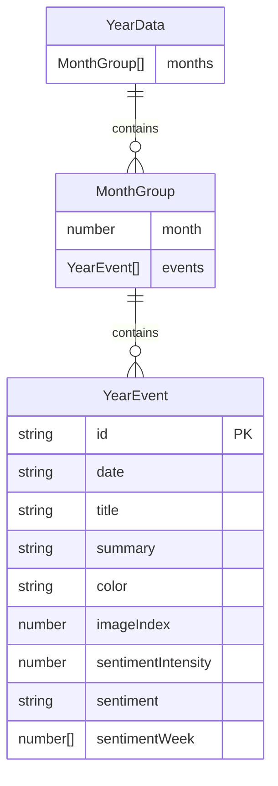

## 1. 架构设计



## 2. 技术说明

- 前端框架：React 18 + TypeScript
- 构建工具：Vite
- 状态管理：Zustand
- 样式方案：CSS Modules + CSS Variables（全局主题变量）
- 数据来源：模拟API模块（mockData.ts），无后端服务
- 初始化工具：Vite init

## 3. 路由定义

| 路由 | 用途 |
|------|------|
| / | 单页应用，所有功能在同一页面 |

## 4. 数据模型

### 4.1 数据模型定义



### 4.2 数据定义

**YearEvent 字段说明：**

| 字段 | 类型 | 说明 |
|------|------|------|
| id | string | 事件唯一标识 |
| date | string | 日期（YYYY-MM-DD） |
| title | string | 事件标题 |
| summary | string | 事件摘要 |
| color | string | 代表色（HEX） |
| imageIndex | number | 配图指数（0-10） |
| sentimentIntensity | number | 情感强度（-10到10） |
| sentiment | string | 情绪标签（positive/neutral/negative） |
| sentimentWeek | number[] | 7天情感值数组 |

**Store 状态定义：**

| 字段 | 类型 | 说明 |
|------|------|------|
| currentMonth | number | 当前月份索引（0-11） |
| selectedEvent | YearEvent \| null | 选中事件 |
| sentimentFilter | string | 情绪筛选（all/positive/neutral/negative） |
| showReview | boolean | 是否显示年度回顾动效 |

## 5. 文件结构与调用关系

```
project/
├── index.html                    # 入口页面，挂载 div#root
├── package.json                  # 依赖与脚本
├── vite.config.ts                # Vite 构建配置
├── tsconfig.json                 # TypeScript 配置
├── src/
│   ├── main.tsx                  # React 入口 → 渲染 App
│   ├── App.tsx                   # 主组件 → 调用 useStore + 渲染子组件
│   ├── store.ts                  # Zustand Store → 导出 useStore
│   ├── mockData.ts               # 模拟数据 → 导出 generateYearEvents
│   ├── styles/
│   │   ├── global.css            # 全局样式 + CSS变量
│   │   ├── Timeline.module.css   # 时间轴样式
│   │   ├── Gallery.module.css    # 画廊样式
│   │   └── DetailPanel.module.css # 详情面板样式
│   └── components/
│       ├── Timeline.tsx          # 时间轴组件 ← useStore.currentMonth, setMonth
│       ├── Gallery.tsx           # 画廊组件 ← useStore.currentMonth, sentimentFilter
│       └── DetailPanel.tsx       # 详情面板 ← useStore.selectedEvent, setSelectedEvent
```

**数据流向：**
1. mockData.ts → App.tsx（generateYearEvents 获取年度数据）
2. App.tsx → Gallery.tsx（传入当月事件数据）
3. store.ts → 所有组件（月份状态、选中事件、筛选条件）
4. Gallery.tsx → store.ts（点击卡片 setSelectedEvent）
5. Timeline.tsx → store.ts（点击月份 setMonth）
6. DetailPanel.tsx → store.ts（关闭面板 setSelectedEvent(null)）
