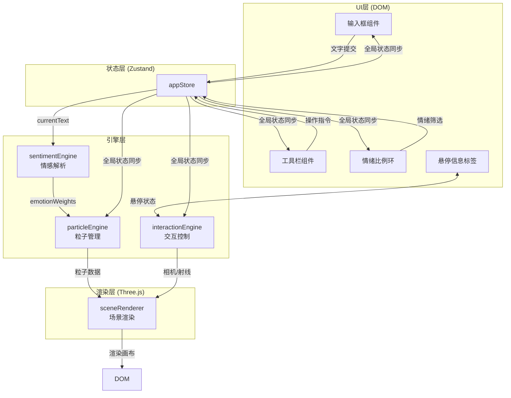

## 1. 架构设计



## 2. 技术选型

- **前端框架**：原生 TypeScript (无React/Vue，用户明确指定独立模块架构)
- **构建工具**：Vite 5.x + @vitejs/plugin-basic
- **3D渲染**：Three.js r160 + @types/three
- **状态管理**：Zustand 4.x
- **工具库**：uuid 9.x（粒子唯一标识）
- **类型系统**：TypeScript 5.x 严格模式

## 3. 模块定义

### 3.1 文件结构
```
src/
├── main.ts                  # 应用入口，模块装配与初始化
├── stores/
│   └── appStore.ts          # Zustand全局状态管理
├── engine/
│   ├── sentimentEngine.ts   # 情感解析引擎
│   ├── particleEngine.ts    # 粒子系统引擎
│   └── interactionEngine.ts # 交互控制引擎
└── renderer/
    └── sceneRenderer.ts     # Three.js场景渲染器
```

### 3.2 核心模块职责

#### sentimentEngine.ts
- 预置50+情感词词典，映射到四类情绪及HSL颜色
- 中文分词（基于词典匹配+正则）
- 情绪权重归一化计算（0-1范围）
- 输出 `EmotionMap` 数据结构

#### particleEngine.ts
- 接收EmotionMap生成粒子配置
- 管理粒子对象池（上限12000）
- 每帧更新布朗运动位置
- 提供 `queryParticlesAt(ray)` 悬停查询接口
- 支持情绪筛选（透明度过渡）

#### interactionEngine.ts
- 封装OrbitControls相机控制
- 监听mousemove/mousedown/touch事件
- Raycaster射线检测粒子群
- 处理情绪环点击→粒子筛选联动
- 80ms内响应鼠标悬停反馈

#### sceneRenderer.ts
- Three.js Scene/Camera/Renderer初始化
- BloomPass后处理管线
- PointLight四色情绪灯光
- Sprite粒子纹理生成（Canvas程序化生成）
- requestAnimationFrame渲染循环

#### appStore.ts
```typescript
interface AppState {
  currentText: string;
  emotionWeights: Record<EmotionType, number>;
  emotionSegments: EmotionSegment[];  // 原文片段与情绪关联
  particleConfig: ParticleConfig;
  selectedEmotion: EmotionType | null;
  hoveredSegment: EmotionSegment | null;
  actions: {
    setText: (t: string) => void;
    analyzeText: () => void;
    setSelectedEmotion: (e: EmotionType | null) => void;
    setHoveredSegment: (s: EmotionSegment | null) => void;
    resetCamera: () => void;
    captureScreenshot: () => void;
    toggleFullscreen: () => void;
  }
}
```

## 4. 数据模型

### 4.1 类型定义
```typescript
type EmotionType = 'joy' | 'sadness' | 'anger' | 'calm';

interface EmotionColor {
  type: EmotionType;
  label: string;
  hex: string;
  hsl: { h: number; s: number; l: number };
}

interface EmotionSegment {
  id: string;
  text: string;         // 原文片段（截断至140字）
  startIndex: number;   // 在原文中的起始位置
  emotion: EmotionType;
  weight: number;
}

interface ParticleData {
  id: string;
  emotion: EmotionType;
  basePosition: Vector3;
  position: Vector3;
  velocity: Vector3;
  size: number;         // 0.3 - 1.2
  color: Color;
  opacity: number;
  segmentId: string;    // 关联的原文片段
}

interface ParticleConfig {
  maxParticles: number;      // 12000
  minSize: number;           // 0.3
  maxSize: number;           // 1.2
  minSpeed: number;          // 0.02
  maxSpeed: number;          // 0.08
  hoverScale: number;        // 1.5
  dimOpacity: number;        // 0.15
  bloomStrength: number;     // 1.2
}
```

## 5. 性能约束

- 粒子对象池：固定容量12000，超出按权重截断
- 渲染循环：单requestAnimationFrame，增量时间Δt控制
- Sprite纹理：共享同一张Canvas生成的径向渐变图，减少DrawCall
- 射线检测：使用包围盒预筛选，避免逐粒子求交
- DOM更新：悬停标签使用requestAnimationFrame节流
