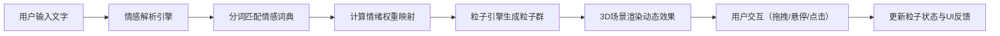

## 1. 产品概述

情绪光谱仪是一款基于WebGL的文字情感可视化应用，将用户输入的文字（日记、诗歌、歌词等）实时解析为情感光谱，通过3D粒子群和色彩脉动呈现动态艺术效果。

- 核心价值：将抽象情感转化为可感知、可交互的立体视觉艺术
- 目标用户：创意工作者、心理学爱好者、文艺创作者

## 2. 核心功能

### 2.1 功能模块
1. **文字输入模块**：右下角悬浮输入框，支持多段文字输入与提交
2. **情感解析引擎**：基于预置情感词典的分词与情绪权重计算
3. **3D粒子系统**：按情绪分类的立体星座状粒子群，支持布朗运动
4. **交互控制模块**：OrbitControls相机控制、粒子悬停放大与信息展示
5. **工具栏模块**：重新分析、截图、全屏、重置视角四大功能按钮
6. **情绪比例环**：左下角微型环形图，展示各情绪占比与快速筛选

### 2.2 功能细节
| 模块 | 功能点 | 详细描述 |
|------|--------|----------|
| 文字输入 | 毛玻璃卡片 | 半透明背景，宽320px，圆角16px，输入时边框渐变动画 |
| 文字输入 | 发光提交按钮 | 直径48px圆环，悬停展开旋转0.6秒，提交时发射粒子扩散波 |
| 情感解析 | 情绪分类 | 喜悦、悲伤、愤怒、宁静四种基础情绪，50+预置情感词典 |
| 粒子系统 | 空间布局 | 按权重排列成星座状，粒子大小0.3-1.2随机，密度反映情绪强度 |
| 粒子系统 | 运动轨迹 | 三维布朗运动，速度0.02-0.08单位/帧，悬停时放大1.5倍加速飘动 |
| 交互控制 | 悬停提示 | 粒子群区域悬停浮现信息标签，展示140字符以内原文片段 |
| 工具栏 | 功能按钮 | 圆形彩色按钮，悬停放大1.2倍，延迟0.3秒显示tooltip |
| 情绪比例环 | 弧段展示 | 四段彩色弧段，长度对应权重百分比，连接处光晕流动周期2秒 |
| 情绪比例环 | 筛选交互 | 点击弧段突出显示该情绪粒子群，其他粒子透明度降至0.15 |

## 3. 核心流程

## 4. 用户界面设计

### 4.1 设计风格
- **主色调**：深蓝渐变背景（#0A0A2E → #1B1B4E）
- **情绪配色**：
  - 喜悦：#FFD93D（金黄）
  - 悲伤：#6C63FF（紫色）
  - 愤怒：#FF6B6B（珊瑚红）
  - 宁静：#6BCB77（薄荷绿）
- **设计语言**：赛博朋克式毛玻璃美学，霓虹发光效果，粒子星云感
- **字体**：现代无衬线字体，英文搭配衬线字体增强艺术感
- **动效**：所有过渡动画使用ease-out缓动，粒子运动具流动感

### 4.2 页面布局
| 区域 | 位置 | 元素 |
|------|------|------|
| 主场景 | 全屏 | Three.js 3D渲染画布，深蓝渐变背景 |
| 输入框 | 右下角 | 毛玻璃卡片（320px宽），含文字输入区与发光提交按钮 |
| 工具栏 | 顶部 | 50px高透明条，四个圆形功能按钮水平排列 |
| 情绪环 | 左下角 | 100px直径环形图，四段弧段展示情绪比例 |
| 悬停标签 | 动态跟随 | 白底黑字圆角卡片，显示原文片段 |

### 4.3 响应式
- 桌面端优先设计
- 平板端：输入框宽度缩至280px，情绪环保持100px
- 移动端：工具栏缩小，输入框适配屏幕宽度
- 触摸设备：支持双指缩放、单指拖拽相机

### 4.4 3D场景指导
- **环境**：深蓝太空感背景，无HDRI，使用渐变色制造深度
- **灯光**：AmbientLight基础光 + 四盏PointLight对应四种情绪色，环绕场景
- **相机**：PerspectiveCamera，fov 60，初始距离15单位
- **后期处理**：UnrealBloomPass泛光效果，增强粒子发光感
- **性能**：粒子总数上限12000，目标帧率30fps+，交互响应<80ms
